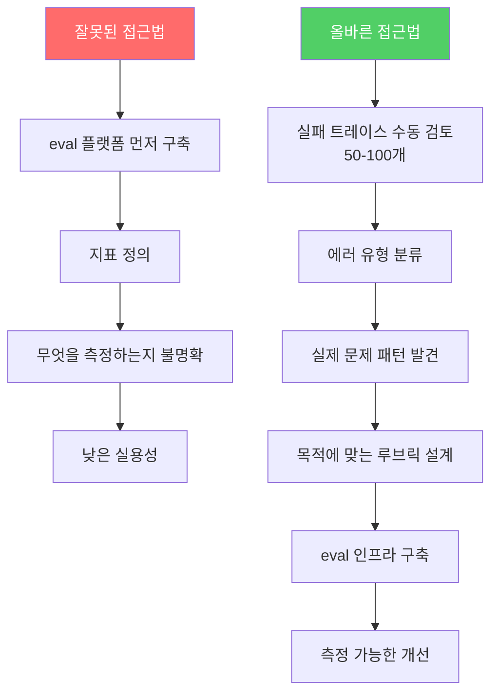
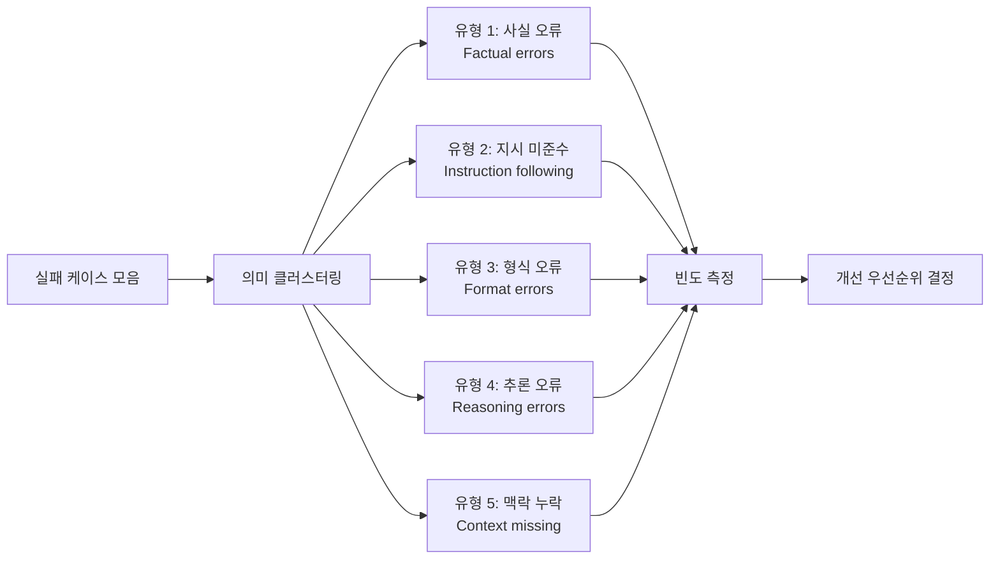

# Error Analysis as the Eval Foundation

실제 트레이스(trace)를 수동으로 검토해 실패 유형 분류 체계(taxonomy)를 만드는 실무 기법. LLM 평가(eval) 인프라를 구축하기 전에 반드시 선행해야 하는 기초 작업이다.

## 정의

**에러 분석(error analysis)**은 모델의 실제 실패 사례를 체계적으로 분류하고, 공통 패턴을 식별해 개선 우선순위를 결정하는 과정이다. Hamel Husain과 Shreya Shankar는 "eval 인프라보다 에러 분석이 먼저"라는 원칙을 강조한다. 도구와 플랫폼을 먼저 구축하는 것은 무엇을 측정할지 모른 채 측정 장비를 세우는 것과 같다.

## 왜 먼저 해야 하는가

## 에러 분류 체계 구축 방법

### 1단계: 샘플 수집
- 프로덕션 로그에서 50-100개 실패 케이스 무작위 추출
- 사용자 부정 피드백이 달린 트레이스 우선
- 다양한 입력 유형을 포함

### 2단계: 수동 레이블링
각 실패에 대해:
- 무엇이 잘못됐는가? (현상)
- 왜 잘못됐는가? (근본 원인)
- 어떻게 고쳐야 하는가? (개선 방향)

### 3단계: 클러스터링

### 4단계: 루브릭 도출
각 유형에서 "좋은 응답"의 기준을 역으로 정의 -> 이것이 eval 루브릭이 된다.

## 시간 배분 원칙

Hamel Husain의 권장:
- **60-80%**: 에러 분석 (수동 검토, 분류, 패턴 발견)
- **10-20%**: 평가 기준 설계 (루브릭, 레이블링 가이드)
- **10-20%**: 자동화 및 인프라 구축

대부분의 팀이 이 비율을 거꾸로 한다 -> LLM-as-Judge를 먼저 구축하고, 무엇을 판단해야 할지 모르는 상태에서 사용.

## 실패 유형 분류 예시 (코드 생성 에이전트)

| 유형 | 설명 | 빈도 | 우선순위 |
|------|------|------|---------|
| 테스트 케이스 미통과 | 생성 코드가 요구사항 테스트 실패 | 35% | 높음 |
| 엣지 케이스 누락 | null, empty, 경계값 처리 없음 | 25% | 높음 |
| 문서화 누락 | docstring, 주석 없음 | 20% | 중간 |
| 비효율 알고리즘 | O(n^2) 대신 O(n log n) 가능 | 15% | 낮음 |
| 보안 취약점 | SQL 인젝션 등 | 5% | 매우 높음 |

## "LLM-as-Judge가 제품을 구하지 않는다"

Eugene Yan의 핵심 논지: 자동 평가자(LLM-as-Judge)는 평가 프로세스를 스케일링하는 도구다. 그러나 **무엇을 평가할지 모른다면** 자동화된 판단도 의미 없다. 에러 분석 없이 LLM-as-Judge를 도입하면:
- 중요하지 않은 것을 빠르게 평가하는 상황이 됨
- 실제 사용자 문제와 괴리된 지표가 쌓임
- 숫자는 좋아 보이지만 제품은 나빠짐

## 대표 레퍼런스

- [LLM Evals: Everything You Need to Know (Hamel Husain & Shreya Shankar, 2026-01-15)](https://hamel.dev/blog/posts/evals-faq/)
- [Q: Why is error analysis so important in LLM evals? (Hamel Husain)](https://hamel.dev/blog/posts/evals-faq/why-is-error-analysis-so-important-in-llm-evals-and-how-is-it-performed.html)
- [Your AI Product Needs Evals (Hamel Husain)](https://hamel.dev/blog/posts/evals/)
- [An LLM-as-judge Won't Save The Product -- Fixing Your Process Will (Eugene Yan)](https://eugeneyan.com/writing/eval-process/)
- [Evals for AI Engineers (O'Reilly, Shreya Shankar & Hamel Husain)](https://www.oreilly.com/library/view/evals-for-ai/9798341660717/)

## 관련 문서

- [[llm-as-judge-calibration|LLM-as-Judge Calibration]]
- [[rubric-based-evals|Rubric-Based Evaluation Frameworks]]
- [[agent-trajectory-evaluation|Agent Trajectory Evaluation]]
- [[synthetic-eval-data-generation|Synthetic Eval Data Generation]]
