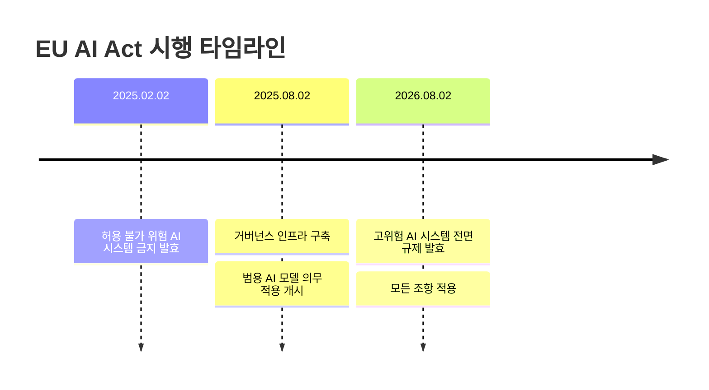

## 개요

EU AI Act는 세계 최초의 포괄적 AI 규제 법률로, 2026년 8월 고위험 AI 시스템에 대한 전면 규제가 발효된다. 최대 3,500만 유로 또는 글로벌 연간 매출의 7%에 달하는 벌금이 부과될 수 있으며, CE 마킹, 적합성 평가, EU 데이터베이스 등록 등 구체적인 준수 요건이 규정되어 있다. 그러나 EU 27개 회원국 중 8개국만 시행 준비를 완료한 상태로, 기술 표준 확정 지연이 과제이다.

## 핵심 개념

**위험 기반 분류(Risk-Based Classification)**: AI 시스템을 허용 불가(금지), 고위험, 제한적 위험, 최소 위험의 4단계로 분류하여 차등 규제를 적용하는 체계.

**적합성 평가(Conformity Assessment)**: 고위험 AI 시스템 제공자가 시장 출시 전 반드시 수행해야 하는 기술적/절차적 검증으로, EU 적합성 선언 및 CE 마킹이 요구된다.

**범용 AI 모델(General-Purpose AI Model, GPAI)**: 다양한 목적으로 사용 가능한 AI 모델에 대한 별도 규제 체계. 시스템적 위험이 있는 GPAI에는 강화된 의무가 적용된다.

## 현황 (2026)

**시행 일정**:

**벌금 체계**:
- 행정 과태료: 최대 **3,500만 유로** 또는 글로벌 연간 매출의 **7%**
- 이탈리아 국내법(2025): 최대 774,685유로 + 사업 자격 박탈 조치
- GDPR 위반 중복 시: 별도 최대 2,000만 유로 또는 매출 4%

**고위험 AI 제공자(Provider) 의무**:
- 문서화된 리스크 관리 시스템
- 강건한 데이터 거버넌스 프로토콜
- 기술 문서화 및 자동 로깅
- 인간 감독(human oversight) 메커니즘
- 시장 출시 전 적합성 평가
- EU 적합성 선언 및 CE 마킹
- EU 데이터베이스 등록

**고위험 AI 배포자(Deployer) 의무**:
- 제공자 지침에 따른 시스템 운영
- 기술적/조직적 안전장치 구현
- 훈련된 인간 감독 인력 배치
- 시스템 성능 지속 모니터링
- 심각한 사고 지체 없이 보고
- 데이터 보호/기본권 영향 평가 수행

**투명성 의무**:
- AI 시스템과 상호작용 시 사용자에게 고지
- AI 생성/조작 콘텐츠 공개
- 합성 콘텐츠 기계 판독 가능 형식 라벨링
- 감정 인식/생체 인식 시스템 사용 시 통지

**준비 현황**: EU 27개 회원국 중 **8개국만** 시행 준비 완료 (2026.04 기준)

## 고위험 AI 시스템 분류 (Annex III)

2026.08.02부터 규제가 적용되는 Annex III 고위험 AI 시스템의 8대 분야:

| 분야 | 예시 |
|------|------|
| 생체 인식(Biometrics) | 원격 생체 인식, 감정 인식 |
| 핵심 인프라 | 전력망, 교통, 수자원 관리 |
| 교육 및 직업 훈련 | 입학 선발, 성적 평가 |
| 고용 및 노동자 관리 | 채용, 성과 평가, 해고 결정 |
| 필수 민간/공공 서비스 | 신용 평가, 사회 보장 수급 |
| 법 집행 | 범죄 예측, 증거 분석 |
| 이민/망명/국경 관리 | 비자 심사, 국경 통제 |
| 사법 행정 및 민주적 절차 | 판결 지원, 선거 관련 |

고위험 시스템은 (1) EU 규제 제품의 안전 구성요소로서 제3자 적합성 평가가 필요한 경우, 또는 (2) 위 8개 범주에 해당하되 제공자가 심각한 위해 위험이 없음을 입증하지 못하는 경우에 해당한다.

## 전망/과제

**기술 표준 지연**: CEN/CENELEC이 요청된 2025년 8월 기한 내에 조화 표준(harmonised standards) 개발을 완료하지 못했으며, 표준화 작업이 계속 진행 중이다. 조화 표준이 확정되면 해당 표준에 따라 개발된 고위험 AI 시스템은 "적합성 추정(presumption of conformity)" 혜택을 받아 준수 부담이 경감되지만, 현재로서는 기업들이 구체적 기준 없이 준수를 준비해야 하는 불확실성에 직면해 있다.

**글로벌 영향(Brussels Effect)**: EU 역외 기업도 EU 시장에 AI 서비스를 제공하려면 AI Act를 준수해야 하므로, 사실상 글로벌 AI 규제 표준으로 기능할 가능성이 높다. EU AI Office와 회원국 당국이 공동으로 시행을 감독하며, 회원국별 최소 1개의 AI 규제 샌드박스 설립이 요구된다.

**회원국별 국내법 편차**: 이탈리아는 이미 자체 국내법을 제정하여 최대 774,685유로 벌금과 사업 자격 박탈 조치를 규정했다. 27개 회원국의 국내법 이행 속도와 해석 차이가 기업의 추가 준수 부담을 야기할 수 있다.

**미국과의 차이**: [[ai-regulation-us]]의 부문별/사후 규제 접근과 대비되는 포괄적/사전 규제 모델로, 글로벌 기업에 이중 준수 부담을 야기한다. 캘리포니아 TFAIA와 뉴욕 RAISE Act는 프론티어 모델 규제에서 EU GPAI 규제와 유사한 방향이지만, EU의 CE 마킹/적합성 평가 체계와는 구조적으로 다르다.

**의료/금융 등 고위험 분야**: [[ai-healthcare]] 등 고위험 분류 AI 시스템 운영 기업은 2026.08까지 적합성 평가, CE 마킹, EU 등록을 완료해야 한다. 품질 관리 시스템의 지속적 준수 역량을 갖추고, 시정 조치와 당국 협력 체계를 구축해야 한다.

## 관련 문서

- [[ai-regulation-us]] - 미국 AI 규제와의 비교
- [[deepfake-detection-c2pa]] - AI 생성 콘텐츠 투명성 의무
- [[enterprise-ai-adoption]] - 규제 준수가 기업 AI 배포에 미치는 영향
- [[ai-healthcare]] - 고위험 AI로 분류되는 의료 AI 시스템
