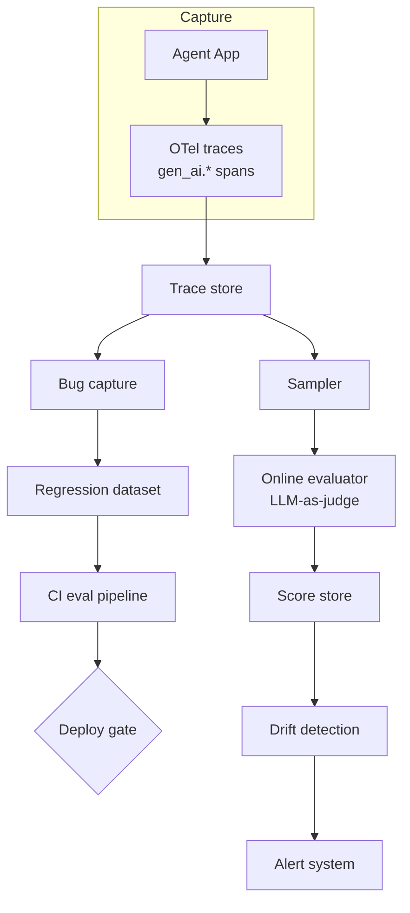

# Eval-in-Loop — Production Eval Harness

LLM agent production eval 은 **4 단계 평가 단위** 가 표준이다:

1. **Span** — 단일 LLM call 또는 tool call
2. **Trace** — 1 user request end-to-end
3. **Trajectory** — agent 가 거친 경로
4. **Session** — multi-turn 상호작용

eval harness 는 이 단위들을 **offline regression dataset** 와 **online production
traffic sampling** 양쪽에 동일 evaluator 로 적용 → 같은 점수 체계로 비교 가능하게
한다.

## 전체 흐름

```mermaid
flowchart LR
    subgraph Offline
        Bug[Production bug] --> Dataset[Regression Dataset]
        Dataset --> Test[Pre-deploy test]
    end
    subgraph Online
        Prod[Production traffic] --> Sample[Sampled traces]
        Sample --> Online[Online eval]
    end
    Test --> Same{Same evaluators}
    Online --> Same
    Same --> Score[Comparable scores]
    Score --> Drift{Drift detection}
    Drift -->|regression| Alert[Alert + investigate]
    Drift -->|stable| Continue[Continue deploy]
```

## Eval Harness 정의

> "An evaluation harness is the architectural backbone of a production AI
> evaluation practice because it turns evaluation from a one-off script into a
> repeatable system for scoring, routing, and improving AI behavior. Candidate
> prompt and model changes run through a regression dataset, scored by the same
> evaluators used in production." — Arize

핵심: **production 과 동일한 evaluator** 가 dev/CI/online 에서 작동해야 비교
가능하다.

## 4 단계 평가 단위

| 단위 | 내용 | 측정 예 |
|---|---|---|
| Span | 1 LLM call / tool call | latency, token usage, individual output quality |
| Trace | 1 request end-to-end | task completion, total cost, error rate |
| Trajectory | agent 의 path | tool 선택 적절성, step count |
| Session | multi-turn 상호작용 | user satisfaction, conversation success |

## Online vs Offline Eval

### Offline

> "Run against curated datasets with expected answers. These validate 'known
> scenarios against reference outputs' and enable regression testing before
> deployment. Teams control examples and verify correctness against ground truth."

→ pre-deploy regression test, ground truth 확보된 dataset.

### Online

> "Monitor production traces without reference outputs. They assess 'quality
> patterns and safety' rather than correctness, asking whether responses are
> 'helpful' or 'on topic' rather than whether they match references."

→ production sampled traces 에 LLM-as-judge 적용.

> "Offline and online evals answer different questions because they operate on
> different data."

## Regression Test — Bug → Test 자동화

> "LangSmith enables teams to convert production failures into regression
> datasets through a single-click workflow... each bug you fix becomes a test
> case, preventing the same failure from recurring months later."

### 권장 workflow

1. Production 에서 trace 가 fail / low score
2. Annotation queue 에 추가
3. Human 이 expected output 라벨링
4. Regression dataset 추가
5. CI 마다 전체 dataset 재실행

## Score 종류 (3 layer)

> "1. **Deterministic checks**: Format validation, schema compliance, and safety
>    filtering — 'cheap and fast' for every run
> 2. **LLM-as-judge**: Qualitative assessment of tone, helpfulness, and reasoning
>    where 'ground truth is sparse or subjective'
> 3. **Human annotation**: Domain expertise calibration and edge-case validation"

| Layer | 비용 | 신뢰도 | 적용 범위 |
|---|---|---|---|
| Deterministic | 거의 0 | 100% (해당 항목) | every run |
| LLM-as-judge | 모델 호출 비용 | 중-상 (calibration 필요) | sampled |
| Human | 인건비 | 최상 | edge case + calibration |

## Drift Detection

> "Quality drift detection tracks how output quality shifts as prompts change
> over time, making it easy to pinpoint when and why a regression was introduced.
> Online evals run on sampled production traffic in real-time, detecting drift or
> quality degradation as it happens."

### 추적 대상

- output quality score
- token 사용량 분포
- tool call 빈도 / 종류
- refusal rate
- response length 분포
- latency 분포

### Drift 원인 패턴

- **Model upgrade**: 동일 prompt, 다른 출력
- **Prompt change**: 의도하지 않은 regression
- **Retrieval corpus drift**: index 가 stale
- **User input drift**: 새로운 use case 등장

## Multi-Turn Agent 평가

> "For AI agents, the evaluation unit should be the 'full conversation thread'
> rather than individual responses. Task completion and user satisfaction 'emerge
> across turns, not from individual responses', making thread-level monitoring
> essential for detecting quality degradation in production."

→ 단일 turn quality 가 좋아도 conversation 전체 task completion 이 실패할 수 있음.

## A/B Test (CI Integration)

> "establish baseline metrics on your core dataset and run experiments to compare
> outputs before and after each change. For high-stakes modifications, use human
> review to ensure improvements don't introduce regressions elsewhere."

### 권장 절차

1. Baseline metric 확정 (current production)
2. Candidate change (new prompt / new model) 적용
3. Same dataset 위 양쪽 score 측정
4. Score 차이 + p-value 또는 effect size
5. Pass 시 staged rollout (canary → full)
6. Online eval 로 production 검증

## OpenTelemetry GenAI Eval Attributes

OTel `gen_ai.evaluation.*` namespace ([[opentelemetry-genai-semconv]] 참고):

| Attribute | 예 |
|---|---|
| `gen_ai.evaluation.name` | `Relevance`, `IntentResolution` |
| `gen_ai.evaluation.score.value` | `4.0` (double) |
| `gen_ai.evaluation.score.label` | `relevant`, `not_relevant`, `correct`, `incorrect` |
| `gen_ai.evaluation.explanation` | "The response is factually accurate but lacks detail" |

→ eval 결과 자체가 OTel span attribute 으로 표준화되어 vendor-agnostic 비교 가능.

## EleutherAI lm-evaluation-harness

학계/모델 평가 표준:

- HuggingFace Open LLM Leaderboard 의 backend
- NVIDIA, Cohere, BigScience, Mosaic ML 등 사용
- 200+ task 표준 benchmark
- repo: https://github.com/EleutherAI/lm-evaluation-harness

production 의 task-specific eval 과는 별개 — 모델 capability baseline 측정용.

## Refusal 패턴 monitoring

production 신호:

- refusal rate spike → prompt regression 또는 모델 변경
- 특정 카테고리 refusal 증가 → safety classifier drift
- "I cannot help with that" 같은 패턴 매칭으로 자동 detect

## 권장 운영 metrics

| Metric | 종류 | Trigger |
|---|---|---|
| LLM-as-judge score (online) | gauge | drift 탐지 |
| Regression test pass rate | gauge | < 95% 시 deploy block |
| Refusal rate | counter | baseline ±50% 시 alert |
| Tool call distribution | histogram | KS-test drift |
| Output token distribution | histogram | length drift |
| Cost per task | gauge | budget guard |

## Production Eval Architecture



## 2026 도구 비교

| 도구 | OSS | OTel | Eval | A/B test | Self-host |
|---|---|---|---|---|---|
| LangSmith | 부분 | 양방향 | 있음 | 있음 | 가능 (k8s) |
| Langfuse | 완전 | 직접 | 있음 | 부분 | 가능 |
| Phoenix (Arize) | 완전 | OpenInference | 있음 | 있음 | 가능 |
| Helicone | 부분 | 부분 | 있음 | 부분 | 가능 |
| Latitude | 완전 | 있음 | 있음 | 있음 | 가능 |
| Confident AI (DeepEval) | 완전 | 있음 | 있음 | 있음 | 부분 |

자세한 플랫폼 비교는 [[llm-observability-platforms]] 참고.

## 관련 문서

- [[opentelemetry-genai-semconv]] — eval attribute 표준
- [[opentelemetry-genai-metrics]] — eval metric 측정
- [[llm-observability-platforms]] — 플랫폼 비교
- [[agent-evaluation-framework]] — eval framework 일반
- [[agent-error-budget-sre]] — quality SLO 측정
- [[component-level-agent-evaluation]] — 단위별 eval
- [[ab-testing-llms]] — LLM A/B test
