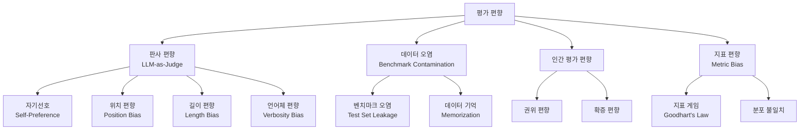
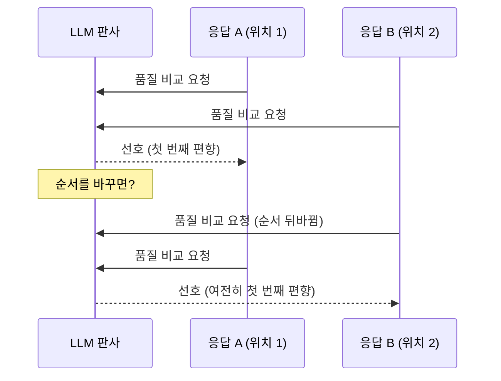
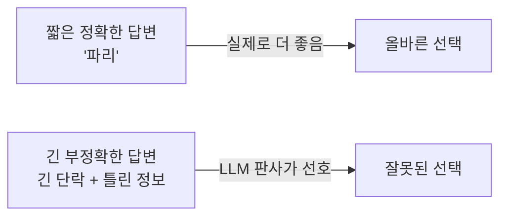
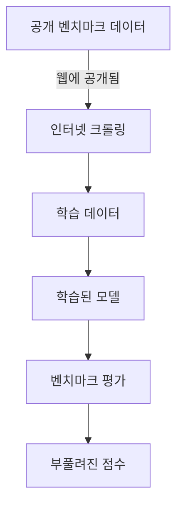
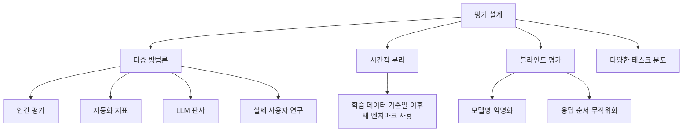

# 평가 편향 (Evaluation Bias)

평가 편향(Evaluation Bias)은 AI 모델의 성능을 측정할 때 발생하는 체계적 오류로, 실제 능력이 아닌 측정 방식의 특성 때문에 결과가 왜곡되는 현상이다. LLM이 판사(judge) 역할을 하거나, 벤치마크 데이터가 학습셋에 노출되거나, 인간 평가자가 특정 패턴을 선호하는 등 다양한 원인으로 발생한다.

평가 편향을 이해하는 것은 모델 선택, 벤치마크 해석, 프로덕션 배포 결정에서 필수적이다. 수치가 높아도 실제 성능을 반영하지 않을 수 있기 때문이다.

## 평가 편향의 분류 체계



## LLM-as-Judge와 판사 편향

[[llm-as-judge]] 참조.

LLM을 평가자로 사용하는 방식은 인간 평가의 확장 대안으로 널리 쓰이지만, 여러 구조적 편향을 내재한다.

### 자기선호 편향 (Self-Preference Bias)

[[self-preference-bias]] 참조.

LLM이 자신과 유사한 스타일·어휘·구조로 작성된 응답을 더 선호하는 경향이다.

**발생 메커니즘**:
- 같은 사전학습 데이터를 기반으로 학습된 모델들은 유사한 선호 패턴을 보임
- 모델 A가 모델 A의 응답을 평가하면, 자신의 생성 분포에서 더 높은 확률을 갖는 응답에 높은 점수를 줌

**실증 연구**: Panickssery et al. (2024)은 GPT-4, Claude, Llama 등 주요 모델이 모두 자신의 응답에 통계적으로 유의미하게 높은 점수를 부여함을 확인했다.

```python
# 자기선호 편향 탐지 실험 패턴
def detect_self_preference(judge_model, candidates):
    """
    동일한 프롬프트에 대한 여러 모델의 응답을
    각 모델이 서로 교차 평가했을 때 자기선호 여부 확인
    """
    scores = {}
    for judge in candidates:
        scores[judge] = {}
        for model, response in candidates.items():
            score = judge_model.evaluate(
                judge_id=judge,
                response=response,
                rubric="quality"
            )
            scores[judge][model] = score
    
    # 대각선(자기평가) vs 비대각선(교차평가) 비교
    self_scores = [scores[m][m] for m in candidates]
    cross_scores = [
        scores[j][m] for j in candidates
        for m in candidates if j != m
    ]
    return {
        "self_mean": sum(self_scores) / len(self_scores),
        "cross_mean": sum(cross_scores) / len(cross_scores),
    }
```

### 위치 편향 (Position Bias)

[[positional-bias-llm]] 참조.

쌍 비교(pairwise comparison)에서 LLM 판사가 특정 위치(첫 번째 또는 두 번째)에 있는 응답을 체계적으로 선호하는 현상이다.



**첫 번째 우선(primacy effect)**: 응답이 많을수록 처음에 나온 응답에 더 높은 가중치를 두는 경향. 긴 컨텍스트에서 특히 강하게 나타난다.

**마지막 우선(recency effect)**: 일부 모델에서는 마지막 응답을 선호하는 반대 경향도 관찰된다.

**완화 방법**:
- 동일 쌍을 순서를 바꿔 두 번 평가 후 일치도 확인
- 3~4개 이상 순열(permutation) 평균

### 길이 편향 (Length Bias)

LLM 판사가 더 긴 응답을 품질 무관하게 선호하는 경향이다.

**원인**: LLM은 상세한 응답이 더 도움이 된다는 패턴을 학습. 길고 구조화된 응답이 실제 정확도와 무관하게 더 "철저해 보임".



**데이터**: MT-Bench 연구에 따르면 응답 길이와 GPT-4 점수 간 0.3~0.5 수준의 상관관계가 관찰됨. 길이를 통제했을 때 상관관계가 크게 감소한다.

**완화 방법**:
- 프롬프트에 "길이는 점수에 영향을 주지 않는다" 명시
- 동일 내용을 짧게/길게 변형해 일관성 테스트
- 루브릭에 "간결성"을 명시적 평가 기준으로 포함

## 벤치마크 오염 (Benchmark Contamination)

테스트 데이터가 학습 데이터에 노출되어 모델이 테스트셋을 "암기"하는 현상이다.

### 오염 메커니즘



### 주요 오염 패턴

**직접 오염**: 벤치마크 질문-답변 쌍이 학습 데이터에 그대로 포함.

**간접 오염**: 벤치마크 문제를 다룬 블로그, 포럼, 논문 토론이 크롤링됨.

**부분 오염**: 테스트 질문은 없지만 동일 출처(예: Wikipedia 특정 페이지)에서 학습.

### 오염 탐지 방법

**n-gram 중복 분석**:
```python
from collections import Counter

def contamination_score(test_item: str, train_corpus: list[str], n: int = 10) -> float:
    """
    테스트 아이템의 n-gram이 학습 코퍼스에 얼마나 존재하는지 측정
    """
    test_ngrams = set(zip(*[test_item.split()[i:] for i in range(n)]))
    
    train_ngrams = set()
    for doc in train_corpus:
        doc_ngrams = set(zip(*[doc.split()[i:] for i in range(n)]))
        train_ngrams.update(doc_ngrams)
    
    overlap = test_ngrams & train_ngrams
    return len(overlap) / len(test_ngrams) if test_ngrams else 0.0
```

**학습 시점 분리**: 벤치마크 공개 날짜 이후 수집된 데이터만 학습에 사용하는 "temporal split".

**역 N-gram 분석**: Shi et al. (2024)의 방법 — 벤치마크 문제 중 특정 n-gram이 모델에서 높은 확률로 생성되면 오염 신호.

### 오염된 벤치마크 사례

| 벤치마크 | 오염 가능성 | 이유 |
|---------|-----------|------|
| MMLU | 높음 | 공개된 지 오래됨, 웹에 광범위 배포 |
| GSM8K | 중간 | 문제 자체보다 해법 패턴이 웹에 다수 |
| HumanEval | 높음 | GitHub에 솔루션 다수 공개 |
| MATH | 중간 | 수학 문제집 기반, 일부 웹 노출 |
| HellaSwag | 낮음 | 완성 태스크, 정답 덜 명시적 |

## Goodhart's Law와 지표 게임

> "지표가 목표가 되는 순간, 그 지표는 더 이상 좋은 지표가 아니다."

LLM 개발에서 특정 벤치마크 점수를 목표로 최적화하면 벤치마크에는 좋지만 실제 유용성은 낮은 모델이 만들어진다.

**RLHF에서의 보상 해킹**: [[rlhf]]에서 보상 모델 점수를 극단적으로 최적화하면 보상 모델을 "해킹"하는 응답이 생성됨. 보상 모델이 실제 인간 선호의 완벽한 대리자가 아니기 때문.

**벤치마크 포화(saturation)**: 주요 벤치마크가 포화되면 새로운 어려운 벤치마크로 이동이 반복된다. MMLU 포화 → MMLU-Pro → Humanity's Last Exam 순서.

## 인간 평가 편향

LLM-as-Judge의 대안인 인간 평가도 여러 편향을 가진다.

### 주요 인간 편향

| 편향 유형 | 설명 | 완화 방법 |
|---------|------|---------|
| 권위 편향 | 유명 모델의 응답을 선호 | 블라인드 평가 (모델명 숨김) |
| 확증 편향 | 자신의 견해와 일치하는 응답 선호 | 다양한 배경의 평가자 |
| 피로 편향 | 평가가 길어질수록 빠른 판단 | 세션 길이 제한, 보상 구조 |
| 지침 해석 차이 | 같은 기준을 다르게 이해 | 구체적 루브릭, 예시 제공 |
| 언어·문화 편향 | 특정 언어나 문화적 표현 선호 | 다문화 평가자 구성 |

### Chatbot Arena의 접근

[[lmsys-chatbot-arena]] 참조.

크라우드소싱 기반 ELO 레이팅. 수만 명의 사용자가 두 모델 중 하나를 선택 → 통계적으로 개인 편향을 평균화.

단점: 영어 및 서구권 사용자 과대표현, 스킬 기반 쿼리 편중.

## [[ai-evaluation]] 관점의 종합 프레임워크

좋은 평가 시스템을 설계하기 위한 원칙들:



### 실무 평가 체크리스트

**벤치마크 선택 시**:
- [ ] 벤치마크 공개 날짜가 모델 학습 데이터 수집 이후인가?
- [ ] n-gram 오염 분석을 실시했는가?
- [ ] 하나의 벤치마크가 아닌 다양한 벤치마크 조합을 사용하는가?

**LLM-as-Judge 사용 시**:
- [ ] 순서를 바꿔 두 번 평가하고 일관성을 확인했는가?
- [ ] 응답 길이를 통제했는가?
- [ ] 다른 LLM 판사와의 합의도를 측정했는가?
- [ ] 판사 모델과 평가 대상 모델이 동일하지 않은가?

**인간 평가 시**:
- [ ] 라벨러 간 일치도(inter-annotator agreement)를 측정했는가?
- [ ] 블라인드 평가를 진행했는가?
- [ ] 평가 지침이 구체적인 예시와 함께 제공되었는가?

## 편향 완화 기법 요약

| 편향 | 완화 기법 |
|------|---------|
| 자기선호 편향 | 교차 모델 평가, 다중 판사 앙상블 |
| 위치 편향 | 순서 무작위화, 순열 평균 |
| 길이 편향 | 루브릭에 간결성 명시, 길이 정규화 |
| 벤치마크 오염 | 새로운 동적 벤치마크, 시간적 분리 |
| Goodhart's Law | 다양한 지표 조합, 실제 사용자 연구 |
| 인간 편향 | 블라인드 평가, 다양한 평가자 풀 |

## 관련 문서

- [[llm-as-judge]] - LLM 판사 방법론 상세
- [[self-preference-bias]] - 자기선호 편향 심층 분석
- [[positional-bias-llm]] - 위치 편향 연구 및 완화
- [[ai-evaluation]] - AI 평가 방법론 전체 개요
- [[rlhf]] - RLHF의 보상 해킹과 평가 편향
- [[lmsys-chatbot-arena]] - 크라우드소싱 기반 평가 사례
- [[benchmark-design-principles]] - 좋은 벤치마크 설계 원칙
