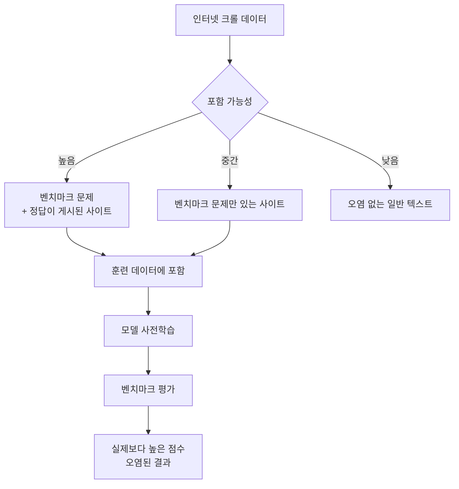
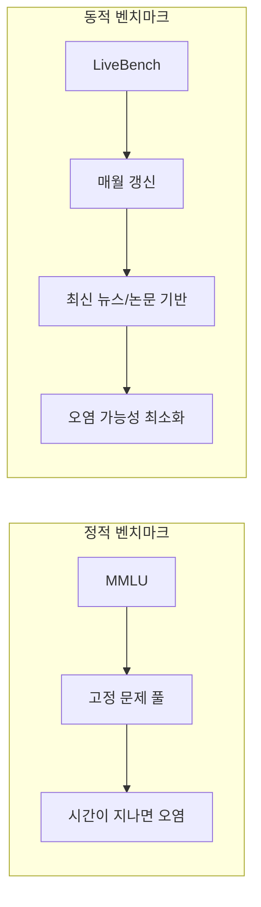
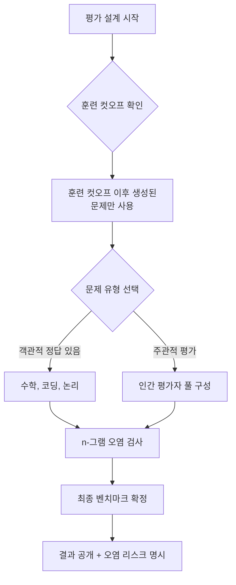

# 평가 데이터 오염과 동적 벤치마크

## 개요

데이터 오염(data contamination)은 AI 모델 평가의 신뢰성을 위협하는 핵심 문제다. 모델이 훈련 데이터에 벤치마크 문제(또는 정답)가 포함된 상태로 학습되면, 평가 결과는 실제 능력이 아닌 암기 수준을 반영하게 된다. 이 문제는 모델의 훈련 데이터 규모가 커지고 인터넷의 거의 모든 텍스트를 포괄하게 되면서 더욱 심각해졌다.

동적 벤치마크(dynamic benchmark)는 이 문제에 대한 해결 방향이다. 고정된 문제 집합 대신 지속적으로 갱신되는 평가 세트를 사용하여 오염의 여지를 차단하는 접근법이다.

## 오염이 발생하는 경로

오염 경로는 크게 세 유형이다:

1. **직접 오염(Direct Contamination)**: 벤치마크 문제와 정답이 그대로 훈련 데이터에 포함
2. **간접 오염(Indirect Contamination)**: 문제 유형이나 구조가 훈련 데이터에 노출
3. **평가 세트 재사용**: 동일한 벤치마크를 여러 모델 개발 과정에서 반복 사용하여 암묵적 튜닝

## 오염 탐지 방법

### n-그램 중복 분석

가장 단순한 방법은 벤치마크 문제와 훈련 데이터 사이의 n-그램 겹침을 분석하는 것이다. 예를 들어, 벤치마크 문제의 8-그램이 훈련 데이터에 등장하면 오염 의심으로 표시한다. 그러나 이 방법은:

- 파라프레이징된 문제를 탐지하지 못한다
- 훈련 데이터에 직접 접근이 불가능한 경우 적용할 수 없다

### 퍼플렉서티 분석

오염된 모델은 벤치마크 문제를 일반 텍스트처럼 처리할 때 비정상적으로 낮은 퍼플렉서티(perplexity)를 보인다. 이를 기준으로 오염 여부를 추정할 수 있다.

### 완성률 비교

문제의 첫 부분을 제시하고 나머지를 생성하게 하면, 오염된 모델은 암기된 답을 그대로 출력하는 경향이 있다.

[[data-contamination-detection]] 연구는 이 탐지 방법들을 체계적으로 정리한다.

## 동적 벤치마크의 접근법

### LiveBench

LiveBench는 2024년 제안된 동적 벤치마크다. 핵심 설계 원칙:

- **시간 기반 갱신**: 매월 새로운 문제 추가, 오래된 문제는 폐기
- **검증 가능한 정답**: 수학 문제, 코딩 문제 등 객관적으로 채점 가능한 형식 사용
- **오염 추적 가능성**: 문제 공개 날짜와 모델 훈련 컷오프를 명시적으로 비교

### LiveCodeBench

[[livecodebench]]는 코딩 능력 평가에 특화된 동적 벤치마크다. LeetCode 등에 새롭게 업로드되는 문제를 사용하여 훈련 데이터 포함 가능성을 차단한다.

## 정적 벤치마크의 인플레이션 문제

주요 벤치마크들의 성능이 시간에 따라 급격히 향상되는 현상이 관찰된다. 이를 "벤치마크 포화(benchmark saturation)"라고 한다.

| 벤치마크 | 2020 SOTA | 2024 SOTA | 인간 수준 |
|----------|-----------|-----------|----------|
| MMLU | ~43% | ~90%+ | ~89% |
| GSM8K | ~10% | ~97% | ~60% |
| HumanEval | ~0% | ~90%+ | - |

이 급격한 향상이 실제 능력 향상인지 오염으로 인한 인플레이션인지 구분하기 어렵다. 학계에서는 특히 다음 질문들이 논쟁 중이다:

- 최신 모델들의 GSM8K 점수는 진짜 수학 능력인가, 아니면 유사한 문제 암기인가?
- 코딩 벤치마크 성능이 실제 업무 성과로 이어지는가?

## 벤치마크 선택과 보고 편향

오염 문제와 별개로, **벤치마크 선택 편향(cherry-picking)**도 심각한 문제다. 많은 논문에서 자신에게 유리한 벤치마크만 선택하여 보고한다. 이를 방지하기 위한 권고사항:

1. 사전에 평가 프로토콜을 공개하고 그대로 따를 것(preregistration)
2. 성능이 나쁜 벤치마크도 포함하여 보고할 것
3. 여러 독립적 평가 기관의 교차 검증을 받을 것

## 오염을 고려한 올바른 평가 설계

## 실무 가이드라인

모델을 개발하거나 평가할 때 오염을 최소화하기 위한 실천 방안:

- 최종 평가 세트는 훈련 데이터 구축이 끝난 후 별도로 수집한다
- 평가 세트는 최대한 비공개로 유지하거나, 공개 시 빠르게 갱신한다
- 내부 평가와 외부 공개 평가 결과가 크게 다르면 오염을 의심한다
- 다양한 평가 형식(few-shot, zero-shot, chain-of-thought)으로 교차 검증한다

## 관련 문서

- [[data-contamination-detection]] - 오염 탐지 방법론 상세
- [[livecodebench]] - 코딩 특화 동적 벤치마크
- [[long-horizon-agent-benchmarks]] - 에이전트 평가의 오염 문제
