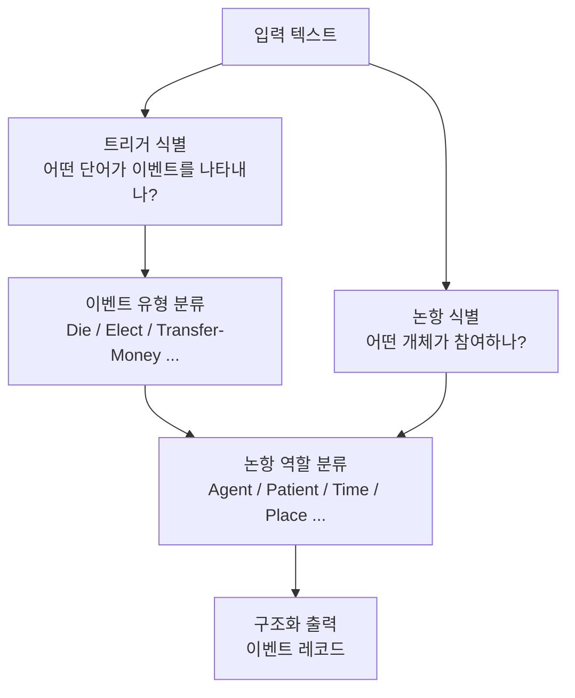

# 이벤트 추출 (Event Extraction)

이벤트 추출(Event Extraction, EE)은 텍스트에서 **무슨 일이 일어났는가**를 구조화된 형태로 파악하는 정보 추출 태스크다. 단순히 "어떤 개체가 있다"(NER) 또는 "개체 간 관계는 무엇인가"([[relation-extraction]])를 넘어서, **사건(event)의 발생과 그 참여자들**을 식별하고 분류한다.

## 핵심 구성 요소

이벤트 추출은 크게 두 단계의 식별 문제로 구성된다:

### 트리거(Trigger) 식별

트리거는 이벤트의 발생을 가장 직접적으로 나타내는 단어(또는 구)다. 보통 동사나 명사가 트리거 역할을 한다.

> 예시: "**회사**가 직원 200명을 **해고**했다."
> - 트리거: **해고** (이벤트 유형: Personnel:End-Position)

### 논항(Argument) 식별

논항은 이벤트에 참여하는 개체와 그 역할(argument role)이다.

| 논항 | 역할 |
|------|------|
| 회사 | Agent(행위자) |
| 직원 200명 | Patient(대상) |

## 이벤트 추출의 분류 체계

이벤트 유형은 도메인별로 온톨로지를 정의하여 사용한다.

**ACE(Automatic Content Extraction) 온톨로지** 예시:
- Life 이벤트: Be-Born, Die, Injure, Marry ...
- Movement 이벤트: Transport ...
- Transaction 이벤트: Transfer-Money, Transfer-Ownership ...
- Personnel 이벤트: Start-Position, End-Position, Elect ...



위 다이어그램은 이벤트 추출의 두 트랙 처리를 나타낸다. 트리거와 논항 식별이 병렬로 진행되며, 최종적으로 이벤트 유형 + 논항 역할이 결합되어 구조화된 레코드로 출력된다.

## 주요 접근 방식

### 파이프라인(Pipeline) 방식

트리거 탐지 -> 이벤트 유형 분류 -> 논항 식별 -> 논항 역할 분류의 순차적 처리. 단계별 오류가 전파되는 **오류 전파(error propagation)** 문제가 있다.

### 공동 학습(Joint) 방식

트리거와 논항을 동시에 예측하여 상호 정보를 공유한다. 일반적으로 파이프라인보다 성능이 높지만 구현이 복잡하다.

### 생성 모델 기반

최근에는 입력 텍스트를 받아 이벤트 레코드를 직접 생성하는 seq2seq 방식이 주목받는다. 대규모 언어모델(LLM)에 프롬프트를 주어 이벤트를 추출하거나, BART/T5 기반의 생성 모델을 파인튜닝하는 방식이다.

```python
# 생성 기반 이벤트 추출 예시 (프롬프트 방식)
prompt = """
다음 문장에서 이벤트를 추출하라.
이벤트 유형: [Die, Injure, Transport, Elect, ...]
형식: {트리거: ..., 유형: ..., 논항: [{개체: ..., 역할: ...}]}

문장: "김 대통령이 서울에서 취임했다."
"""
```

## 벤치마크 데이터셋

| 데이터셋 | 도메인 | 규모 | 특징 |
|----------|--------|------|------|
| ACE 2005 | 뉴스 | 599문서 | 표준 영어 벤치마크 |
| ERE | 뉴스 | - | ACE 단순화 버전 |
| RAMS | 뉴스 | 9,124 이벤트 | 멀티문서 논항 |
| WikiEvents | Wikipedia | 246문서 | 문서 수준 EE |
| MAVEN | Wikipedia | 4,480문서 | 168개 이벤트 유형 |

## 이벤트 추출과 정보 추출 파이프라인

이벤트 추출은 [[relation-extraction]]과 함께 **정보 추출 파이프라인**의 고급 레이어를 구성한다. 엔티티([[named-entity-recognition]])가 "누가/무엇이"를 파악한다면, 관계 추출은 "둘 사이가 어떤가"를, 이벤트 추출은 "무슨 일이 일어났나"를 다룬다.

실무 활용 시나리오:
- **금융**: "기업 합병" 이벤트에서 인수자, 피인수자, 금액, 날짜 자동 추출
- **의료**: "약물 투여" 이벤트에서 약물명, 용량, 환자, 부작용 추출
- **뉴스 모니터링**: 특정 유형의 사건(선거, 재난, 테러) 자동 탐지 및 요약
- **지식 그래프 구축**: 이벤트 레코드를 트리플 형태로 지식베이스에 적재

## 주요 과제

1. **낮은 자원(Low-resource)**: 이벤트 온톨로지 정의 및 주석 비용이 매우 높아 학습 데이터가 부족
2. **도메인 이전(Domain transfer)**: 뉴스 도메인에서 학습된 모델이 의료/법률 도메인에서 성능 급락
3. **문서 수준 EE**: 단일 문장을 넘어 여러 문단에 걸친 이벤트와 논항 인식
4. **이벤트 공지시(Event coreference)**: 같은 이벤트를 다르게 표현한 텍스트를 묶는 문제

## 관련 문서

- [[relation-extraction]] - 개체 간 관계 추출, EE와 유사한 구조적 접근
- [[named-entity-recognition]] - EE의 선행 단계, 논항이 되는 개체를 먼저 식별
- [[information-extraction-pipeline]] - NER, RE, EE를 통합하는 전체 파이프라인 구조
