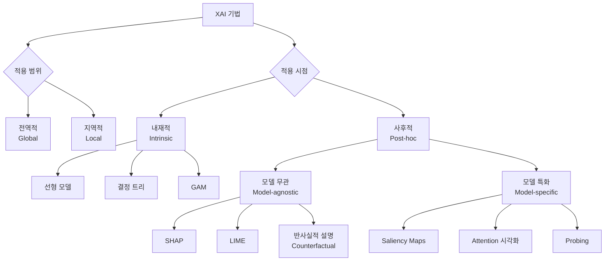

# 설명 가능한 AI (Explainable AI, XAI)

## 정의

설명 가능한 AI(XAI, eXplainable AI)는 AI 모델의 예측·결정 근거를 인간이 이해할 수 있는 형태로 제공하는 기법과 연구 분야를 통칭한다. 단순히 "블랙박스" 모델의 출력을 신뢰하는 것을 넘어, 모델이 왜 그런 결론에 도달했는지 추적·검증할 수 있게 한다.

## 해석가능성 vs 설명가능성

두 용어는 종종 혼용되지만 엄밀히 다른 개념이다:

| 속성 | 해석가능성 (Interpretability) | 설명가능성 (Explainability) |
|------|-------------------------------|------------------------------|
| 초점 | 모델 내부 구조 자체를 이해 | 특정 예측의 근거를 사후에 제공 |
| 시점 | 모델 설계 단계부터 | 학습 완료 후 |
| 예시 | 선형 회귀, 결정 트리 | LIME, SHAP, 어텐션 시각화 |
| 범위 | 전체 모델 | 특정 입력-출력 쌍 |

해석가능한(interpretable) 모델은 자동으로 설명 가능하지만, 역은 성립하지 않는다. 복잡한 신경망은 해석이 어렵지만 SHAP/LIME 같은 사후(post-hoc) 기법으로 설명을 제공할 수 있다.

## XAI 기법 분류

XAI 기법은 적용 범위(전역/지역)와 적용 시점(내재적/사후적) 두 축으로 분류된다.

## 주요 기법 상세

### SHAP (SHapley Additive exPlanations)

게임 이론의 Shapley 값을 활용해 각 입력 피처가 예측값에 기여한 양을 계산한다. 일관성(consistency)과 지역 정확성(local accuracy)을 수학적으로 보장한다. 계산 비용이 높지만 TreeSHAP 등 근사 구현이 발전하고 있다.

### LIME (Local Interpretable Model-agnostic Explanations)

특정 예측 주변에서 단순한 해석 가능 모델(선형 모델 등)로 국소 근사를 생성한다. 임의의 블랙박스 모델에 적용 가능하지만, 근방 샘플링 방식에 따라 결과가 불안정할 수 있다.

### 현저성 지도 (Saliency Maps)

이미지 분류 등의 모델에서 입력 픽셀이 예측에 미치는 영향을 기울기(gradient)로 계산해 시각화한다. Grad-CAM, Integrated Gradients 등 다양한 변형이 있다.

### 어텐션 시각화 (Attention Visualization)

Transformer 기반 모델의 [[self-attention-mechanism|셀프 어텐션]] 가중치를 시각화해 모델이 어떤 토큰/영역에 집중했는지 확인한다. 단, 어텐션 가중치 = 설명이라는 등식은 논쟁 중 ("Attention is not explanation").

### 반사실적 설명 (Counterfactual Explanations)

"입력의 어떤 부분을 바꾸면 결과가 달라졌을까?"를 답한다. 예: "소득이 5만 달러 더 높았다면 대출이 승인됐을 것입니다." 규제 대응에 특히 유용하다.

## LLM과 기계론적 해석가능성 (Mechanistic Interpretability)

대규모 언어 모델(LLM)에서는 전통적인 XAI 기법을 넘어 **기계론적 해석가능성(mechanistic interpretability)**이라는 심층 접근이 등장했다. [[mechanistic-interpretability-circuits|회로 해석가능성(circuits)]] 연구는 모델 내부의 특정 기능(예: 간접 목적어 식별, 숫자 연산)을 수행하는 서브네트워크 "회로"를 역공학(reverse engineering)한다.

[[sparse-autoencoders-mech-interp|희소 오토인코더(SAE)]]는 LLM의 활성화 공간에서 해석 가능한 특징(feature)을 추출하는 유망한 도구로 주목받고 있다. 이는 기존 SHAP/LIME 방식이 가정하는 "입력 피처 중요도"와 달리, 모델 내부 표현 자체를 해석한다는 점에서 차별화된다.

## 규제 배경

XAI는 기술적 필요를 넘어 법적 요구 사항이 되고 있다:

- **EU AI Act**: 고위험 AI 시스템에 대해 인간이 이해 가능한 설명 제공을 의무화
- **EU GDPR 제22조**: 자동화된 결정에 대한 설명을 요구할 권리 ("right to explanation")
- **금융 규제**: 신용 평가, 대출 심사 등에서 거절 사유 설명 의무

고위험 도메인(의료, 금융, 형사사법)에서는 XAI가 모델 채택의 전제 조건이 되는 추세다.

## 실무 적용 관점

XAI는 다음 상황에서 특히 가치가 있다:

- **모델 디버깅**: 예상치 못한 예측이 발생했을 때 원인을 파악
- **편향 탐지**: 특정 피처(성별, 인종 등)가 예측에 부당하게 영향을 주는지 확인
- **도메인 전문가 신뢰 구축**: 의사, 법관 등이 AI 보조 결정을 검토할 때 근거 제공
- **규제 컴플라이언스**: 위의 법적 요구 충족

XAI 도구가 완벽한 해석을 보장하지는 않으며, 설명 자체도 근사(approximation)라는 점을 염두에 두어야 한다.

## 관련 문서

- [[mechanistic-interpretability-circuits|기계론적 해석가능성 (회로)]]
- [[mechanistic-interpretability-2026|기계론적 해석가능성 2026]]
- [[sparse-autoencoders-mech-interp|희소 오토인코더 (SAE)]]
- [[self-attention-mechanism|셀프 어텐션 메커니즘]]
- [[sails-interpretable-safety-paper|SAILS 해석 가능 안전성 논문]]
