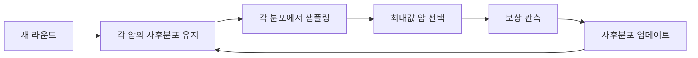
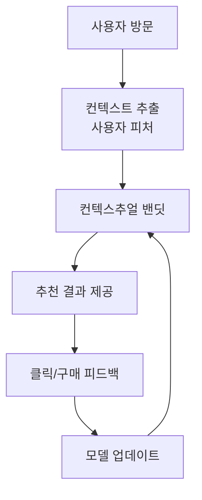

# 탐색-활용 딜레마 (Explore-Exploit Tradeoff & Bandit)

## 개념 요약

탐색-활용 딜레마(explore-exploit tradeoff)는 강화학습 및 의사결정 시스템에서 가장 근본적인 문제 중 하나다. 이미 알고 있는 좋은 선택지를 계속 활용(exploit)할 것인지, 아직 덜 시도해본 선택지를 탐색(explore)하여 더 나은 보상을 발견할 것인지 사이에서 균형을 찾는 문제다.

멀티암드 밴딧(Multi-Armed Bandit, MAB) 문제는 이 딜레마를 가장 순수한 형태로 추상화한 수학적 프레임이다. 슬롯머신(밴딧)을 여러 대 앞에 두고, 각 머신의 진짜 보상 분포를 모르는 상태에서 누적 보상을 최대화하는 전략을 학습하는 상황을 모델링한다.

## 핵심 용어

- **리그렛(Regret)**: 최선의 행동을 항상 선택했을 때 얻을 보상과 실제 얻은 보상의 차이. 알고리즘 성능의 핵심 지표
- **암(Arm)**: 선택 가능한 행동 또는 옵션
- **보상(Reward)**: 특정 암을 선택했을 때 얻는 값 (확률적으로 분포)

## 주요 알고리즘

### 엡실론-그리디 (epsilon-greedy)

가장 단순한 접근법. 확률 $\varepsilon$으로 무작위 탐색, 확률 $1-\varepsilon$으로 현재 최선 활용.

$$a_t = \begin{cases} \arg\max_a \hat{\mu}_a & \text{with prob. } 1-\varepsilon \\ \text{random} & \text{with prob. } \varepsilon \end{cases}$$

단점: 시간이 지나도 탐색 비율이 줄지 않으며, 불확실성을 무시한다.

### UCB (Upper Confidence Bound)

불확실성이 높은 암을 더 적극적으로 탐색하는 원칙. "낙관적 불확실성 하에서의 행동(optimism in the face of uncertainty)"을 구현한다.

$$a_t = \arg\max_a \left( \hat{\mu}_a + \sqrt{\frac{2 \ln t}{N_a}} \right)$$

- $\hat{\mu}_a$: 암 $a$의 추정 평균 보상
- $N_a$: 암 $a$를 선택한 횟수
- $t$: 전체 라운드 수

선택 횟수가 적을수록 신뢰 구간이 넓어져 더 자주 선택된다. 이론적으로 리그렛이 $O(\log T)$로 증명된다.

### 톰슨 샘플링 (Thompson Sampling)

베이지안 접근법. 각 암의 보상 분포에 대한 사후 분포(posterior)를 유지하고, 매 라운드 각 분포에서 샘플링한 값이 가장 높은 암을 선택한다.

베타-베르누이 밴딧의 경우:
- 암 $a$가 $\alpha_a$번 성공, $\beta_a$번 실패했다면 사후 분포는 $\text{Beta}(\alpha_a, \beta_a)$
- 매 라운드 각 암에서 샘플 $\theta_a \sim \text{Beta}(\alpha_a, \beta_a)$를 뽑아 $\arg\max_a \theta_a$ 선택

UCB보다 실무에서 성능이 좋은 경우가 많으며, 자연스러운 불확실성 정량화가 장점이다.

위 다이어그램은 톰슨 샘플링의 순환적 업데이트 흐름을 나타낸다.

## 컨텍스추얼 밴딧 (Contextual Bandit)

순수 밴딧의 확장. 매 라운드 컨텍스트(문맥 정보) $x_t$가 주어지고, 이를 활용해 암을 선택한다. 추천 시스템에서 사용자 피처가 컨텍스트 역할을 한다.

LinUCB는 대표적인 컨텍스추얼 밴딧 알고리즘으로, 보상이 컨텍스트의 선형 함수라 가정하고 UCB 방식으로 탐색한다.

## 추천 시스템 응용

밴딧 알고리즘은 추천 시스템의 온라인 학습 프레임워크로 널리 쓰인다.

| 시나리오 | 밴딧 요소 매핑 |
|----------|--------------|
| 콘텐츠 추천 | 암 = 추천 아이템 |
| A/B 테스트 | 암 = 실험 변형 |
| 광고 노출 | 암 = 광고 크리에이티브 |
| 검색 랭킹 | 암 = 랭킹 전략 |

오프라인 배치 학습과 달리 실시간 피드백 루프를 통해 탐색-활용을 동시에 수행할 수 있다는 것이 핵심 이점이다.

## 실무 고려사항

- **탐색 비용**: 탐색은 단기적으로 보상 손실을 유발. 비용이 높은 환경(의료, 금융)에서는 안전 탐색(safe exploration) 고려
- **지연 피드백**: 추천 클릭 후 구매까지 시간 지연이 있는 경우 업데이트 타이밍 조정 필요
- **비정상성(non-stationarity)**: 사용자 취향이 변하면 오래된 관측값의 가중치를 낮추는 슬라이딩 윈도우 또는 할인 UCB 사용
- **배치 업데이트**: 대규모 시스템에서는 라운드마다 갱신하는 대신 미니배치로 업데이트

## 관련 문서

- [[q-learning-dqn]] - 상태-행동 공간이 있는 풀 강화학습으로의 확장
- [[recommendation-systems-dl]] - 딥러닝 기반 추천 시스템에서의 밴딧 응용
- [[bayesian-inference]] - 톰슨 샘플링의 베이지안 이론적 배경
