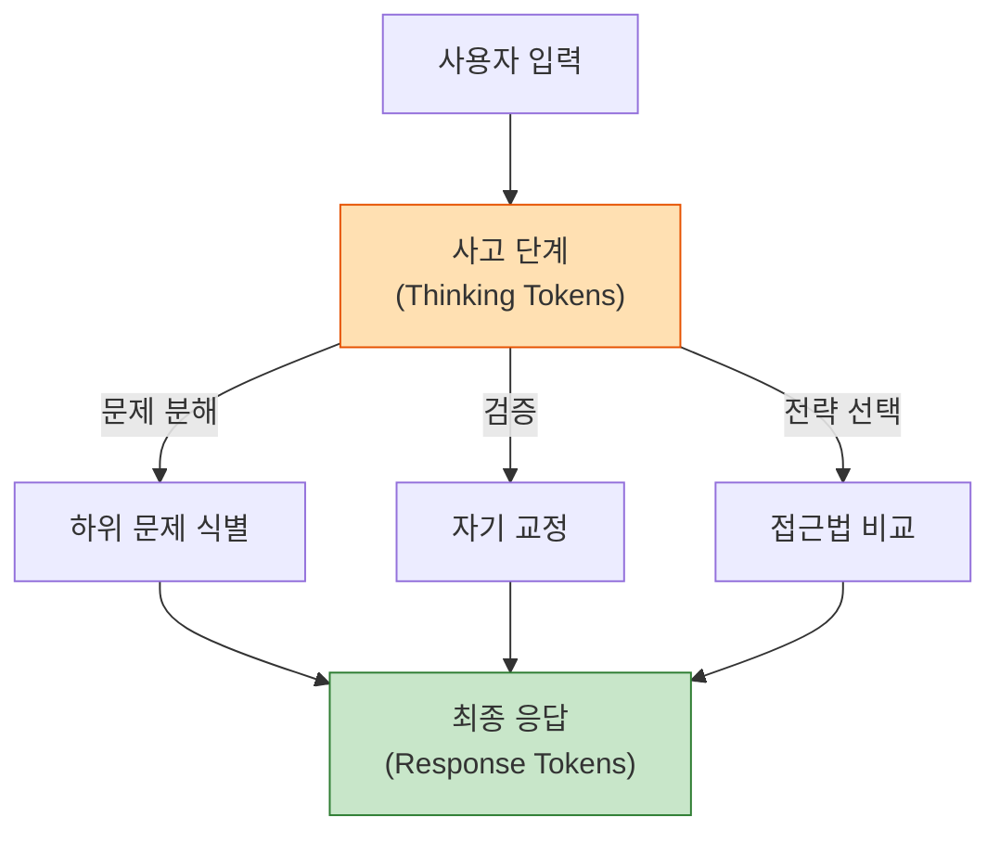

# 확장된 사고 (Extended Thinking)

## 정의

확장된 사고(Extended Thinking)는 LLM이 최종 응답을 생성하기 전에 **내부적으로 단계별 추론 과정을 수행하는 기능**을 말한다. 모델이 "생각하는 토큰(thinking tokens)"을 별도로 생성하여 문제를 분석, 분해, 검증한 후 응답하므로, 복잡한 수학, 코딩, 논리 추론 작업에서 정확도가 크게 향상된다.

이 개념은 [[test-time-compute-scaling|추론 시간 연산 스케일링]]의 실용적 구현이다. 학습 시점이 아닌 추론 시점에 더 많은 연산을 투입하여 성능을 끌어올리는 전략이며, [[chain-of-thought-paper|Chain-of-Thought]] 프롬프팅의 아이디어를 모델 아키텍처 수준으로 내재화한 것이다.

## 핵심 메커니즘

### 사고 토큰(Thinking Tokens)

확장된 사고를 지원하는 모델은 응답 생성 전에 **사고 토큰**이라는 별도의 토큰 시퀀스를 생성한다. 이 토큰들은 모델이 문제를 내부적으로 처리하는 "작업 메모리(working memory)" 역할을 한다.

사고 토큰은 문제 분해, 자기 교정, 전략 선택 등의 과정을 거친 후 최종 응답 토큰이 생성되는 2단계 구조를 보여준다.

핵심 특징:

- 사고 토큰은 사용자에게 **직접 노출되지 않는** 경우가 많다 (모델/API에 따라 다름)
- API 응답에서 `thinking` 블록으로 분리되어 반환
- 사고 토큰도 출력 토큰으로 과금되므로 비용 요소

### 사고 예산(Thinking Budget)

모델이 사고에 사용할 수 있는 최대 토큰 수를 제한하는 파라미터다.

- 예산이 클수록 더 깊은 추론이 가능하지만 지연 시간과 비용 증가
- 간단한 질문에는 적은 예산, 복잡한 문제에는 큰 예산을 동적으로 할당하는 것이 효율적
- Anthropic API의 경우 `max_tokens`와 별도로 `thinking.budget_tokens` 파라미터를 제공

## 주요 구현 비교

### Claude Extended Thinking

Anthropic의 Claude 3.5 Sonnet 이후 모델에 도입된 기능이다.

- **명시적 thinking 블록**: API 응답에서 `thinking` 타입의 content block이 분리되어 반환
- **예산 제어**: `thinking.budget_tokens` 파라미터로 사고 토큰 상한 설정
- **스트리밍 지원**: 사고 토큰도 스트리밍으로 실시간 확인 가능
- **도구 사용과 결합**: 확장된 사고 중 도구 호출을 수행하여 외부 정보를 사고 과정에 통합

### OpenAI o-시리즈 (o1, o3, o4-mini)

OpenAI의 [[ai-reasoning-models|추론 모델]] 시리즈는 확장된 사고를 핵심 설계 원칙으로 삼는다.

- **숨겨진 사고 과정**: o1 초기에는 사고 과정을 사용자에게 전혀 노출하지 않았으며, 이후 요약(summary)만 제공
- **강화학습 기반 추론**: 단순한 CoT가 아니라 RL로 학습된 추론 전략을 사용
- **자동 예산 조절**: 문제 난이도에 따라 모델이 스스로 사고 토큰 양을 조절 (o3의 "reasoning effort" 파라미터)
- **o4-mini**: 작은 모델에서도 확장된 사고를 적용하여 비용 효율적 추론 제공

### 비교 요약

| 특성 | Claude Extended Thinking | OpenAI o-시리즈 |
|------|------------------------|----------------|
| 사고 과정 노출 | thinking 블록으로 전문 공개 | 요약만 공개 (o1), 점진적 공개 확대 |
| 예산 제어 | 사용자가 budget_tokens 설정 | reasoning_effort (low/medium/high) |
| 학습 방식 | SFT + RLHF 기반 | RL 기반 추론 전략 학습 |
| 도구 사용 | 사고 중 도구 호출 가능 | o3부터 도구 사용 통합 |
| 스트리밍 | thinking 토큰 스트리밍 지원 | reasoning summary 스트리밍 |

## 추론 시간 연산 스케일링과의 관계

확장된 사고는 [[test-time-compute-scaling|추론 시간 연산 스케일링]]의 가장 직접적인 구현이다.

전통적인 LLM 성능 향상 전략은 학습 시간 연산(training-time compute)에 집중했다 -- 더 많은 데이터, 더 큰 모델, 더 긴 학습. 확장된 사고는 이와 반대로 **추론 시점에 연산을 추가 투입**하는 전략이다.

핵심 인사이트는 **사고에 투입하는 연산이 증가할수록 성능이 로그 스케일로 향상**한다는 것이다. 이는 학습 데이터의 스케일링 법칙과 유사한 패턴을 보이며, "test-time scaling law"라고 불린다.

## 사고 추적(Thinking Traces)

사고 추적은 모델의 내부 추론 과정을 기록한 것으로, 디버깅과 신뢰성 확보에 핵심적이다.

### 활용 방법

1. **디버깅**: 모델이 틀린 답을 낸 경우, 사고 추적에서 추론 오류 지점을 식별
2. **품질 평가**: 사고 과정의 논리적 일관성, 자기 교정 빈도 등을 분석
3. **프롬프트 최적화**: 사고 패턴을 분석하여 어떤 지시가 더 효과적인 추론을 유도하는지 파악
4. **안전성 검증**: 모델이 유해한 추론 경로를 거치지 않는지 확인

### 한계와 논쟁

- **Faithful Reasoning 문제**: 모델이 표시하는 사고 과정이 실제 내부 계산과 일치하는지 보장할 수 없음
- **사후 합리화(Post-hoc Rationalization)**: 이미 결론을 내린 후 그럴듯한 사고 과정을 생성할 가능성
- **보안 리스크**: 사고 추적에 민감한 추론 과정이 노출될 수 있음

## 실무 활용 패턴

### 효과적인 사용 시나리오

- **수학/과학 문제**: 다단계 계산, 증명, 공식 도출
- **복잡한 코딩**: 알고리즘 설계, 버그 원인 추적, 아키텍처 결정
- **분석 과제**: 여러 정보원을 교차 비교하여 결론 도출
- **의사결정 지원**: 장단점 분석, 시나리오 비교

### 비효율적인 사용 시나리오

- 단순한 사실 조회 ("프랑스의 수도는?")
- 짧은 텍스트 생성 (이메일 인사말, 간단한 번역)
- 창의적 글쓰기 (사고 과정이 오히려 창의성을 제약할 수 있음)

### 비용 최적화

확장된 사고는 토큰 소비가 일반 응답의 3-10배에 달할 수 있다. 실용적 접근법:

1. **라우팅(Routing)**: 쿼리 복잡도를 먼저 평가하여, 단순 쿼리는 표준 모델, 복잡한 쿼리만 확장된 사고 모델로 라우팅
2. **동적 예산 할당**: 문제 유형에 따라 사고 예산을 차등 설정
3. **캐싱**: 동일하거나 유사한 질문에 대한 사고 결과를 캐싱하여 재사용

## 관련 문서

- [[ai-reasoning-models]] -- o1/o3 등 추론 모델 패러다임 개요
- [[test-time-compute-scaling]] -- 추론 시간 연산 스케일링의 이론적 배경
- [[chain-of-thought-paper]] -- Wei et al.의 원조 Chain-of-Thought 연구
- [[prompt-engineering]] -- 사고 유도를 위한 프롬프트 기법
- [[self-consistency-decoding]] -- 다중 추론 경로의 일관성 기반 디코딩
