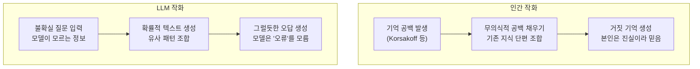
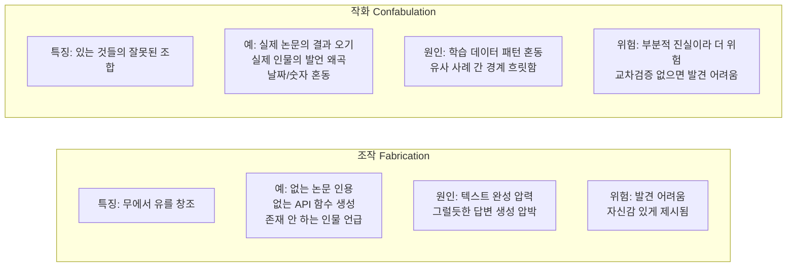
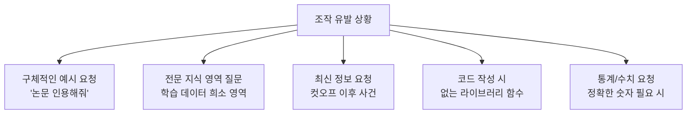
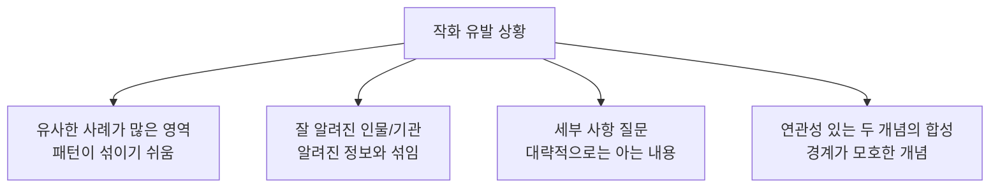
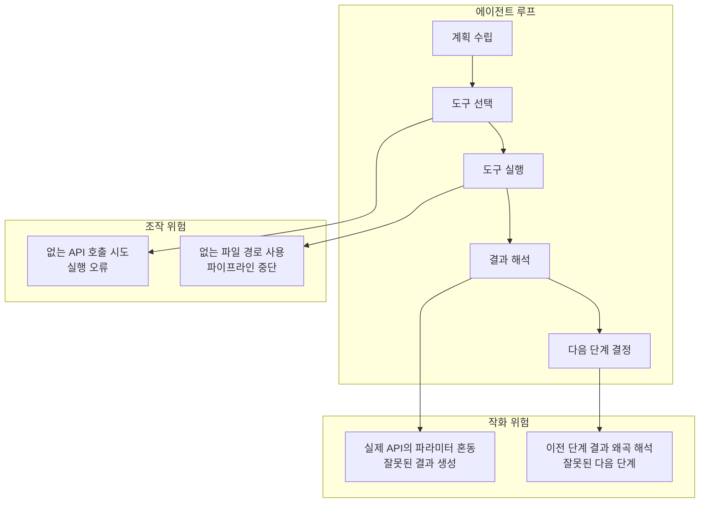

# 환각: 조작(Fabrication) vs 작화(Confabulation)

## 정의 / 본질

[[hallucination]](환각)은 LLM이 사실이 아닌 정보를 생성하는 현상을 총칭한다. 그런데 "사실이 아닌 정보"가 생성되는 방식과 원인은 하나가 아니다. 이를 보다 정밀하게 이해하기 위해 의학·심리학 용어를 차용한 두 개념을 구분한다:

- **조작(Fabrication)**: 모델이 완전히 없는 정보를 **창조**하는 것. 존재하지 않는 논문, 없는 API, 없는 인물을 만들어내는 행위.
- **작화(Confabulation)**: 모델이 기존 지식 조각들을 **무의식적으로 잘못 조합**하여 그럴듯한 오류를 생성하는 것. 거짓말 의도 없이 일어나는 인지적 충전(gap filling).

이 구분은 단순한 학술적 분류가 아니라, **서로 다른 완화 전략이 필요하다는 실용적 함의**를 갖는다.

---

## 의학/심리학 용어의 차용

### 인간 심리학에서의 Confabulation

작화(confabulation)는 원래 신경심리학 용어로, 기억 손상 환자가 기억의 공백을 채우기 위해 의도치 않게 허구의 이야기를 생성하는 현상을 말한다. 코르사코프 증후군(Korsakoff syndrome) 환자에서 잘 관찰된다.

핵심은 **의도성 없음**이다. 환자는 자신이 거짓말을 하고 있다고 인식하지 못한다. 뇌가 불완전한 기억을 그럴듯한 서사로 "수리"하는 자동적 과정이다.

### LLM에의 적용

LLM의 작화는 이와 유사한 메커니즘으로 발생한다. 모델이 정확한 답을 알지 못할 때, 확률적 언어 생성 과정이 관련 있어 보이는 정보 조각들을 연결하여 그럴듯한 답을 "수리"한다.



---

## 조작 vs 작화 비교



### 구체적 예시 비교

| 구분 | 조작(Fabrication) | 작화(Confabulation) |
|------|------------------|---------------------|
| 인용 오류 | 완전히 없는 논문 인용 | 실제 논문 제목/저자를 섞어서 인용 |
| API 오류 | 없는 함수 이름 생성 | 실제 함수의 파라미터 혼동 |
| 역사적 사실 | 없는 사건 생성 | 실제 사건의 날짜/장소 왜곡 |
| 인물 정보 | 없는 인물 생성 | 실제 인물의 발언/행적 왜곡 |
| 통계 | 완전히 없는 수치 | 관련 통계의 단위/방향 오류 |

---

## 조작이 더 쉽게 발생하는 상황



조작은 특히 **검증하기 어려운 구체성이 요구될 때** 강하게 나타난다. "어떤 논문이 있어?"라는 질문이 "그 주제에 대해 설명해줘"보다 조작 위험이 높다.

---

## 작화가 더 쉽게 발생하는 상황



작화는 **부분적으로 알고 있는 것이 있을 때** 더 자주 나타난다. 완전히 모르면 "모릅니다"라고 할 수 있지만, 반쯤 알 때 나머지를 채우는 과정에서 오류가 생긴다.

---

## 실제 사례 분석

### 코드 생성에서의 조작

```python
# 사용자 요청: pandas DataFrame에서 중복 제거 후 통계
# LLM 조작 응답 (없는 함수 생성)
import pandas as pd

df = pd.DataFrame(...)
# 없는 함수: df.deduplicate_and_summarize() 같은 것
result = df.deduplicate_and_stats(subset=["name"], keep="first")

# 올바른 코드
df_clean = df.drop_duplicates(subset=["name"], keep="first")
result = df_clean.describe()
```

`deduplicate_and_stats`는 존재하지 않는 함수다. 모델이 `drop_duplicates`와 `describe`를 알고 있지만, 단일 호출로 요청이 들어오자 없는 함수를 만들어냈다. 이것이 조작이다.

### 논문 인용에서의 작화

```
사용자: "attention mechanism에 대한 핵심 논문을 인용해줘"

작화 응답:
"Vaswani et al. (2017)의 'Attention Is All You Need' 논문에서는
트랜스포머 아키텍처를 제안했으며, 이 논문에서 최초로 multi-head
self-attention을 8개 헤드로 제안했고, 모델 크기는 65M 파라미터입니다."

실제 정보:
- 제목, 저자, 연도: 맞음
- 헤드 수(8개): 기본 모델 기준 맞음 (하지만 버전에 따라 다름)
- 파라미터 수(65M): 틀림 (기본 모델은 65M이 아님)
```

부분적으로 맞는 실제 논문에 잘못된 숫자를 섞는 것이 작화의 전형적 패턴이다.

---

## 교정 전략

### 조작 완화 전략

**1. 근거 제시 강제(Grounding)**

```python
ANTI_FABRICATION_PROMPT = """다음 규칙을 반드시 지키세요:
- 논문/책/링크를 인용할 때는 "제가 확인할 수 없어 출처를 제공할 수 없습니다"라고 명시하세요
- 없는 API나 함수를 생성하지 마세요. 잘 모르면 "확인이 필요합니다"라고 답하세요
- 구체적 수치가 확실하지 않으면 범위나 "약"을 사용하세요"""
```

**2. 검색 증강 생성(RAG)**

실시간 검색 도구를 연결해 모델이 생성하는 대신 검색하게 한다.

```python
def grounded_response(query: str, search_tool, llm) -> str:
    """검색 기반 근거 제시 응답."""
    search_results = search_tool.search(query, max_results=3)
    
    prompt = f"""다음 검색 결과만을 근거로 답변하세요.
검색 결과에 없는 내용은 "검색 결과에서 확인할 수 없었습니다"라고 하세요.

검색 결과:
{search_results}

질문: {query}"""
    
    return llm.invoke(prompt).content
```

**3. 불확실성 캘리브레이션**

모델이 확실하지 않을 때 명시적으로 표현하도록 학습·프롬프팅한다.

```python
UNCERTAINTY_PROMPT = """답변에 확신 수준을 표시하세요:
- [확실]: 직접 알고 있는 사실
- [가능성 높음]: 합리적으로 추론 가능
- [불확실]: 확인이 필요
- [모름]: 검색이나 확인 없이는 알 수 없음"""
```

### 작화 완화 전략

**1. 세부 사항 검증 요청**

```python
VERIFICATION_PROMPT = """답변에 포함된 모든 구체적 수치, 날짜, 이름을 
별도로 나열하고 각각의 확실성 수준을 표시해줘.
확실하지 않은 세부 사항은 "[검증 필요]"로 표시해."""
```

**2. 단계적 분리 응답**

일반적 설명과 구체적 사실을 분리해서 응답하도록 구성한다.

```python
TWO_STAGE_PROMPT = """
1단계: {topic}에 대해 일반적인 개념만 설명해줘 (구체적 수치, 인용 없이)
2단계: 방금 설명한 내용 중 구체적으로 확인이 필요한 부분을 목록으로 정리해줘
"""
```

**3. 자기 검증 (Self-Verification)**

```python
SELF_CHECK_PROMPT = """방금 한 답변을 다시 검토해줘.
특히 다음을 확인해:
- 언급한 날짜/숫자가 정확한가?
- 인용한 인물/출처가 실제로 존재하는가?
- 두 가지 사실을 혼동하지는 않았는가?

수정이 필요한 부분이 있으면 명시하고 수정된 답변을 제공해줘."""
```

---

## 에이전트 시스템에서의 함의

에이전트 루프에서 조작과 작화는 각기 다른 위험을 제기한다.



[[agent-self-correction]] 메커니즘이 작화보다 조작을 더 쉽게 감지한다. 없는 함수를 호출하면 즉각적인 오류 메시지가 나오지만, 실제 함수의 파라미터 혼동은 조용히 잘못된 결과를 낼 수 있다.

---

## 한계 / 비판

### 1. 경계의 모호성

실제 환각 사례를 보면 조작과 작화의 경계가 흐릿한 경우가 많다. "50% 실제 + 50% 생성"인 출처는 어디에 속하는가? 명확한 이분법이 항상 적용되지는 않는다.

### 2. 의도성 논쟁

LLM에게 "의도"를 귀속할 수 있는가 자체가 논쟁적이다. LLM이 "무의식적으로" 조작한다는 표현은 은유적일 뿐이며, 이 구분이 엄밀한 기술적 범주라기보다는 유용한 분류 도구에 가깝다.

### 3. 평가 기준 부재

현재 "이 오류가 조작인가 작화인가"를 자동으로 분류하는 표준화된 벤치마크가 없다. 연구마다 다른 기준을 사용해 비교가 어렵다.

### 4. 완화 전략의 공통성

두 유형 모두 RAG, 검증 요청, 불확실성 표현 강화로 완화된다. 구분이 실용적으로 얼마나 가치가 있는지는 사용 맥락에 따라 다르다.

---

## 관련 문서

- [[hallucination]] - LLM 환각 현상 전반
- [[agent-self-correction]] - 에이전트의 자기 오류 수정 메커니즘
- [[grounding]] - 근거 기반 응답 생성 전략
- [[confirmation-bias-llm]] - 확증 편향과 환각의 관계
- [[positional-bias-llm]] - 위치 편향이 환각에 미치는 영향
- [[llm-as-judge]] - 환각 감지를 위한 LLM 평가자 활용
