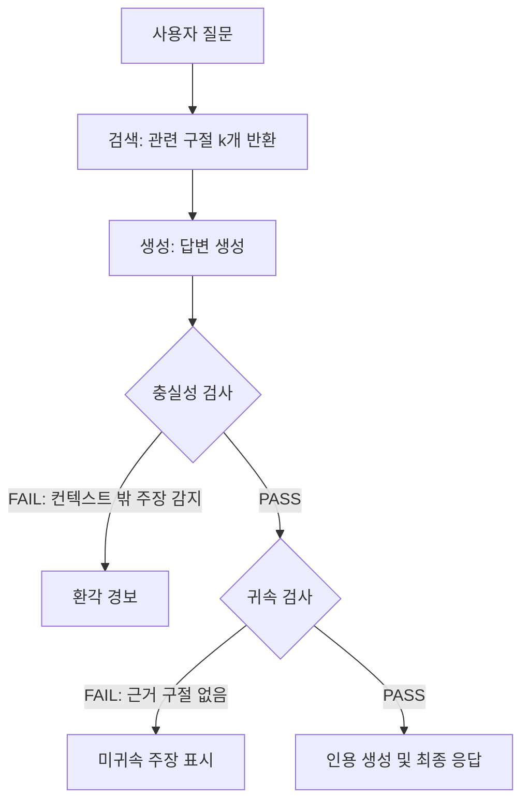

# 충실성과 출처 귀속 (Faithfulness & Attribution)

## 정의 / 본질

**충실성(faithfulness)**은 생성된 답변이 제공된 컨텍스트(입력 문서)에 *논리적으로 지지(entail)*되는지를 측정하는 성질이다. **출처 귀속(attribution)**은 그보다 한 단계 구체적으로, 답변의 각 주장(claim)이 특정 소스 구절로 *거슬러 올라갈 수 있는지*를 추적하는 능력이다.

두 개념은 밀접하지만 방향이 다르다.

- **충실성**: "이 답변이 컨텍스트에서 벗어난 내용을 만들어냈는가?" (거짓 추가 여부)
- **출처 귀속**: "이 주장은 컨텍스트의 어느 부분에서 나왔는가?" (근거 특정 가능 여부)

RAG (Retrieval-Augmented Generation) 시스템에서 두 성질이 모두 높아야 신뢰할 수 있는 답변을 제공할 수 있다. 충실성 없이 귀속만 있으면 "출처를 달았지만 틀린 요약"이 되고, 귀속 없이 충실성만 있으면 "맞는 말 같은데 어디서 나왔는지 모름"이 된다.

## 핵심 아이디어

### 충실성 - 귀속 파이프라인



위 흐름은 RAG 평가 파이프라인에서 충실성과 귀속이 순차적으로 작동하는 방식을 보여준다. 충실성이 게이트 역할을 하고, 통과 후 귀속이 출처를 특정한다.

### ATTR 지표 (Attribution Score)

**ATTR(Attribution Score)**은 답변 내 주장(claim) 중 검색된 소스 구절로 귀속(entailed)될 수 있는 비율이다.

$$\text{ATTR} = \frac{\text{귀속 가능한 주장 수}}{\text{전체 주장 수}}$$

- 값 범위: 0~1 (또는 0~100%)
- ATTR = 1.0이면 모든 주장이 소스로 거슬러 올라간다는 의미
- 단, 주장 분리(claim decomposition) 방법에 따라 값이 달라짐

주장 분리 자체도 LLM에 위임하는 방식이 일반적이며, 이로 인해 주장 분리 오류가 ATTR 측정 오류를 유발할 수 있다.

### NLI 기반 충실성 측정

**자연어 추론(NLI, Natural Language Inference)**을 활용하면 "(전제: 소스 구절) → (가설: 답변 주장)"의 수반(entailment) 관계를 분류기로 판단할 수 있다.

| NLI 레이블 | 의미 | 충실성 판정 |
|-----------|------|-------------|
| Entailment | 소스가 주장을 논리적으로 지지 | 충실함 |
| Neutral | 소스와 관련 없음 | 미지지 (귀속 불가) |
| Contradiction | 소스가 주장을 직접 반박 | 비충실 (환각 강도 높음) |

대표 NLI 모델: `cross-encoder/nli-deberta-v3-base`, `roberta-large-mnli`. 최근에는 LLM 자체를 NLI 판단기로 쓰는 방식도 보편화됨(예: G-Eval, ARES 프레임워크).

## 충실성 vs 관련 개념 비교

| 개념 | 정의 | 측정 대상 |
|------|------|-----------|
| 충실성(Faithfulness) | 생성 내용이 입력 컨텍스트에 entailed되는가 | 답변 전체 vs. 소스 전체 |
| 출처 귀속(Attribution) | 각 주장이 특정 소스 구절에 매핑되는가 | 주장 단위 vs. 구절 단위 |
| 그라운드니스(Groundedness) | 답변이 근거 있는 사실에 기반하는가 | 답변 vs. 소스·지식 전반 |
| 환각(Hallucination) | 모델이 사실과 다른 내용을 생성하는가 | 생성 내용 vs. 실세계 사실 |
| 정확성(Factuality) | 생성 내용이 실세계 사실과 일치하는가 | 생성 내용 vs. 외부 지식 |

> 핵심 구별: 충실성/귀속은 "주어진 컨텍스트"에 대한 관계이고, 환각/정확성은 "실세계 사실"에 대한 관계다. RAG 맥락에서는 컨텍스트가 신뢰할 만할 때 두 관점이 수렴한다.

## 주요 평가 프레임워크

### RAGAS (RAG Assessment)

RAGAS는 RAG 시스템 전용 평가 프레임워크로, 충실성과 답변 관련성을 LLM 기반으로 자동 측정한다.

```python
from ragas import evaluate
from ragas.metrics import faithfulness, answer_relevancy

results = evaluate(
    dataset=eval_dataset,  # question, contexts, answer 포함
    metrics=[faithfulness, answer_relevancy]
)
print(results["faithfulness"])   # 0.0 ~ 1.0
```

RAGAS 충실성 측정 단계:
1. 답변을 원자적 주장(atomic statements)으로 분해 (LLM)
2. 각 주장을 컨텍스트와 NLI 판단 (LLM)
3. Entailed 비율로 충실성 점수 산출

### ARES (Automated RAG Evaluation System)

Stanford 제안. 소량 레이블 데이터로 PPI(Prediction Powered Inference) 통계를 활용해 신뢰 구간 있는 충실성 측정.

### TruLens

오픈소스 LLM 앱 평가 도구. TruLens Eval은 충실성을 "Context Relevance", "Groundedness", "Answer Relevance" 세 지표로 분해.

## 실제 사례 / 응용

### 의료·법률 RAG에서의 귀속

고위험 도메인에서는 ATTR = 1.0에 가까운 답변만 사용자에게 제공하고, 귀속 불가 주장은 "소스에서 확인되지 않음" 표시가 필수다.

```python
def answer_with_attribution(query: str, docs: list[str]) -> dict:
    """각 주장에 소스 인덱스를 달아 반환"""
    claims = decompose_into_claims(llm_answer)
    attributed = []
    for claim in claims:
        best_doc, score = find_supporting_doc(claim, docs)
        attributed.append({
            "claim": claim,
            "source": best_doc if score > THRESHOLD else None,
            "confidence": score
        })
    return {"answer": llm_answer, "attributions": attributed}
```

### 인용 생성 (Citation Generation)

충실성이 확인된 주장에 대해 `[1]`, `[2]` 스타일 인라인 인용을 자동 삽입하는 기능. Anthropic Citations API가 대표적인 프로덕션 구현. 자세한 내용은 [[evidence-attribution]] 참조.

### 충실성 기반 리랭킹

검색 결과를 충실성 점수로 재정렬하면, 답변 가능성이 높은 구절을 LLM에 먼저 전달할 수 있다.

## 한계 / 비판

### 주장 분해 의존성

충실성 측정의 품질은 "주장을 얼마나 잘 분해했는가"에 크게 의존한다. LLM으로 분해하면 분해 단계의 오류가 충실성 측정 오류로 전파된다.

### 짧은 컨텍스트 편향

NLI 모델은 짧고 명확한 주장-구절 쌍에서 정확도가 높고, 긴 다중 홉(multi-hop) 추론이 필요한 경우 성능이 저하된다.

### 충실성 ≠ 올바른 답변

소스 자체가 틀렸다면, 충실한 답변도 사실 오류를 포함한다. 충실성은 컨텍스트 내부 일관성이지 절대적 정확성이 아님을 항상 명심해야 한다.

### ATTR 측정의 복수 소스 문제

여러 소스의 조합으로만 지지되는 주장은 단일 소스 귀속이 어렵다. 복수 소스 귀속(multi-source attribution)은 아직 표준화된 측정 방법이 없다.

## 관련 문서

- [[groundedness-evaluation]] -- 그라운드니스 평가 전반
- [[evidence-attribution]] -- 증거 귀속과 인용 생성의 구체적 구현
- [[hallucination-mitigation]] -- 환각 탐지와 완화 전략
- [[chain-of-thought-prompting]] -- CoT 답변의 충실도 문제
- [[advanced-rag-patterns]] -- RAG 고급 패턴에서 충실성 통합
