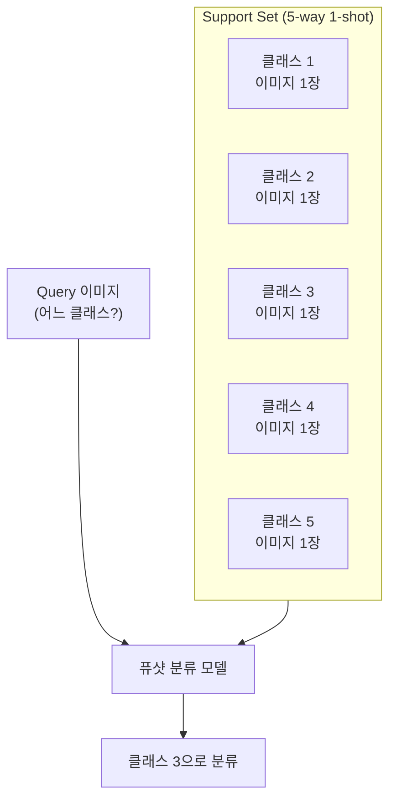
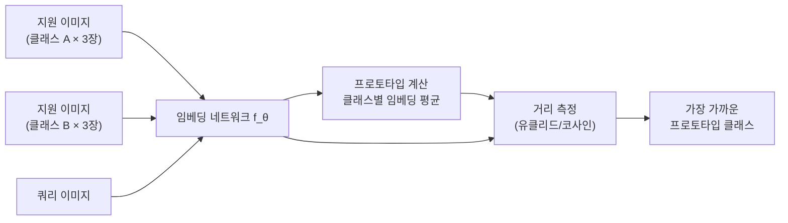
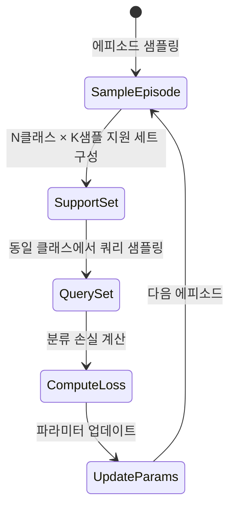

# 퓨샷 이미지 분류 (Few-Shot Image Classification)

## 개요

퓨샷 이미지 분류(Few-Shot Image Classification)는 각 클래스에 대해 극소수(1~5장)의 예시 이미지만으로 새로운 이미지를 올바르게 분류하는 태스크다. 인간은 고양이 사진 한 장만 보고도 다른 고양이를 알아보지만, 기존 딥러닝은 클래스당 수천 장의 데이터가 필요하다는 간극을 좁히는 것이 목표다.

[[few-shot-learning]] 패러다임의 핵심 응용 도메인이며, [[meta-learning-maml]]과 같은 메타러닝 기법이 강력한 접근법을 제공한다. 특히 희귀 질병 진단, 제조 불량 검출 등 데이터 수집이 어려운 영역에서 실용적 가치가 크다.

## N-way K-shot 설정

퓨샷 분류의 표준 실험 프레임워크다.

- **N-way**: 새로운 클래스 수 (예: 5-way = 5개 클래스)
- **K-shot**: 클래스당 지원 샘플 수 (예: 1-shot 또는 5-shot)
- **Support set**: 학습 시 참고하는 K개 예시 이미지
- **Query set**: 분류해야 할 새 이미지

## 주요 접근법

### 1. 메트릭 학습 (Metric Learning)

"유사한 이미지는 임베딩 공간에서 가깝다"는 원칙을 학습한다.

#### 프로토타입 네트워크 (Prototypical Networks, 2017)

각 클래스의 지원 이미지들을 임베딩해 평균(프로토타입)을 계산하고, 쿼리 이미지와의 거리로 분류한다.

$$c_k = \frac{1}{|S_k|} \sum_{(x_i, y_i) \in S_k} f_\theta(x_i)$$

$$p(y = k | x) = \frac{\exp(-d(f_\theta(x), c_k))}{\sum_{k'} \exp(-d(f_\theta(x), c_{k'}))}$$

- $c_k$: 클래스 $k$의 프로토타입 (지원 샘플 임베딩의 평균)
- $d$: 유클리드 거리 (또는 코사인 거리)
- $f_\theta$: 공유 임베딩 네트워크 (보통 ResNet)

#### 사이아미즈 네트워크 (Siamese Networks, 2015)

두 이미지를 동일한 네트워크에 통과시켜 유사도를 이진 분류(같은 클래스/다른 클래스)로 학습한다.

#### 매칭 네트워크 (Matching Networks, 2016)

어텐션 메커니즘으로 지원 샘플과 쿼리 간 어텐션 가중 합산으로 분류한다.

### 2. 최적화 기반 메타러닝

[[meta-learning-maml]](MAML, Model-Agnostic Meta-Learning)은 "적은 그래디언트 스텝으로 새 태스크에 빠르게 적응할 수 있는 초기 파라미터"를 학습한다.

$$\theta^* = \theta - \alpha \nabla_\theta \mathcal{L}_{S_i}(f_{\theta - \beta \nabla_\theta \mathcal{L}_{S_i}})$$

내부 루프(inner loop)에서 support set으로 빠른 적응, 외부 루프(outer loop)에서 query set으로 메타 학습을 수행한다.

### 3. 사전학습 + 파인튜닝

CLIP 등 대규모 사전학습 모델의 임베딩을 활용해 퓨샷 분류를 수행한다. CLIP은 텍스트 설명만으로 제로샷 분류가 가능하며, 퓨샷에서도 강력한 성능을 보인다.

## 주요 벤치마크

| 벤치마크 | 클래스 수 | 특징 |
|----------|----------|------|
| miniImageNet | 100 (meta: 20) | 가장 널리 사용 |
| tieredImageNet | 608 (계층적) | ImageNet 계층 구조 반영 |
| CUB-200 | 200 (조류) | 세밀한 분류 (fine-grained) |
| FC100 | 100 (CIFAR 기반) | 저해상도 |
| Meta-Dataset | 10개 데이터셋 | 다중 도메인 |

## 에피소딕 훈련 (Episodic Training)

퓨샷 분류 모델은 테스트 조건을 시뮬레이션하는 **에피소딕 방식**으로 훈련한다.

훈련 중 "기본 클래스(base classes)"로 에피소드를 구성하고, 테스트 시 "신규 클래스(novel classes)"로 평가한다. 두 클래스 집합은 겹치지 않는다.

## 실무 적용 관점

**왜 중요한가**: 실제 세계에서 레이블 데이터는 비싸다. 신규 제품 출시, 희귀 질병, 새로운 법적 문서 유형처럼 초기에 소수 예시만 있는 상황이 흔하다. 퓨샷 학습은 이 문제를 해결하는 실용적 경로를 제공한다.

**실무에서 어떻게 쓰이나**:
- 제조업 품질 검사: 신규 불량 유형이 출시 초기에 소수만 발생
- 의료 영상: 희귀 질환은 데이터셋 자체가 수백 건에 불과
- 로봇 비전: 새로운 물체를 배치 전 몇 장만 보고 인식
- 개인화 이미지 검색: 사용자가 좋아하는 스타일 이미지 몇 장으로 검색

## 관련 문서

- [[few-shot-learning]] - 퓨샷 학습의 일반 개념 및 패러다임
- [[meta-learning-maml]] - 최적화 기반 메타러닝 접근법
- [[clip]] - 제로샷/퓨샷 이미지 분류에 활용되는 대규모 사전학습 모델
