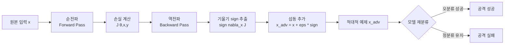

# FGSM (Fast Gradient Sign Method)

FGSM은 Ian Goodfellow 등이 2014년 "Explaining and Harnessing Adversarial Examples"에서 제안한 **단일 스텝 적대적 섭동(adversarial perturbation) 생성 기법**이다. 모델의 손실 함수에 대한 입력 기울기(gradient)의 부호(sign)를 이용해 인간이 인지하기 어려운 작은 노이즈를 추가함으로써, 분류 모델을 오분류하도록 속이는 것이 핵심 아이디어다.

## 핵심 개념

딥러닝 모델은 입력 공간에서 매우 비선형적이지만, 손실 함수를 입력에 대해 한 번 미분하면 "어느 방향으로 픽셀을 바꿀 때 손실이 가장 크게 증가하는가"를 즉시 알 수 있다. FGSM은 이 방향으로 입력을 $\epsilon$만큼 밀어 적대적 예제(adversarial example)를 만든다.

수식으로는 다음과 같이 표현한다:

$$x_{\text{adv}} = x + \epsilon \cdot \text{sign}(\nabla_x J(\theta, x, y))$$

- $x$: 원본 입력
- $y$: 정답 레이블
- $J$: 손실 함수 (예: cross-entropy)
- $\theta$: 모델 파라미터
- $\epsilon$: 섭동 강도 (보통 0.01~0.3 수준)
- $\text{sign}(\cdot)$: 기울기의 부호만 추출 (-1, 0, 1)

### 직관

모델을 학습할 때는 기울기 반대 방향으로 파라미터를 업데이트해 손실을 낮춘다. FGSM은 반대로 입력을 기울기 방향으로 이동시켜 **모델이 가장 틀리기 쉬운 방향**으로 입력을 변형한다.

## 동작 흐름



위 흐름에서 역전파는 파라미터 업데이트 없이 입력에 대한 기울기 계산만을 위해 사용된다.

## 특성과 한계

**장점**
- 단 1번의 순전파 + 역전파로 적대적 예제 생성 완료 - 계산 비용이 극히 낮음
- 표준 PyTorch/TensorFlow 코드로 몇 줄 구현 가능
- Adversarial Training의 데이터 증강 기법으로 활용 가능

**한계**
- 단일 스텝이므로 최적화되지 않은 섭동 - 방어 모델에 대해 공격 성공률이 낮음
- $\epsilon$-ball(허용 노이즈 범위) 내에서 더 강한 공격을 만들려면 반복 접근법인 [[pgd-adversarial-training]] 필요
- White-box 공격 (모델 파라미터 접근 필요) - 실제 배포 환경에서는 제한적
- 단일 스텝 특성 때문에 [[adversarial-robustness-certified]] 같은 인증된 방어 기법이 FGSM을 쉽게 무력화

## Adversarial Training에서의 역할

FGSM은 공격 도구이기도 하지만 **방어 기법**으로도 활용된다. 학습 중에 FGSM으로 생성한 적대적 예제를 원본 데이터와 혼합해 학습시키면, 모델이 이런 섭동에 더 강건해진다. 이 방식을 "FGSM Adversarial Training"이라 한다.

그러나 FGSM 적대적 학습만으로는 더 강한 반복 공격(예: PGD)에 취약하기 때문에, 실용적인 강건성을 원한다면 [[pgd-adversarial-training]] 기반의 학습이 필요하다.

## 구현 예시

```python
import torch

def fgsm_attack(model, loss_fn, x, y, epsilon=0.03):
    x_adv = x.clone().detach().requires_grad_(True)
    output = model(x_adv)
    loss = loss_fn(output, y)
    model.zero_grad()
    loss.backward()
    # 기울기의 부호만 사용해 섭동 생성
    perturbation = epsilon * x_adv.grad.sign()
    x_adv = x_adv + perturbation
    # 유효한 입력 범위로 클리핑 (이미지: 0~1)
    x_adv = torch.clamp(x_adv, 0, 1)
    return x_adv.detach()
```

## [[gradient-descent-backpropagation]] 연결

FGSM은 역전파(backpropagation)를 그대로 활용하지만, 목적이 다르다. 일반 학습에서 역전파는 모델 파라미터($\theta$)를 업데이트하기 위해 $\nabla_\theta J$를 계산한다. FGSM에서는 **입력 $x$에 대한 기울기** $\nabla_x J$를 계산해 입력 자체를 변형한다. 이 차이가 FGSM의 핵심이다.

## 실무 관점

- ImageNet 분류 모델에서 $\epsilon=8/255$ 수준의 섭동으로도 95% 이상의 모델이 오분류
- 섭동이 너무 작으면 공격 성공률 감소, 너무 크면 인간이 노이즈를 인지 - $\epsilon$ 튜닝이 중요
- [[adversarial-attacks-robustness]] 연구의 출발점으로, 이후 BIM, PGD, C&W 등 더 강한 공격 기법의 기반이 됨
- 모델 보안 평가(red-teaming) 시 FGSM 저항성은 최소 요건으로 간주

## 관련 문서

- [[adversarial-attacks-robustness]] - 적대적 공격의 전체 분류 체계
- [[pgd-adversarial-training]] - FGSM을 반복 적용한 더 강한 공격 및 학습 기법
- [[gradient-descent-backpropagation]] - FGSM이 활용하는 역전파 메커니즘
- [[adversarial-robustness-certified]] - 수학적 보장을 갖춘 방어 기법
