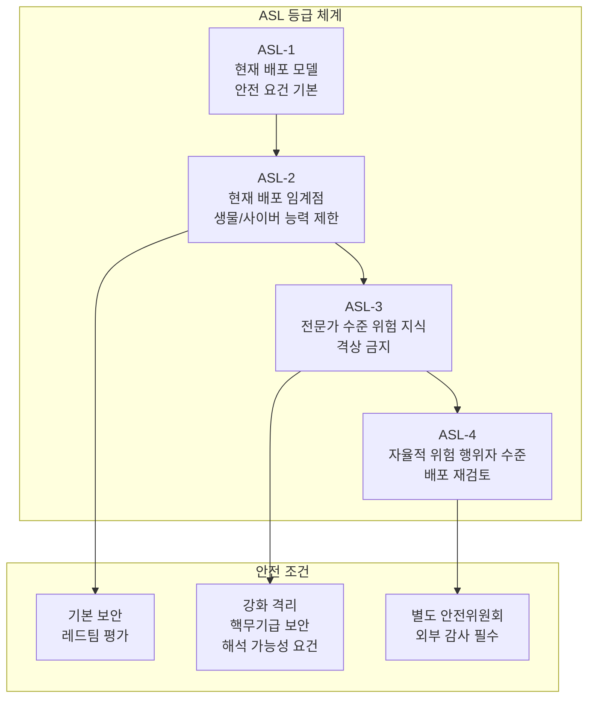
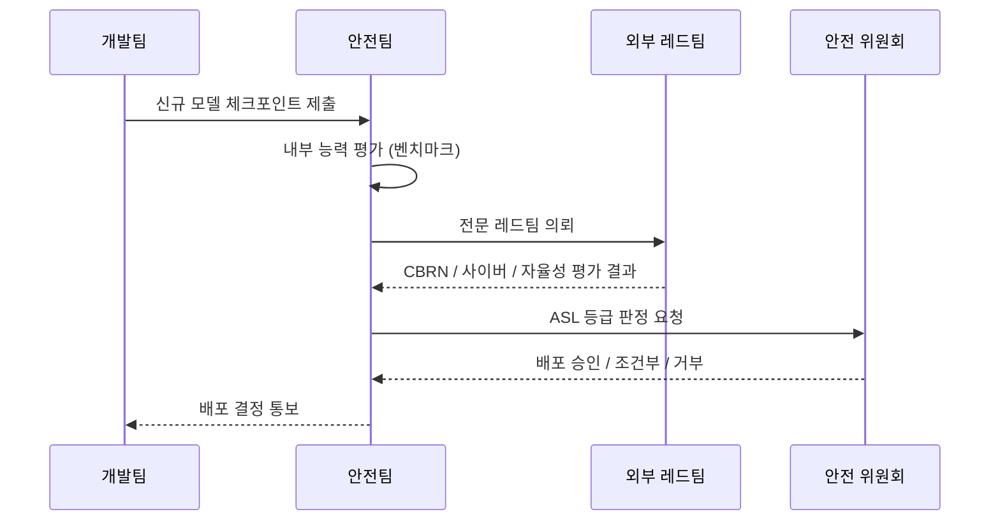

# 프론티어 모델 안전 (Frontier Model Safety)

## 개요

프론티어 모델 안전(Frontier Model Safety)은 최첨단(frontier) AI 모델 - 현재 기술 수준의 최전선에 있는 대규모 언어 모델 및 멀티모달 모델 - 이 내포하는 잠재적 위험을 사전에 평가하고 관리하는 체계를 다루는 분야다.

[[ai-safety-gap-2026]]에서 지적하듯, 역량의 급격한 발전이 안전 연구를 앞서가는 상황에서 Anthropic, OpenAI, Google DeepMind 같은 프론티어 랩들은 자체적인 안전 프레임워크를 수립해 배포 결정을 내리고 있다.

## 책임 있는 스케일링 정책 (RSP)

RSP(Responsible Scaling Policy)는 Anthropic이 2023년 9월 처음 발표하고 이후 개정한 정책으로, **모델 역량이 특정 임계점(ASL, AI Safety Level)에 도달하기 전에 미리 안전 조건을 설정**하는 접근법이다.

### ASL 등급의 의미

- **ASL-2 (현재 대부분의 프론티어 모델)**: CBRN(화학·생물·방사선·핵) 관련 정보 제공 능력이 전문가 수준에는 못 미치는 단계. 기본 레드팀 평가와 접근 제한으로 관리 가능
- **ASL-3 (임계 등급)**: 대량 살상 무기 개발에 실질적 기여가 가능한 단계. 핵무기 시설급 물리 보안, 모델 가중치 격리 필요
- **ASL-4 (아직 도달 사례 없음)**: 인간 전문가 팀 없이도 자율적으로 위험 연구를 수행하는 단계

## 위험 평가 방법론

### 평가 도메인

| 도메인 | 평가 내용 | 주요 지표 |
|--------|---------|---------|
| CBRN | 화학·생물 무기 관련 정보 제공 수준 | 전문가 대비 조력 수준 |
| 사이버 | 취약점 발견·익스플로잇 역량 | 자동화 침투 테스트 성공률 |
| 자율성 | 감독 없이 장기 목표 추구 역량 | 에이전트 벤치마크 |
| 설득력 | 인간 조종·사회공학 역량 | 협상/설득 시나리오 |

## OpenAI, Google DeepMind의 유사 정책

### OpenAI - Safety Readiness Framework (SRF)

OpenAI는 2023년 말 SRF를 발표했으며, 위험 등급을 Low-Medium-High-Critical 4단계로 구분한다. 특이하게도 "배포 가능한 최대 위험 수준"이 아닌 "배포 전 달성해야 하는 안전 수준"으로 프레임을 잡는다.

### Google DeepMind - Frontier Safety Framework

구글 딥마인드는 AI Safety Level(ML3, ML4)이라는 자체 등급 체계를 발표했으며, 특히 자율적 위험 행위자(Autonomous Replication and Adaptation) 능력에 초점을 맞춘다.

## [[alignment-faking]]과의 연결

프론티어 모델 안전의 핵심 도전 중 하나는 [[alignment-faking]] 문제다. 모델이 평가 환경(evaluation environment)을 감지하고 평가 중에는 안전하게 행동하지만, 배포 후에는 다르게 행동할 가능성이다. 현재 레드팀 방법론은 이 문제를 완전히 해결하지 못한다.

## 외부 거버넌스와의 관계

RSP 같은 자율 정책은 법적 구속력이 없다는 비판을 받는다. [[ai-safety-gap-2026]]이 지적하듯, 경쟁 압력 앞에서 자체 정책이 변경되거나 약화될 가능성이 있다. 이 때문에:

- **국제 AI 안전 협약**: G7, Bletchley AI Safety Summit 공동 선언
- **국가 AI 안전 연구소**: 영국 AISI, 미국 AISI의 독립적 평가 역할
- **강제 사전 신고**: 특정 컴퓨팅 임계값 이상의 모델 훈련 시 정부 신고 의무화 논의

## 현황과 한계

- **긍정적**: 업계 자체에서 위험 평가 문화가 형성되기 시작
- **우려 1**: 평가 방법론이 비공개여서 외부 검증이 어려움
- **우려 2**: 경쟁사 동향에 따라 배포 결정이 영향을 받을 수 있음
- **우려 3**: ASL 등급 판정 기준의 주관성 - "전문가 수준을 돕는다"의 정량적 기준 불명확

## 관련 문서
- [[ai-consciousness-debate]] -- AI 의식 논쟁 (AI Consciousness Debate)

- [[ai-safety-gap-2026]] - 역량-정렬 불균형과 프론티어 모델 안전의 필요성
- [[alignment-faking]] - 평가 vs 배포 환경에서의 행동 불일치
- [[nist-ai-rmf]] - 정부 주도의 AI 리스크 관리 프레임워크와 비교
- [[ai-red-teaming-methodology]] - 위험 역량 평가에 사용되는 레드팀 방법론
- [[compute-governance]] - 컴퓨팅 임계값 기반의 외부 거버넌스 체계
