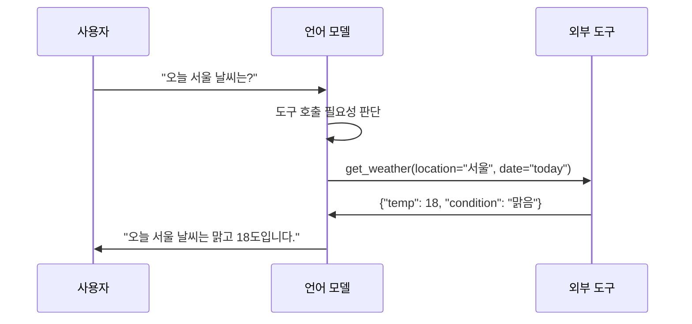

# 함수 호출과 도구 사용 (Function Calling)

## 개요

**함수 호출(function calling)** 또는 **도구 사용(tool use)** 은 LLM이 텍스트 생성을 잠시 멈추고, 미리 정의된 외부 도구(함수, API, 검색 엔진, 데이터베이스 등)를 호출해 그 결과를 다시 응답에 통합하는 기능이다.

이 기능이 없으면 LLM은 학습 당시 알고 있던 정보만 활용할 수 있는 "폐쇄된 박스"다. 함수 호출은 모델을 동적인 세계와 연결하는 핵심 인터페이스다.

## 동작 원리



1. 사용자 메시지를 받은 모델이 도구 호출이 필요한지 판단
2. JSON 형식으로 함수명과 파라미터를 출력 (실제 실행은 아님)
3. 애플리케이션 레이어가 실제 함수를 실행
4. 실행 결과를 모델 컨텍스트에 추가
5. 모델이 결과를 바탕으로 최종 응답 생성

## OpenAI 함수 호출 API

OpenAI는 2023년 6월 GPT-3.5/GPT-4에 함수 호출 기능을 도입했다. 도구를 JSON 스키마(JSON Schema)로 정의한다.

```python
tools = [
    {
        "type": "function",
        "function": {
            "name": "get_weather",
            "description": "특정 도시의 현재 날씨를 반환합니다.",
            "parameters": {
                "type": "object",
                "properties": {
                    "location": {
                        "type": "string",
                        "description": "도시명, 예: '서울', 'London'"
                    },
                    "unit": {
                        "type": "string",
                        "enum": ["celsius", "fahrenheit"]
                    }
                },
                "required": ["location"]
            }
        }
    }
]
```

`tool_choice` 파라미터로 모델의 도구 선택 방식을 제어한다:
- `"auto"`: 모델이 필요 여부 판단
- `"required"`: 반드시 도구 호출
- `{"type": "function", "function": {"name": "get_weather"}}`: 특정 함수 강제

## Anthropic 도구 사용 API

Anthropic는 Claude에서 유사한 "tool use" 기능을 제공한다. 구조는 OpenAI와 비슷하지만 메시지 형식이 다르다.

도구 결과는 `tool_result` 타입의 메시지 블록으로 반환되며, 이미지 등 다양한 콘텐츠 타입을 포함할 수 있다. computer_use 도구를 통해 브라우저·데스크탑 조작도 지원한다.

## 병렬 도구 호출 (Parallel Tool Calls)

GPT-4o부터 하나의 응답에서 여러 도구를 동시에 호출할 수 있다. 독립적인 정보 수집 작업을 병렬화해 전체 지연시간(latency)을 줄인다.

```
모델 응답:
  - 도구 호출 1: get_weather(location="서울")
  - 도구 호출 2: get_news(topic="AI")
  - 도구 호출 3: search_restaurant(city="서울", cuisine="한식")
```

세 호출이 동시에 실행되어 각각의 결과를 모아 최종 응답을 생성한다.

## 에이전트에서의 도구 사용

### ReAct 패턴

Yao et al. (2022) "ReAct: Synergizing Reasoning and Acting in Language Models". 추론(Reasoning)과 행동(Acting)을 교차 수행하는 프롬프팅 패턴이다.

```
생각: 날씨를 알아야 옷을 추천할 수 있다.
행동: get_weather(location="서울")
관찰: {"temp": 5, "condition": "눈"}
생각: 영하에 가까운 온도와 눈. 두꺼운 코트 추천.
답변: 오늘 서울은 눈이 오고 5도입니다. 두꺼운 패딩이나 코트를 입으세요.
```

### Toolformer

Schick et al. (2023) Meta AI. 언어 모델을 어떤 도구를 언제 사용할지 자기 지도 방식(self-supervised)으로 학습시키는 연구. 별도 라벨링 없이 API 호출 데이터를 자동 생성해 파인튜닝(fine-tuning) 수행.

## 도구 사용을 위한 파인튜닝

### Gorilla

Patil et al. (2023). 1,600개 이상의 API 호출 능력에 특화된 파인튜닝 모델. API 문서를 검색(retrieve) 후 정확한 호출 생성. 환각(hallucination)으로 인한 잘못된 API 호출을 줄이는 것이 핵심 목표.

### ToolBench / ToolLLaMA

Qin et al. (2023). 16,000개 실제 REST API를 포함하는 대규모 도구 사용 벤치마크 및 파인튜닝 데이터셋. GPT-4로 도구 사용 데이터를 생성하고 LLaMA를 파인튜닝.

| 모델 | 도구 수 | 학습 방식 |
|------|---------|-----------|
| Gorilla | 1,600+ API | 파인튜닝 + RAG |
| ToolLLaMA | 16,000+ API | GPT-4 증류 + 파인튜닝 |
| Claude (원래) | 정의된 도구들 | RLHF + 프롬프팅 |
| GPT-4o | 정의된 도구들 | 파인튜닝 |

## 구조화된 출력 (Structured Output)

함수 호출의 또 다른 용도는 JSON 같은 **구조화된 출력**을 강제하는 것이다. "get_structured_data"라는 가상 함수를 정의하고, 그 파라미터 스키마가 원하는 출력 구조를 정의한다.

OpenAI의 `response_format: {"type": "json_schema", ...}` 옵션과 함수 호출이 이 역할을 한다.

## MCP (Model Context Protocol)

Anthropic이 제안한 **모델 컨텍스트 프로토콜(Model Context Protocol, MCP)** 은 LLM과 외부 도구/데이터 소스를 연결하는 표준 프로토콜이다. 특정 모델 API에 종속되지 않고 어떤 클라이언트와 서버도 MCP를 구현해 상호 운용할 수 있다.

도구 정의, 리소스 접근, 프롬프트 관리를 표준화해 생태계 파편화를 줄이는 것이 목적이다.

## 관련 문서

- [[에이전트 스킬]] - 도구 사용이 에이전트 스킬 시스템에서 구현되는 방식
- [[MCP]] - 도구 연결 표준 프로토콜
- [[구조화 출력]] - 함수 호출로 구조화된 JSON 출력 강제
- [[ReAct 패턴]] - 추론과 도구 사용을 결합하는 에이전트 패턴
- [[에이전트 루프]] - 도구 호출이 통합되는 에이전트 실행 루프
