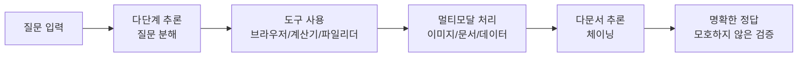

# GAIA Benchmark

GAIA(General AI Assistants)는 범용 AI 어시스턴트의 실제적 자율 능력을 평가하는 벤치마크. **466개 태스크**로 구성되며, 추론(reasoning), 멀티모달 처리(multimodal), 웹 브라우징(web browsing), 도구 사용(tool use) 등 기본 능력을 복합적으로 요구한다.

## 왜 중요한가

기존 벤치마크와의 차별점:

| 벤치마크 | 평가 대상 |
|----------|-----------|
| AgentBench | 특정 환경에서의 멀티턴 추론 |
| BFCL | 함수 호출(function calling) 정확도 |
| **GAIA** | **범용 자율성** -- 실제 세계 적용성 강조 |
| CUB | 컴퓨터 사용 능력 |

2026년 기준 독립적 평가 기준으로 GAIA와 CUB(Computer Use Benchmark)가 에이전트 자율성의 표준 척도로 자리잡았다.

## 설계 원칙

이 다이어그램은 GAIA 태스크의 전형적 풀이 흐름을 보여준다. 단순 QA가 아니라, 다단계 추론과 도구 사용, 멀티모달 처리가 결합된 복합 태스크다.

### 핵심 특성 4가지

1. **도구 사용 필수**: 브라우저, 계산기, 파일 리더 등 외부 도구 활용이 전제
2. **다단계 추론**: 단순 질의응답이 아닌 복합 추론 체인 필요
3. **실제적(grounded)**: 실세계 정보에 기반한 질문으로 환각(hallucination) 감지 가능
4. **검증 가능**: 모호하지 않은 명확한 정답이 존재하여 자동 평가 가능

## 성능 추이

| 시점 | 모델/에이전트 | 점수 |
|------|-------------|------|
| 2023 (출시) | GPT-4 + plugins | ~15% |
| 2023 | 인간 | ~92% |
| 2026.04 | 최상위 에이전트 | ~75% |

3단계 난이도로 구성되며, 최상위 에이전트도 인간 대비 약 17%p 뒤처진다. 특히 고난이도 태스크에서 격차가 크다.

## 실무 적용

- **에이전트 개발 평가**: 새로운 에이전트 아키텍처의 범용 자율성을 GAIA로 벤치마킹
- **도구 통합 검증**: 에이전트의 도구 사용 능력(브라우저, 파일 파싱 등)을 체계적으로 평가
- **진행 지표**: 연도별 GAIA 점수 추이로 AI 어시스턴트의 자율성 발전을 추적

## 관련 문서

- [[long-horizon-agent-benchmarks]] -- SWE-bench, GAIA 등 장기 에이전트 벤치마크 비교
- [[agent-trajectory-evaluation]] -- 에이전트 궤적 평가 방법론
- [[agent-benchmark-comparison-2026-04]] -- 2026년 4월 에이전트 벤치마크 비교
