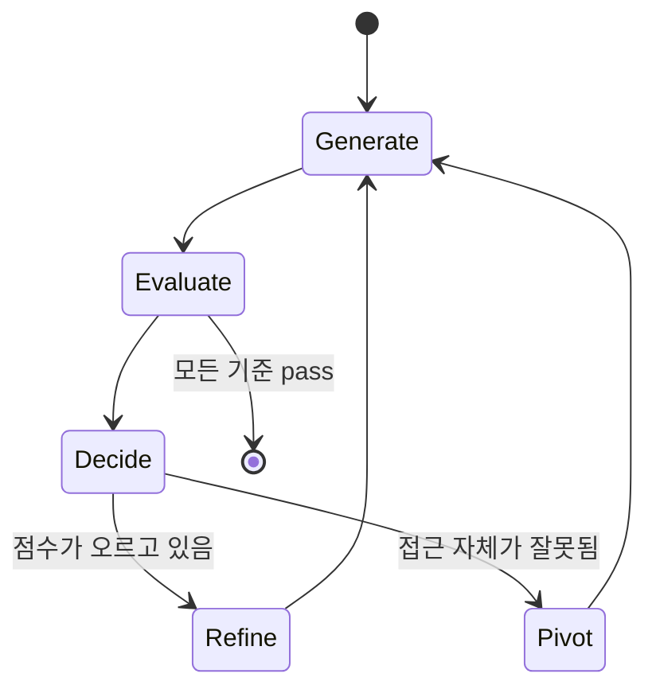

# Generator-Evaluator Architecture (생성자-평가자 아키텍처)

## 정의

**Generator-Evaluator Architecture**는 *작업을 생성하는 에이전트*와 *작업을 평가하는 에이전트*를 구조적으로 분리하는 하네스 패턴이다. GAN(Generative Adversarial Networks)의 generator/discriminator 분리에서 영감을 받았다.

두 에이전트가 같은 모델을 사용해도 상관없다. 핵심은 **두 에이전트가 서로 다른 시스템 프롬프트와 도구 집합을 갖는 독립된 컨텍스트**에서 동작한다는 점이다.

## 왜 분리해야 하는가

단일 에이전트가 자기 작업을 평가하게 하면 [[self-evaluation bias|self-evaluation bias]]가 발생한다. LLM은 자기 출력을 관대하게 평가하는 경향이 있고, 이 경향은 바이너리 검증이 없는 **주관적 태스크**(디자인, 글쓰기, 복잡한 UX 흐름)에서 특히 두드러진다.

분리의 핵심 이점:

> "tuning a standalone evaluator to be skeptical proves far more tractable than making a generator critical of its own work"

즉 evaluator도 결국 LLM이지만, "비판적인 judge 역할"로 설정하는 것이 "자기 작업에 비판적인 maker 역할"로 설정하는 것보다 훨씬 쉽다.

## 구성 요소

### Generator (생성자)

- 입력 프롬프트 또는 스펙을 받아 산출물을 만드는 역할
- 자기 작업을 QA handoff 전에 self-evaluate 할 수 있지만, 그것이 최종 판단은 아님
- 실패한 기준에 대한 evaluator의 상세 피드백을 받아 교정
- 산출물 예: 코드, 디자인, 분석 리포트, 테스트 케이스

### Evaluator (평가자)

- Generator와 **다른 시스템 프롬프트**, 가능하면 다른 도구 세트를 갖는다
- 사전에 정의된 **grading criteria**에 따라 점수와 비평을 생성
- 실패 시 구체적 피드백 (무엇이, 왜, 어떻게 실패했는가)
- 가능하면 **실행 환경 접근** 권한 — 예: Playwright로 실제 앱 클릭, 테스트 러너 실행, 런타임 로그 확인

### Grading Criteria

채점 기준은 태스크 성격에 따라 달라진다. 좋은 기준의 특징:

1. **다차원** — 단일 점수가 아니라 독립된 여러 측면 (Anthropic의 프론트엔드 예: Design Quality / Originality / Craft / Functionality)
2. **가중치 명시** — 어떤 기준이 더 중요한지 generator가 알 수 있어야 함
3. **Few-shot calibrated** — 예시와 함께 "이 정도면 8점" 같은 기준점 제공해 drift 감소
4. **Threshold 기반** — 각 기준에 hard minimum, 실패하면 pass 안 함

## 반복 루프와 전략 결정

단순한 한 방향 피드백이 아니라 **반복 루프**가 핵심이다:

매 반복 후 generator는 단순히 "버그를 고쳐라"가 아니라 **전략적 선택**을 한다:

- **Refine**: 현재 방향이 점수를 올리고 있으면 같은 방향으로 개선
- **Pivot**: 점수가 정체되거나 평범한 영역에 갇혔으면 접근 자체를 버리고 다른 aesthetic/architecture로 재출발

이 "pivot" 옵션은 특히 디자인·UX 작업에서 중요하다. Generator가 같은 지역 최적점에 갇히지 않게 하는 명시적 탈출 신호다.

## 평가자 튜닝의 어려움

분리가 해답이지만 완벽한 해결책은 아니다. 평가자 자체도 튜닝이 필요하다:

- **초기 관대함**: 평가자가 정당한 이슈를 식별한 뒤 "크게 중요하지 않다"며 승인하는 경향
- **표면 테스트**: 엣지 케이스를 probe하지 않고 해피 패스만 확인
- **일관성 drift**: 같은 실수에 대해 세션마다 다른 점수

**개선 방법**:
1. 평가자 로그를 주기적으로 읽기
2. 인간 판단과의 divergence 식별
3. Few-shot 예시와 criterion 정의를 iteratively 업데이트
4. Tool 접근 확대 — 실제 실행 권한이 있을수록 표면 테스트를 벗어나기 쉬움

## 언제 쓰는가

- **주관적 태스크** — 디자인, UX, 글쓰기, 복잡한 시스템 설계 (verifier가 없거나 약함)
- **Frontier 태스크** — 모델의 baseline 능력 경계 위에 있는 작업
- **Long-running 작업** — self-evaluation bias가 누적되어 품질이 떨어지는 경우
- **Multi-feature 구축** — 각 feature마다 evaluator의 hard threshold가 필요한 경우

### 언제 쓰지 말 것

- 태스크가 모델의 baseline capability 내에 확실히 있을 때 (overhead만 증가)
- 바이너리 verifier가 이미 있을 때 (테스트, 컴파일러, 타입 체커로 충분)
- Low-stakes iteration — 코스트와 레이턴시가 정당화되지 않음

**핵심 원칙**:

> "The evaluator is not a fixed yes-or-no decision. It is worth the cost when the task sits beyond what the current model does reliably solo."

## 다른 multi-agent 패턴과의 차이

| 패턴 | 주된 동기 | 에이전트 역할 분리 |
|---|---|---|
| **Generator-Evaluator** | Self-evaluation bias 극복 | maker vs judge |
| [[subagents]] | 컨텍스트 창 보호 | parent vs child (같은 역할) |
| Parallel workers | 처리량 증가 | 동일 역할의 복제 |
| Planner-Worker | 계획과 실행 분리 | strategy vs execution |

실제 시스템은 여러 패턴을 조합한다. 예: Anthropic 3-agent 시스템은 **Planner + Generator-Evaluator** 조합이다 ([[anthropic harness design]] 참조).

## 해석 포인트

Generator-Evaluator Architecture (생성자-평가자 아키텍처)은 **성능만이 아니라 운영 설계까지 함께 봐야 하는 축** 으로 이해할 때 가장 명확하다. 이번 source 묶음이 `arxiv.org×3, anthropic.com×2`처럼 분산돼 있다는 것은, 이 주제가 단일 주장보다 여러 층위의 검증을 거치고 있다는 뜻이다.

실무적으로는 개념 정의 자체보다 **어떤 병목을 해결하고 어떤 비용을 새로 만들까**를 묻는 편이 유익하다. 그래서 이 토픽은 통합 난이도, 관측 가능성, 운영 비용, 교체 가능성를 기준으로 비교·실험하는 식으로 다루는 것이 좋다.

## 2026년 4월 큐레이션 요약

- 정의: 생성 에이전트와 별도의 평가 에이전트를 분리해 자기평가 편향을 외부화하는 GAN 영감의 멀티 에이전트 하니스.
- 왜 중요한가: 2026년 3월 24일 Anthropic의 "Harness design for long-running application development" 글이 Sonnet 4.5의 자기평가 편향과 컨텍스트 불안(context anxiety) 문제를 정면으로 다루며 화제가 되었고, 같은 글에서 Opus 4.5의 등장으로 일부 하니스 컴포넌트를 제거할 수 있다고 밝혀 모델 진화에 따른 하니스 재설계 논의가 본격화됐다.
- 직접 수집 원문: 5개
- 주요 도메인: arxiv.org×3, anthropic.com×2

## 핵심 메커니즘

생성 에이전트와 별도의 평가 에이전트를 분리해 자기평가 편향을 외부화하는 GAN 영감의 멀티 에이전트 하니스. 이 개념은 단일 문장 정의보다 **어떤 failure mode를 설명하는지, 어떤 구조적 trade-off를 드러내는지**를 함께 볼 때 가치가 커진다.

## 핵심 포인트

Generator-Evaluator Architecture (생성자-평가자 아키텍처)는 현재 시점의 핵심 개념을 정리한 페이지다. 출발점은 이며, 직접 수집한 source 5건은 이 개념이 연구·문서·구현으로 어떻게 확장되는지 보여준다.

## source로 보면

수집된 source는 arxiv.org×3, anthropic.com×2로 분포한다. 연구 논문과 공식 문서가 함께 있어 원리와 제품화 흐름을 같이 읽을 수 있다.

## 실무 관점

개념 페이지는 용어 정의에서 끝나지 않고, 어떤 시스템 설계 문제를 해결하려고 등장했는지와 어디까지가 적용 범위인지까지 함께 봐야 한다.

## source 기반 참고

- topic packet: `raw/hot-topics-sources/2026-04-10/topics/generator-evaluator-architecture.md`

### source별 핵심 신호

- **Harness design for long-running application development \ Anthropic** (`anthropic.com`): https://www.anthropic.com/engineering/harness-design-long-running-apps
  - 메모: Harness design is key to performance at the frontier of agentic coding. Here's how we pushed Claude further in frontend design and long-running autonomous software engineering.
- **Introducing Claude Opus 4.5 \ Anthropic** (`anthropic.com`): https://www.anthropic.com/news/claude-opus-4-5
  - 메모: Our newest model, Claude Opus 4.5, is available today. It’s intelligent, efficient, and the best model in the world for coding, agents, and computer use.
- **Self-Improving AI Agents through Self-Play** (`arxiv.org`): https://arxiv.org/html/2512.02731v1
  - 메모: We extend the moduli-theoretic framework of psychometric batteries [2] to the domain of dynamical systems.
- **[2506.11442] ReVeal: Self-Evolving Code Agents via Reliable Self-Verification** (`arxiv.org`): https://arxiv.org/abs/2506.11442
  - 메모: Reinforcement learning with verifiable rewards (RLVR) has advanced the reasoning capabilities of large language models.
- **[2512.20845] MAR:Multi-Agent Reflexion Improves Reasoning Abilities in LLMs** (`arxiv.org`): https://arxiv.org/abs/2512.20845
  - 메모: LLMs have shown the capacity to improve their performance on reasoning tasks through reflecting on their mistakes, and acting with these reflections in mind.

## source 종합 해석

이 개념의 핵심은 `Generator-Evaluator Architecture는 *작업을 생성하는 에이전트*와 *작업을 평가하는 에이전트*를 구조적으로 분리하는 하네스 패턴이다. GAN(Generative Adversarial Networks)의 generator/discriminator 분리에서 영감을 받았다.`에 있지만, 실제 의미는 원문 source들이 어떤 병목·trade-off를 반복적으로 강조하는지에서 더 또렷해진다.

예를 들어 source note는 Harness design is key to performance at the frontier of agentic coding. Here's how we pushed Claude further in frontend design and long-running autonomous software engineering.

또 다른 source는 Our newest model, Claude Opus 4.5, is available today. It’s intelligent, efficient, and the best model in the world for coding, agents, and computer use.

함께 읽을 문서로는 harness engineering, self-evaluation bias, sprint contracts가 유용하다. 이 페이지가 다루는 주제의 인접 개념·구현·평가 층위를 보강해 준다.

## 실무 체크리스트

- 이 문서를 읽을 때는 이름보다 **어떤 병목을 해결하고 어떤 비용을 새로 만드는지**를 먼저 본다.
- `Generator-Evaluator Architecture는 *작업을 생성하는 에이전트*와 *작업을 평가하는 에이전트*를 구조적으로 분리하는 하네스 패턴이다. GAN(Generative Adversarial Networks)의 generator/discriminator 분리에서 영감을 받았다.`를 실제로 적용할 때는 정의 자체보다 측정 지표와 실패 모드가 무엇인지 같이 봐야 한다.
- source note가 추상 개념/실험 결과/운영 사례 중 어디에 치우쳐 있는지 보면, 이 토픽을 실무에서 어떻게 다뤄야 하는지가 드러난다.

## 관련 문서

- [[harness engineering]] — generator-evaluator는 하네스 엔지니어링의 대표 빌딩 블록
- [[self-evaluation bias]] — 분리의 동기
- [[sprint contracts]] — generator-evaluator 간 pre-coding 협상 패턴
- [[harness quadrants]] — evaluator는 "Inferential (LLM-as-a-judge)" 사분면
- [[anthropic harness design]] — 이 패턴의 대표 구현 사례
- [[subagents]] — 다른 목적의 multi-agent 패턴
- [[context anxiety]] — 분리가 간접적으로 완화하는 연관 문제
- [[load-bearing harness]] — evaluator를 언제 유지/제거할지 결정하는 메타 원칙
