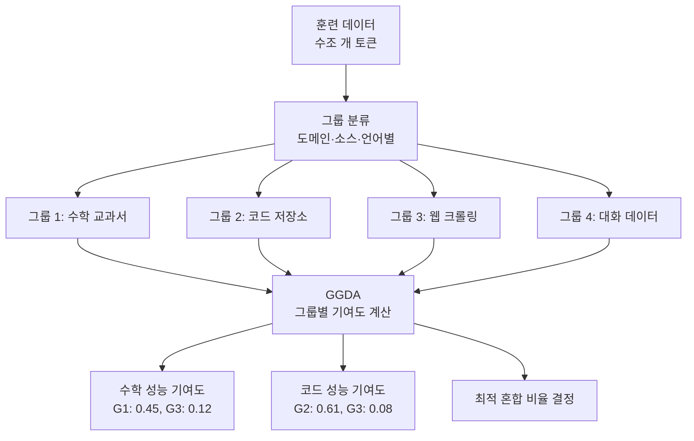
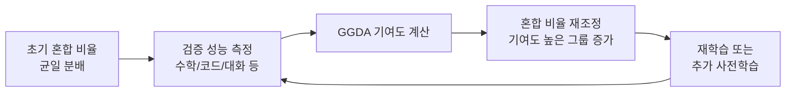

# 그룹 데이터 귀속 (GGDA)

GGDA(Group-level Gradient-based Data Attribution, 또는 Group-level Data Attribution)는 개별 훈련 데이터 샘플의 영향도를 **그룹 단위**로 집계해 훈련 성능에 대한 기여도를 분석하는 기법이다. 개별 샘플 수준 귀속(per-sample attribution)에 비해 10~50배 효율적이며, 도메인별·소스별 데이터 혼합(data mixing) 최적화에 직접 활용된다.

## 왜 데이터 귀속이 필요한가

대규모 LLM 훈련에서 수조 개의 토큰이 사용된다. 이 데이터 중 어떤 부분이 특정 능력(수학 추론, 코드 생성, 대화 능력 등)에 기여했는지 이해하면:

- 불필요하거나 해로운 데이터 소스를 식별해 제거할 수 있다
- 능력별 최적 데이터 혼합 비율을 결정할 수 있다
- 저작권 분쟁에서 특정 콘텐츠가 모델에 미친 영향을 정량화할 수 있다

## 개별 귀속 vs 그룹 귀속

기존의 개별 샘플 귀속 방법(influence functions, TracIn, TRAK 등)은 훈련 데이터의 각 샘플이 특정 테스트 예측에 미치는 영향을 계산한다. 이 방식의 문제점:

- 1조 개 샘플에 대해 각각 그래디언트를 계산하는 것은 불가능에 가깝다
- 개별 샘플 수준의 노이즈가 크고 해석하기 어렵다
- 모델 가중치에 대한 완전한 접근이 필요하다

GGDA는 샘플들을 의미 있는 그룹으로 먼저 묶은 뒤, 그룹 수준의 집계된 그래디언트를 사용한다.

## 핵심 수식

그룹 $G_k$가 모델 성능 $\mathcal{L}$에 미치는 영향:

$$\hat{\tau}_k = \sum_{i \in G_k} \nabla_\theta \mathcal{L}_{\text{val}}(\theta)^T \cdot \nabla_\theta \mathcal{L}_i(\theta)$$

이를 그룹 수준으로 집계하면:

$$\hat{\tau}_k \approx \nabla_\theta \mathcal{L}_{\text{val}}(\theta)^T \cdot \left( \sum_{i \in G_k} \nabla_\theta \mathcal{L}_i(\theta) \right)$$

그룹 내 그래디언트를 합산해 단일 벡터로 만들기 때문에, 개별 샘플 수를 줄이지 않고도 계산 복잡도를 그룹 수에 비례하게 줄일 수 있다.

## 10~50배 효율의 근거

| 방법 | 기여도 계산 횟수 | 주요 비용 |
|------|-----------------|-----------|
| TracIn (전체 체크포인트) | 샘플 수 × 체크포인트 수 | 극히 높음 |
| TRAK | 샘플 수 × projection 차원 | 높음 |
| Influence Functions | 샘플 수 × Hessian 역계산 | 높음 |
| **GGDA** | **그룹 수 (수백~수천)** | **낮음** |

실제 훈련 데이터가 1조 토큰이라도, 도메인/소스 기준으로 분류하면 수백~수천 그룹으로 줄어든다. 이 덕분에 GGDA는 실제 대규모 모델에도 적용 가능하다.

## 도메인별 데이터 혼합 최적화

이 반복적 최적화(iterative optimization) 과정을 통해 동일한 컴퓨트 예산 하에 더 높은 성능을 달성할 수 있다. Llama, Mistral 등 오픈 모델 개발팀들이 공개한 데이터 혼합 비율(웹 50%, 코드 20%, 수학 10% 등)은 이런 방식의 분석을 거친 결과물이다.

## 그룹 정의 전략

그룹을 어떻게 정의하느냐가 분석의 질을 결정한다.

- **소스 기반**: Common Crawl, Books, Code, Wikipedia, Scientific papers 등 데이터 출처별
- **도메인 기반**: 수학, 과학, 법률, 의학, 일반 지식 등 주제별
- **품질 기반**: 필터링 점수 구간별 (0-0.3, 0.3-0.7, 0.7-1.0)
- **언어 기반**: 영어, 한국어, 중국어 등 언어별
- **혼합**: 소스 × 도메인 교차 그룹 (예: "Wikipedia_수학", "GitHub_Python")

## 한계

- 그룹 경계가 명확하지 않은 경우 결과 해석이 어렵다 (웹 크롤링 데이터는 도메인이 혼재)
- 그룹 내 이질적인 샘플이 많으면 평균 기여도가 실제 영향을 숨길 수 있다
- 비선형 모델에서 그래디언트 기반 근사는 2차 이상의 상호작용을 무시한다

## 관련 문서

- [[data-shapley]] - 개별 샘플 수준의 게임이론적 데이터 가치 측정
- [[data-selection-optimal]] - GGDA 결과를 활용한 최적 데이터 선택
- [[influence-functions-ml]] - 개별 샘플 영향도 계산의 고전적 방법
