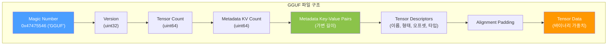
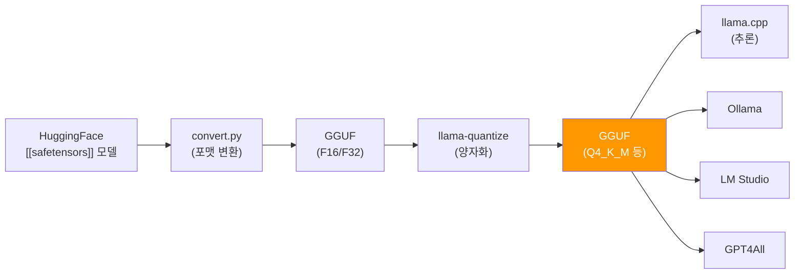

# GGUF Format (GGUF 포맷)

## 정의

**GGUF(GGML Unified Format)**는 llama.cpp 프로젝트가 개발한 양자화 LLM 모델의 바이너리 직렬화 포맷이다. 2023년 8월 이전 포맷인 GGML을 대체하며 도입되었으며, 로컬 LLM 추론 생태계의 **사실상 표준(de facto standard)** 파일 포맷이다.

단일 파일에 모델 가중치, 토크나이저 어휘, 하이퍼파라미터, 양자화 메타데이터를 모두 포함하여, 별도 설정 파일 없이 모델을 로드하고 추론할 수 있다.

## GGML에서 GGUF로의 전환

### 왜 GGML을 대체했는가

2023년 중반까지 llama.cpp는 GGML 포맷을 사용했으나, 지원 모델 아키텍처가 급증하면서 한계에 도달했다.

| 문제 | GGML | GGUF |
|------|------|------|
| 호환성 | 포맷 변경 시 기존 모델 깨짐 | 확장 가능한 키-값 메타데이터로 호환성 유지 |
| 메타데이터 | 하드코딩된 헤더 구조 | 자유 형식 key-value 메타데이터 |
| 아키텍처 지원 | LLaMA 계열 중심 | 임의 아키텍처 기술 가능 |
| 토크나이저 | 외부 파일 필요 | 파일 내 내장 |
| 미래 확장성 | 제한적 | 새 필드 추가 시 하위 호환 유지 |

## 파일 구조



### 각 섹션 상세

**Magic Number & Version**: 파일이 GGUF인지 식별하는 4바이트 매직넘버(0x47 0x47 0x55 0x46)와 포맷 버전. 리틀 엔디안 방식이다.

**Metadata Key-Value**: 모델의 모든 설정 정보를 저장한다.

```
general.architecture = "llama"
general.name = "Llama-3.1-8B-Q4_K_M"
llama.context_length = 131072
llama.embedding_length = 4096
llama.block_count = 32
tokenizer.ggml.model = "gpt2"
tokenizer.ggml.tokens = ["<unk>", "<s>", "</s>", ...]
```

**Tensor Descriptors**: 각 텐서의 이름, 차원, 데이터 타입, 파일 내 오프셋을 기술한다. 데이터를 읽기 전에 전체 구조를 파악할 수 있어 효율적 메모리 매핑(mmap)이 가능하다.

**Tensor Data**: 실제 양자화된 가중치 바이너리. 정렬 패딩 이후 연속 배치된다.

## 양자화 타입

GGUF는 2비트부터 8비트까지 다양한 양자화 스킴을 지원한다.

### 주요 양자화 타입

| 타입 | 비트 | 설명 | 용도 |
|------|------|------|------|
| **Q2_K** | ~2.5 | 초저정밀. 극단적 메모리 절약 | 실험적 |
| **Q3_K_S/M/L** | ~3.4 | 3비트 계열. S/M/L은 블록 크기 차이 | 메모리 제한 환경 |
| **Q4_0** | 4 | 기본 4비트. 블록별 단일 스케일 | 호환성 |
| **Q4_K_M** | ~4.5 | K-quant 4비트 중형. 품질/크기 균형 | **가장 보편적 선택** |
| **Q5_K_S/M** | ~5.5 | 5비트 계열. 4비트 대비 품질 향상 | 품질 중시 |
| **Q6_K** | ~6.5 | 6비트. 원본에 근접한 품질 | 충분한 메모리 시 |
| **Q8_0** | 8 | 8비트. 거의 무손실 | 레퍼런스/중간 변환 |
| **F16** | 16 | 반정밀 부동소수점 | 양자화 없이 저장 |
| **BF16** | 16 | Brain Float 16 | GPU 최적화 |

### K-Quant의 의미

Q4_K_M에서 "K"는 **k-quant** 방식을 의미한다. 전통적 양자화가 모든 가중치에 동일 비트를 할당하는 반면, k-quant는 레이어별 중요도에 따라 비트를 차등 배분한다. 중요한 레이어(attention)에 더 많은 비트를, 덜 중요한 레이어(feed-forward)에 적은 비트를 할당한다.

### Importance Matrix (imatrix)

imatrix는 **보정 데이터셋(calibration dataset)**을 사용하여 각 가중치의 활성화 빈도를 측정한 행렬이다. 이를 양자화 시 반영하면, 자주 활성화되는 가중치에 더 높은 정밀도를 부여하여 품질 손실을 최소화한다. 특히 Q2-Q4급 저비트 양자화에서 체감 품질 차이가 크다.

## llama.cpp 생태계



GGUF는 llama.cpp뿐 아니라 다양한 로컬 추론 도구에서 지원된다:

- **llama.cpp**: GGUF의 원본 런타임. CPU + GPU 하이브리드 추론
- **Ollama**: GGUF 기반 모델을 Docker처럼 pull/run하는 CLI
- **LM Studio**: GGUF 모델의 GUI 기반 관리 및 추론
- **GPT4All**: 데스크톱 LLM 앱. GGUF 포맷 지원
- **koboldcpp**: 롤플레이/창작 특화 llama.cpp 포크

## GGUF vs SafeTensors

| 특성 | GGUF | [[safetensors]] |
|------|------|------------|
| 주 용도 | CPU/로컬 추론 | GPU 학습/추론, 모델 배포 |
| 양자화 | 내장 (2-8bit) | 미지원 (별도 양자화 필요) |
| 메타데이터 | 토크나이저, 하이퍼파라미터 내장 | 텐서 메타데이터만 |
| 프레임워크 | llama.cpp 생태계 | PyTorch, TF, JAX 등 범용 |
| 파일 수 | 단일 파일 | config.json + 분할 가능 |
| 메모리 매핑 | 지원 (mmap) | 지원 (zero-copy) |

## 관련 페이지

- [[safetensors|SafeTensors]] -- HuggingFace 생태계의 안전한 모델 직렬화 포맷
- [[on-device-llm|On-Device LLM]] -- GGUF 모델이 주로 사용되는 로컬 추론 맥락
- [[token-economics|Token Economics]] -- 양자화가 추론 비용에 미치는 영향
- [[small-language-models|Small Language Models]] -- 양자화와 결합되는 경량 모델

## 참고 자료

- llama.cpp GitHub, "GGUF Format Specification" -- 공식 포맷 명세
- Georgi Gerganov, llama.cpp PR #2398 (2023.08) -- GGUF 도입 PR
- Wikipedia, "Llama.cpp" -- GGUF 전환 배경 및 양자화 타입 목록
