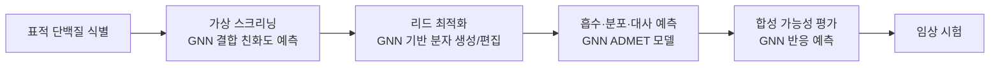
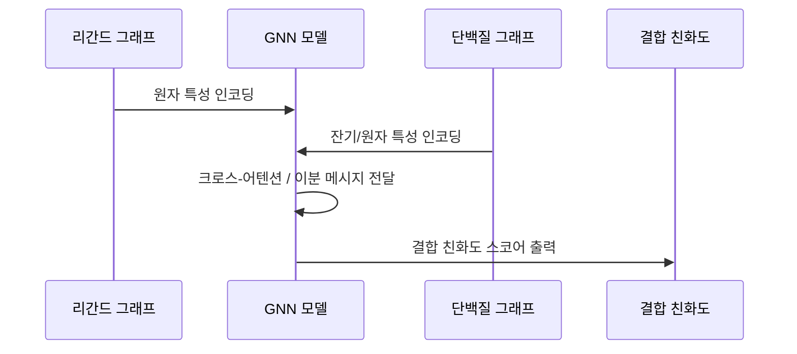

# GNN 기반 신약 발견

신약 발견(drug discovery)은 평균 10-15년, 수십억 달러가 소요되는 과정이다. 그래프 신경망(GNN)은 분자를 그래프로 직접 표현함으로써 **가상 스크리닝**, **분자 생성**, **부작용 예측** 등 파이프라인 전반에 걸쳐 시간과 비용을 단축하는 핵심 기술로 자리잡았다.

## 신약 발견 파이프라인과 GNN 적용 지점

## 가상 스크리닝 (Virtual Screening)

실험실에서 수백만 화합물을 물리적으로 테스트하는 대신, 컴퓨터로 후보를 줄이는 과정이다.

### 구조 기반 스크리닝 (Structure-Based)

단백질-리간드 복합체를 그래프로 표현해 결합 친화도를 예측한다.

- **단백질 노드**: 아미노산 잔기 또는 원자
- **리간드 노드**: 소분자 원자
- **이분 그래프(bipartite graph)**: 단백질-리간드 상호작용 엣지 포함

**GraphDTA**, **DGraphDTA** 등이 대표적이며, 단백질 서열 정보와 리간드 그래프를 공동 학습한다.

### 리간드 기반 스크리닝 (Ligand-Based)

알려진 활성 화합물과의 유사도를 기반으로 스크리닝한다. [[gnn-molecular-property]] 예측 모델을 활용해 표적 활성(pIC50, pKd)을 직접 예측한다.

## 분자 생성 (Molecular Generation)

새로운 화학 공간을 탐색하며 원하는 속성을 가진 분자를 설계하는 작업이다.

### 그래프 기반 생성 모델

[[ai-drug-discovery-2026]]의 흐름에 따라 세 가지 주요 패러다임이 발전해왔다:

| 방법 | 핵심 아이디어 | 대표 모델 |
|------|--------------|-----------|
| VAE 기반 | 잠재 공간에서 연속적 분자 탐색 | Junction Tree VAE (JT-VAE) |
| GAN 기반 | 생성자-판별자 대립 학습 | MolGAN |
| 흐름 기반 | 역가역 변환으로 정확한 우도 계산 | GraphNVP, GRF |
| 확산 기반 | 노이즈 제거 과정으로 분자 생성 | DDPM-Mol, DiffSBDD |

### 목표 지향 최적화 (Goal-Directed Optimization)

단순 생성이 아닌 특정 속성(결합 친화도, 합성 용이성, 독성 부재 등)을 최적화하는 분자를 찾는다:

- **강화학습 + GNN**: 분자 그래프를 단계적으로 편집하며 보상 최대화
- **베이지안 최적화**: 잠재 공간에서 가우시안 프로세스 기반 탐색
- **진화 알고리즘**: GNN 적합도 함수로 세대 진화

## ADMET 예측

신약 후보가 생체 내에서 어떻게 거동하는지 예측하는 것이 ADMET 분석이다:

- **A**bsorption (흡수): 경구 생체이용률 (Caco-2 투과성)
- **D**istribution (분포): 혈액-뇌 장벽(BBB) 통과 여부
- **M**etabolism (대사): CYP 효소 저해 여부
- **E**xcretion (배설): 반감기, 신장 청소율
- **T**oxicity (독성): hERG 채널 저해, 유전독성

GNN은 이 다섯 가지 속성을 **멀티태스크 학습**으로 동시에 예측해 데이터 효율성을 높인다. Chemprop(방향성 MPNN)이 ADMET 예측에서 강력한 성능을 보인다.

## 단백질-리간드 상호작용 예측

## 실제 사례

- **Insilico Medicine**: 폐 섬유증 치료제 후보를 GNN 기반 생성 모델로 46일 만에 설계 (임상 2상 진행 중, 2023)
- **Recursion Pharmaceuticals**: 고처리량 표현형 스크리닝 데이터와 GNN을 결합해 희귀 질환 약물 탐색
- **Schrödinger**: 물리 기반 시뮬레이션 + GNN 하이브리드 플랫폼으로 결합 자유에너지(FEP+) 가속

## 데이터셋과 벤치마크

| 데이터셋 | 규모 | 용도 |
|----------|------|------|
| ChEMBL | 230만+ 화합물 | 생물 활성 스크리닝 |
| BindingDB | 200만+ 결합 데이터 | 단백질-리간드 친화도 |
| TDC (Therapeutics Data Commons) | 다양한 ADMET | 벤치마킹 표준 |
| PDBbind | 23,000+ 복합체 구조 | 3D 결합 예측 |

## 한계와 미래 방향

1. **데이터 편향**: 알려진 약물 표적/화합물 클래스에 치우쳐 있어 새로운 화학 공간 탐색에 한계
2. **해석 가능성**: 왜 이 분자가 좋은지 화학자가 납득할 수 있는 설명 필요
3. **합성 가능성**: 좋은 속성을 예측해도 실제로 합성할 수 없으면 무의미
4. **실험 검증 루프**: 예측-합성-실험의 피드백 루프를 빠르게 닫는 자동화 시스템 필요

## 관련 문서

- [[gnn-molecular-property]] - 분자 속성 예측 GNN 모델 (SchNet, DimeNet 등)
- [[graph-generation-molecules]] - VAE/GAN/확산 기반 분자 생성 방법론
- [[graph-neural-networks]] - GNN 기본 원리
- [[ai-drug-discovery-2026]] - AI 신약 발견 트렌드 2026
- [[protein-structure-gnn]] - 단백질 구조 GNN과 표적 분석
