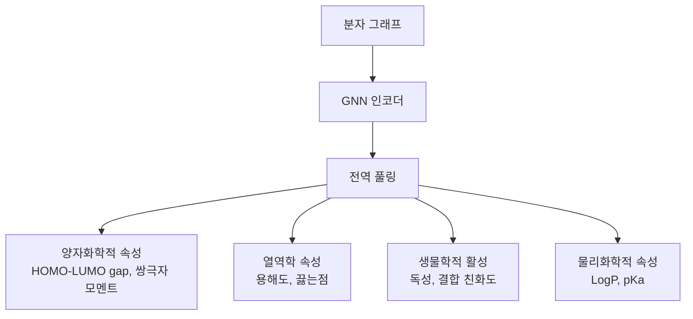

# GNN 분자 속성 예측

분자 속성 예측(molecular property prediction)은 화학 구조로부터 물리화학적·생물학적 속성을 계산하는 문제다. 전통적으로는 분자 지문(fingerprint)이나 기술자(descriptor) 기반의 머신러닝을 사용했지만, [[graph-neural-networks]]가 도입된 이후 분자 자체를 그래프로 표현하고 끝-투-끝(end-to-end)으로 학습하는 방식이 주류가 됐다.

## 왜 GNN인가

분자는 원자(노드)와 화학 결합(엣지)으로 이루어진 자연스러운 그래프 구조를 갖는다. 기존 SMILES 문자열 기반 접근은 순서 의존성이라는 인위적 제약을 가지고 있지만, 그래프 표현은 분자의 위상 구조를 직접 포착한다.

| 표현 방식 | 장점 | 단점 |
|-----------|------|------|
| SMILES + RNN/Transformer | 대규모 데이터셋 학습 용이 | 위상 구조 손실, 순열 불변성 없음 |
| 분자 지문 + MLP | 간단한 구현 | 수동 설계, 표현력 제한 |
| 그래프 + GNN | 위상 구조 직접 학습, 순열 불변성 보장 | 3D 정보 추가 인코딩 필요 |

## 핵심 아키텍처

### MPNN (Message Passing Neural Network)

2017년 DeepMind/Google이 제안한 분자 속성 예측을 위한 통합 프레임워크다. 메시지 전달 단계와 읽기(readout) 단계로 구성된다.

$$h_v^{(t+1)} = U_t\left(h_v^{(t)},\ \sum_{w \in N(v)} M_t(h_v^{(t)}, h_w^{(t)}, e_{vw})\right)$$

$M_t$는 메시지 함수, $U_t$는 업데이트 함수, $e_{vw}$는 엣지 특성(결합 종류 등)이다.

### SchNet

SchNet은 3D 원자 좌표를 명시적으로 활용하는 모델로, 연속 필터 합성곱(continuous-filter convolution)을 사용한다. 거리 정보를 가우시안 기저 함수로 인코딩하고 원자 간 상호작용을 물리 법칙에 부합하게 모델링한다.

- 입력: 원자 타입 + 3D 좌표
- 핵심 아이디어: 원자 간 거리 $r_{ij}$를 연속 필터로 변환
- 물리적으로 의미 있는 표현: 회전 불변성(rotational invariance) 만족

### DimeNet / DimeNet++

DimeNet(Directional Message Passing)은 결합 거리뿐 아니라 **결합 각도(bond angle)**를 메시지 전달에 포함한다. 이로써 동일한 거리를 가진 원자들 사이의 기하학적 차이를 구별할 수 있다.

```
원자 i ← (거리 + 각도 정보) ← 원자 j ← 원자 k
```

DimeNet++는 메시지 집계 방식을 개선해 속도를 크게 향상시켰다.

## 예측 대상 속성들



벤치마크로는 **QM9** (12만 개 소분자, 13가지 양자화학 속성), **MoleculeNet** (다양한 실험적 속성)이 널리 사용된다.

## 학습 전략

### 사전학습 (Pre-training)

라벨이 부족한 분자 데이터에서 자기지도학습(self-supervised learning)을 적용한다:
- **Atom Masking**: 일부 원자 타입을 가리고 예측
- **Context Prediction**: 하위 그래프 문맥 예측
- **Motif Prediction**: 화학적으로 의미 있는 부분구조(motif) 예측

Hu et al. (2020)의 연구에 따르면 사전학습 GNN이 무작위 초기화 대비 최대 10% 이상 성능을 향상시킨다.

### 데이터 증강

- 원자 순열(permutation)은 동일 분자이므로 자연스러운 불변성
- SMILES augmentation: 동일 분자의 다양한 SMILES 표현 활용
- 3D 좌표의 회전/이동 변환

## 실무 적용

- **[[gnn-drug-discovery]]**: 가상 스크리닝에서 활성 화합물 우선순위 결정
- **소재 발견**: 배터리 전해질, 유기 태양전지 소재 탐색
- **독성 예측**: 임상 전 단계 화합물 안전성 평가 (ADMET)
- **반응 수율 예측**: 합성 조건 최적화

## 한계와 도전

1. **3D 구조 가용성**: 결정 구조 없이는 정확한 3D 좌표를 얻기 어려움 (Conformer 생성 필요)
2. **대형 분자**: 단백질-리간드 복합체처럼 수천 원자 시스템에서 계산 비용 급증
3. **분포 외 일반화**: 학습 데이터와 화학적으로 다른 분자 예측 성능 저하
4. **물리 법칙 준수**: 예측값이 물리화학적으로 타당한지 보장이 어려움

[[graph-attention-network]]의 어텐션 메커니즘을 분자 예측에 적용하면 어떤 원자/결합이 속성 예측에 중요한지 해석 가능성(interpretability)도 확보할 수 있다.

## 관련 문서

- [[graph-neural-networks]] - GNN 기본 원리와 메시지 전달 프레임워크
- [[graph-attention-network]] - 어텐션 기반 그래프 학습
- [[gnn-drug-discovery]] - 분자 속성 예측의 신약 발견 응용
- [[graph-generation-molecules]] - 새 분자 구조 생성
- [[protein-structure-gnn]] - 단백질 구조에서의 GNN 적용
