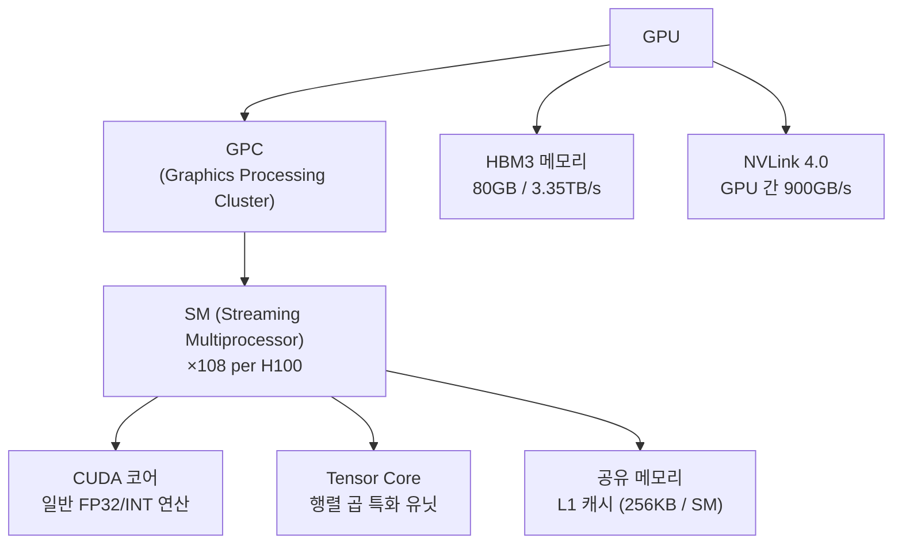
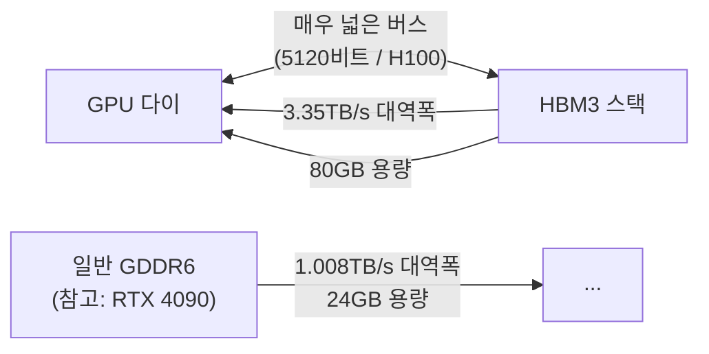

# GPU 아키텍처와 ML

ML 연구자가 GPU 내부 구조를 이해해야 하는 이유는 명확하다: **연산 병목이 어디에 있는지** 알아야 최적화 방향을 잡을 수 있기 때문이다. CUDA 코어, Tensor Core, HBM 메모리, NVLink 인터커넥트는 현대 딥러닝 성능의 4가지 핵심 축이다.

## GPU 계층 구조

H100 SXM 기준으로, 108개의 SM이 하나의 GPU를 이루며 각 SM은 독립적으로 스케줄링된다.

## CUDA 코어

CUDA 코어는 GPU의 기본 연산 단위다. 단일 사이클에 스칼라 FP32 또는 INT32 연산을 실행한다.

- H100: SM당 128개 CUDA 코어, 총 16,896개
- A100: SM당 64개, 총 6,912개
- 스레드는 **워프(warp)** 단위(32개)로 묶여 동시에 같은 명령어를 실행 (SIMT: Single Instruction, Multiple Threads)

워프 내 스레드가 서로 다른 분기(if/else)를 실행하면 **워프 다이버전스(warp divergence)**가 발생해 성능이 크게 저하된다.

## Tensor Core: 행렬 연산 특화 유닛

Tensor Core는 딥러닝의 핵심 연산인 **행렬 곱(GEMM)**을 위해 설계된 특수 회로다. CUDA 코어보다 훨씬 높은 처리량을 제공하지만, 저정밀도 포맷에서만 최고 성능을 발휘한다.

| GPU 세대 | Tensor Core 세대 | 지원 포맷 | 피크 처리량 |
|---------|----------------|-----------|------------|
| V100 | 1세대 | FP16 | 125 TFLOPS |
| A100 | 3세대 | FP16, BF16, TF32, INT8 | 312 TFLOPS (BF16) |
| H100 | 4세대 | FP8, FP16, BF16, TF32 | 1979 TFLOPS (FP8) |

[[flash-attention]]의 핵심 아이디어도 Tensor Core를 최대한 활용하면서 HBM 접근을 최소화하는 것이다.

### TF32 (TensorFloat-32)

A100에서 도입된 포맷으로, FP32와 동일한 지수 범위(8비트)를 가지면서 가수를 10비트로 줄인 포맷이다. `torch.backends.cuda.matmul.allow_tf32 = True` 설정만으로 Tensor Core가 자동으로 사용된다. 정확도 손실 없이 처리량이 크게 향상된다.

## HBM (High Bandwidth Memory)

HBM은 GPU 칩에 수직으로 적층(stacked)된 고대역폭 메모리 아키텍처다. 일반 GDDR 메모리 대비 대역폭이 수 배 높다.

### 메모리 대역폭이 왜 중요한가

많은 딥러닝 연산은 **메모리 대역폭 제한(memory-bound)**이다. 즉, 연산 속도보다 데이터를 메모리에서 가져오는 속도가 병목이다.

- **계산 집약적(compute-bound)**: 행렬 곱, Attention 계산 (큰 배치)
- **메모리 집약적(memory-bound)**: 레이어 정규화, 원소별 연산, 추론 (작은 배치)

**Roofline 모델**([[roofline-model-ml]])은 주어진 연산이 계산 제한인지 메모리 제한인지 판단하는 도구다:

$$\text{산술 강도} = \frac{\text{FLOP 수}}{\text{메모리 접근량 (바이트)}}$$

산술 강도가 **Ridge Point** 이하면 메모리 제한, 이상이면 계산 제한이다. H100의 Ridge Point는 약 590 FLOP/byte (FP16 기준)이다.

## NVLink: GPU 간 고속 인터커넥트

다수의 GPU를 연결할 때 PCIe가 병목이 되는 문제를 해결하기 위해 NVIDIA가 설계한 전용 인터커넥트다.

| 세대 | 단방향 대역폭 | 총 대역폭 |
|------|-------------|----------|
| NVLink 3.0 (A100) | 300GB/s | 600GB/s |
| NVLink 4.0 (H100) | 450GB/s | 900GB/s |
| PCIe 5.0 (비교) | 63GB/s | 126GB/s |

NVLink는 [[distributed-training-overview]]에서 텐서 병렬(Tensor Parallelism)의 All-Reduce 통신을 지원하는 핵심 인프라다. NVSwitch를 통해 DGX 노드 내 8개 GPU를 전완전 메시(full mesh)로 연결한다.

## CUDA 프로그래밍 관점의 최적화 힌트

ML 엔지니어가 알아야 할 실용적 지식:

- **Coalesced Memory Access**: 워프 내 스레드가 연속된 메모리 주소에 접근해야 대역폭을 최대로 활용
- **공유 메모리(Shared Memory) 활용**: L1 캐시처럼 사용할 수 있는 SM 내 고속 메모리. Tiled 행렬 곱의 핵심
- **점유율(Occupancy)**: SM에 동시에 실행 중인 워프 비율. 너무 큰 레지스터 사용은 점유율을 낮춤
- **비동기 복사(async copy)**: 메모리 복사와 연산을 겹쳐 실행 (memcpy_async)

[[flash-attention]]은 이 원칙들을 모두 활용해 표준 어텐션보다 훨씬 효율적인 CUDA 커널을 구현한 대표 사례다.

## 관련 문서

- [[flash-attention]] - HBM 접근 최소화를 통한 어텐션 최적화
- [[distributed-training-overview]] - NVLink/NVSwitch 기반 분산 학습
- [[roofline-model-ml]] - 연산이 계산 제한인지 메모리 제한인지 분석하는 방법
- [[mixed-precision-training]] - Tensor Core를 최대한 활용하기 위한 정밀도 선택
