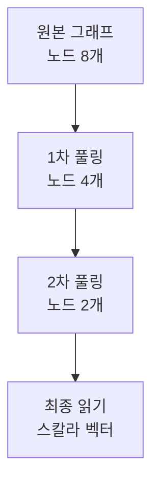

# 그래프 분류와 풀링

그래프 분류(graph classification)는 노드나 엣지가 아닌 **그래프 전체**에 레이블을 부여하는 문제다. 분자 독성 분류, 단백질 기능 분류, 소셜 네트워크 커뮤니티 식별 등이 대표적이다.

노드/엣지 수준 예측과 달리 그래프 수준 예측에는 **풀링(pooling)** 단계가 필수다 — 가변 크기의 그래프를 고정 크기 벡터로 집약해야 하기 때문이다.

## 전체 파이프라인

## 전역 풀링 (Global Pooling / Readout)

가장 단순한 방법으로, 모든 노드 임베딩을 단일 벡터로 집약한다.

| 방법 | 수식 | 특징 |
|------|------|------|
| 평균 풀링 | $\mathbf{h}_G = \frac{1}{|V|} \sum_v \mathbf{h}_v$ | 노드 수에 무관, 주요 구조 손실 |
| 최대 풀링 | $\mathbf{h}_G = \max_v \mathbf{h}_v$ | 두드러진 특성 추출 |
| 합산 풀링 | $\mathbf{h}_G = \sum_v \mathbf{h}_v$ | 노드 수에 민감 |
| 어텐션 기반 | $\mathbf{h}_G = \sum_v \alpha_v \mathbf{h}_v$ | 중요한 노드에 가중치 부여 |

[[graph-attention-network]]의 어텐션 메커니즘을 풀링에 적용하면 어떤 노드가 분류에 중요한지 파악할 수 있다.

[[graph-neural-networks]] 연구에서 Xu et al. (2019)은 GIN(Graph Isomorphism Network)이 이론적으로 최대 표현력을 가지며, 합산 집계가 평균보다 강력하다는 것을 증명했다.

## 계층적 풀링 (Hierarchical Pooling)

단순 전역 풀링은 중간 구조를 잃는다. 계층적 풀링은 그래프를 점진적으로 압축해 다중 스케일 정보를 보존한다.

### DiffPool

Ying et al. (2018)이 제안한 **미분 가능 풀링(Differentiable Pooling)**이다. 학습 가능한 소프트 클러스터링 행렬로 노드를 집약한다:

$$\mathbf{S}^{(l)} = \text{softmax}\left(\text{GNN}_{pool}(\mathbf{A}^{(l)}, \mathbf{X}^{(l)})\right)$$

$$\mathbf{X}^{(l+1)} = \mathbf{S}^{(l)T} \mathbf{Z}^{(l)}, \quad \mathbf{A}^{(l+1)} = \mathbf{S}^{(l)T} \mathbf{A}^{(l)} \mathbf{S}^{(l)}$$

- 장점: 완전히 미분 가능, 역전파로 학습 가능
- 단점: 밀집 행렬로 메모리 $O(n^2)$ 필요, 대규모 그래프 비효율

### SAGPool (Self-Attention Graph Pooling)

Lee et al. (2019)이 제안한 **자기 어텐션 기반 풀링**이다. GNN으로 각 노드의 중요도 점수를 계산하고 상위 $k$개 노드만 선택한다(Top-k 선택):

$$\mathbf{Z} = \sigma\left(\tilde{\mathbf{D}}^{-1/2}\tilde{\mathbf{A}}\tilde{\mathbf{D}}^{-1/2}\mathbf{X}\Theta_{att}\right)$$

$$\text{idx} = \text{top-k}(\mathbf{Z}, \lceil kN \rceil)$$

- 장점: 희소 행렬 유지, 메모리 효율적
- 단점: 상위 k 선택이 불연속 연산이므로 기울기 문제

### MinCutPool

Spectral 클러스터링의 MinCut 목적 함수를 손실로 추가해 DiffPool의 클러스터링 품질을 개선한다. 보조 손실(auxiliary loss)이 클러스터 붕괴를 방지한다.

## 비교 요약

| 방법 | 방식 | 메모리 | 계층 구조 | 해석 가능성 |
|------|------|--------|-----------|-------------|
| 평균/합산/최대 | 전역 집약 | O(n) | X | 낮음 |
| 어텐션 Readout | 가중 전역 집약 | O(n) | X | 보통 |
| DiffPool | 소프트 클러스터링 | O(n²) | O | 낮음 |
| SAGPool | 노드 선택 (Top-k) | O(n) | O | 높음 |
| MinCutPool | 손실 기반 클러스터링 | O(n²) | O | 보통 |

## 벤치마크 데이터셋

- **MUTAG, PROTEINS, D&D**: 분자/단백질 이진 분류
- **COLLAB, REDDIT**: 소셜 네트워크 분류
- **TUDataset**: 화학·생물학·소셜 그래프 컬렉션

## 실무 고려사항

1. **소규모 그래프** (< 100 노드): 전역 풀링이 충분히 효과적이고 간단
2. **중간 규모** (100~1000 노드): SAGPool이 메모리와 성능 균형
3. **대규모 그래프** (> 1000 노드): 계층적 풀링보다 클러스터링 후 서브그래프 접근 고려
4. **해석이 중요한 경우**: SAGPool의 노드 선택이 어떤 원자/잔기가 분류에 기여했는지 파악 가능

## 관련 문서

- [[graph-neural-networks]] - GNN 기본 원리와 메시지 전달
- [[graph-attention-network]] - 어텐션 기반 노드 집약
- [[gnn-molecular-property]] - 분자 그래프 분류 응용 (독성, 활성)
- [[protein-structure-gnn]] - 단백질 기능 분류에서의 풀링 적용
