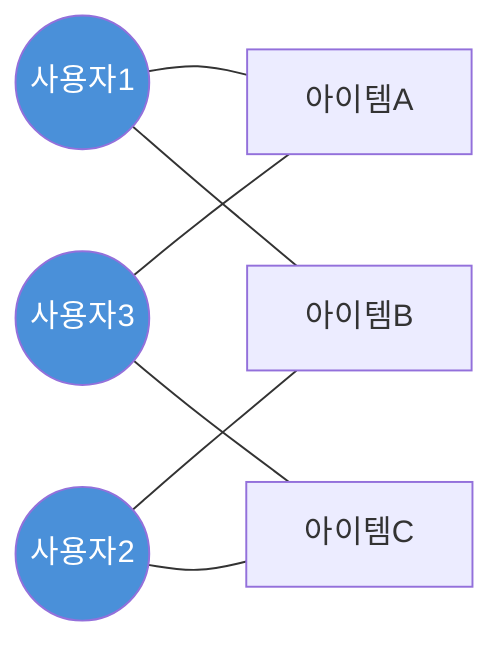
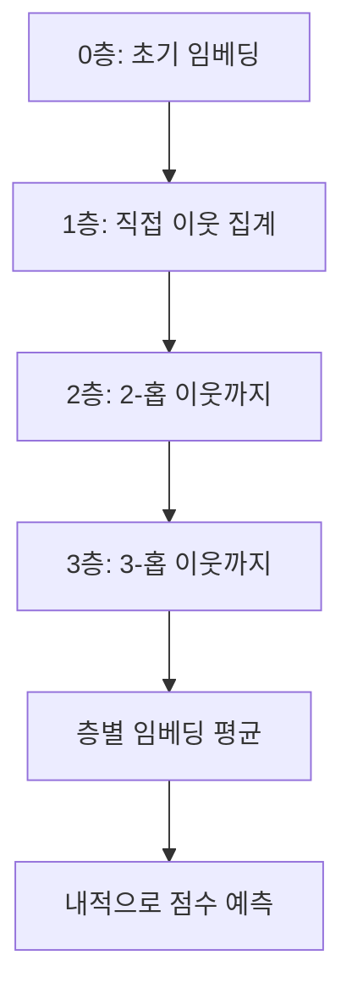

# 그래프 협업 필터링 (Graph Collaborative Filtering)

## 개념 요약

그래프 협업 필터링(Graph Collaborative Filtering)은 사용자-아이템 상호작용을 이분 그래프(bipartite graph)로 모델링하고, 그래프 신경망(GNN)을 통해 사용자와 아이템의 임베딩을 학습하는 추천 알고리즘 계열이다.

전통적인 행렬 분해(Matrix Factorization)가 직접적인 상호작용 신호만 활용하는 것과 달리, 그래프 기반 방법은 고차 연결성(higher-order connectivity)을 포착한다. "사용자 A가 좋아한 아이템을 사용자 B도 좋아했다면, A와 B의 취향이 유사하다"는 협업 필터링의 핵심 신호를 그래프 전파(propagation)로 자연스럽게 표현한다.

## 이분 그래프 구조

사용자 집합 $\mathcal{U}$와 아이템 집합 $\mathcal{I}$로 구성된 이분 그래프 $G = (\mathcal{U} \cup \mathcal{I}, \mathcal{E})$를 정의한다. 사용자 $u$가 아이템 $i$와 상호작용하면 엣지 $(u, i) \in \mathcal{E}$가 존재한다.

위 이분 그래프에서 사용자1과 사용자3은 아이템A를 공유하므로 고차 이웃 관계로 연결된다.

## LightGCN

LightGCN(He et al., 2020)은 추천 시스템에 특화된 경량 그래프 컨볼루션 네트워크다. NGCF(Neural Graph Collaborative Filtering) 대비 불필요한 특징 변환과 비선형 활성화를 제거해 성능과 효율을 동시에 향상시켰다.

### 핵심 연산: 선형 전파

$$\mathbf{e}_u^{(k+1)} = \sum_{i \in \mathcal{N}_u} \frac{1}{\sqrt{|\mathcal{N}_u||\mathcal{N}_i|}} \mathbf{e}_i^{(k)}$$

$$\mathbf{e}_i^{(k+1)} = \sum_{u \in \mathcal{N}_i} \frac{1}{\sqrt{|\mathcal{N}_i||\mathcal{N}_u|}} \mathbf{e}_u^{(k)}$$

- $k$층에서 이웃의 임베딩을 정규화하여 집계
- 학습 파라미터는 0층 임베딩 $\mathbf{e}^{(0)}$뿐
- 최종 임베딩: 모든 층의 가중 평균 $\mathbf{e} = \sum_{k=0}^{K} \frac{1}{K+1} \mathbf{e}^{(k)}$

### 학습 목표

베이지안 개인화 랭킹(BPR) 손실을 사용:

$$\mathcal{L}_{BPR} = -\sum_{(u,i,j) \in \mathcal{O}} \ln \sigma(\hat{y}_{ui} - \hat{y}_{uj})$$

관측된 아이템 $i$의 점수가 미관측 아이템 $j$보다 높아야 함을 학습한다.

## 주요 변형 모델

| 모델 | 특징 | 기여 |
|------|------|------|
| NGCF | 비선형 변환 포함 | 첫 GNN 협업 필터링 |
| LightGCN | 선형 전파만 사용 | 단순화로 성능 향상 |
| UltraGCN | 명시적 전파 없이 근사 | 학습 속도 대폭 향상 |
| SimGCL | 대조 학습 통합 | 데이터 희소성 대응 |
| GCCF | 자기 루프 제거 | 오버스무딩 완화 |

## 오버스무딩 문제

레이어를 깊게 쌓을수록 모든 노드의 임베딩이 균일해지는 오버스무딩(over-smoothing) 현상이 발생한다. 실무에서 LightGCN은 보통 2~4층으로 제한한다.

## 그래프 협업 필터링의 장점

1. **고차 연결성 포착**: 2-홉, 3-홉 이웃을 자동으로 반영해 간접적 유사도 학습
2. **콜드스타트 부분 완화**: 소수의 상호작용만으로도 그래프 전파를 통해 의미 있는 임베딩 학습 가능
3. **해석 가능성**: 추천 경로를 그래프 엣지로 역추적 가능

## 실무 적용 시 고려사항

- **그래프 밀도**: 상호작용이 극히 희소한 경우(ex. 신규 서비스) 전파 신호가 약함
- **동적 그래프**: 새 사용자/아이템 추가 시 전체 재학습 vs. 인덕티브 방법 선택 필요
- **확장성**: 수억 노드 규모에서는 미니배치 그래프 샘플링(ex. ClusterGCN, GraphSAGE 스타일) 필요
- [[recommendation-systems-dl]]의 다른 모델들과 앙상블 시 다양성이 향상됨

## 관련 문서

- [[graph-neural-networks]] - GNN의 일반 이론과 메시지 패싱 메커니즘
- [[recommendation-systems-dl]] - 딥러닝 추천 시스템 전체 조망
- [[llm-recommendation]] - LLM을 추천에 결합하는 하이브리드 접근
- [[explore-exploit-bandit]] - 추천 시스템의 온라인 학습 전략
