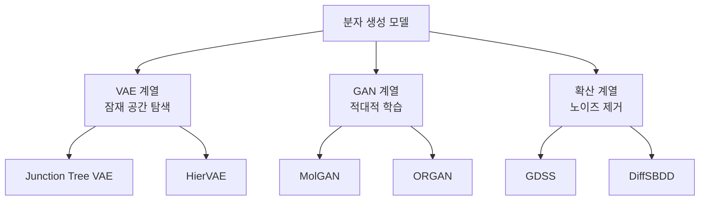
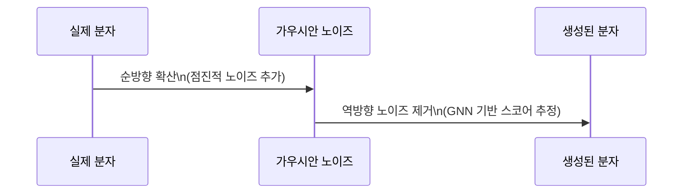

# 그래프 기반 분자 생성

분자 생성(molecular generation)은 원하는 속성을 가진 새로운 화학 구조를 설계하는 문제다. 단순 분자 속성 예측([[gnn-molecular-property]])에서 한 발 나아가, **존재하지 않는 분자를 창출**한다는 점에서 역방향(generative) 문제다.

분자를 그래프로 표현하면 SMILES 기반 순서형 생성의 단점(위상 구조 손실, 순열 의존성)을 피하고 화학 구조를 직접 모델링할 수 있다.

## 분자 그래프 표현

- **노드**: 원자 (원소 종류, 수소 개수, 전하 등)
- **엣지**: 화학 결합 (단일/이중/삼중/방향족)
- **특성 벡터**: 원자/결합의 화학적 속성 (hybridization, aromaticity 등)

생성 목표는 유효한(valid) — 화학 원자가(valency) 규칙을 만족하고, 신규(novel) — 학습 데이터에 없고, 다양한(diverse) — 서로 구조적으로 다른 분자를 만드는 것이다.

## 세 가지 생성 패러다임

### VAE 기반: Junction Tree VAE

[[autoencoders-vae]] 구조를 그래프에 적용한다. JT-VAE(Jin et al., 2018)는 두 단계로 분자를 생성한다:

1. **트리 단계**: 분자를 화학 모티프(ring, chain 등) 의 트리로 분해
2. **그래프 단계**: 모티프를 조립해 완전한 분자 그래프 재구성

$$q(\mathbf{z}|G) = \mathcal{N}(\mu_G, \sigma_G^2) \quad \text{(인코더)}$$
$$p(G|\mathbf{z}) = \prod_t p(\text{node}_t|\mathbf{z}) \cdot p(\text{edge}_t|\mathbf{z}) \quad \text{(디코더)}$$

- 장점: 화학적 유효성 높음 (100%), 잠재 공간에서 연속적 탐색 가능
- 단점: 모티프 어휘 사전 필요, 대형 분자 확장 어려움

### GAN 기반: MolGAN

De Cao & Kipf (2018)이 제안한 MolGAN은 그래프 직접 생성을 GAN으로 학습한다:

- **생성자**: 노이즈 $z$에서 인접 행렬 $A$와 노드 특성 $X$를 직접 생성
- **판별자**: 실제/가짜 분자 그래프를 구분 (R-GCN 사용)
- **보상 네트워크**: 화학적 속성 점수를 강화학습 보상으로 활용 (WGAN-GP)

그러나 GAN은 학습 불안정성과 모드 붕괴(mode collapse) 문제가 있어 최근에는 확산 모델에 밀리는 추세다.

### 확산 기반: GDSS / DiffSBDD

확산 모델(diffusion model)은 분자 생성에서 가장 빠르게 발전하는 분야다.

**GDSS (Score-based Generative Modeling for Graphs)**:

노드 특성 $X$와 인접 행렬 $A$를 동시에 확산-역확산한다:

**DiffSBDD (Structure-Based Drug Design)**:

단백질 결합 포켓 구조를 조건으로 리간드 분자를 3D 공간에서 직접 생성한다. 원자 위치($x, y, z$)와 원소 타입을 동시에 확산-역확산하는 SE(3) 등변(equivariant) 확산 모델이다.

## 목표 지향 최적화

단순 생성이 아닌 **원하는 속성을 최적화**하는 분자를 찾는 것이 실무 목표다:

| 방법 | 전략 |
|------|------|
| 베이지안 최적화 | 잠재 공간에서 가우시안 프로세스로 탐색 |
| 강화학습 | 분자 편집 행동의 보상 최대화 |
| 유전 알고리즘 | 좋은 분자를 교차/돌연변이 |
| 그래디언트 기반 | 잠재 공간에서 역전파로 속성 최적화 |

**REINVENT** (Olivecrona et al., 2017): SMILES 기반이지만 강화학습 목표 지향 최적화의 표준 벤치마크로 널리 사용된다.

## 평가 지표

- **Validity**: 화학적으로 유효한 분자 비율 (RDKit으로 검증)
- **Uniqueness**: 생성된 분자 중 중복 없는 비율
- **Novelty**: 학습 데이터에 없는 신규 분자 비율
- **FCD (Fréchet ChemNet Distance)**: 실제 분자 분포와의 거리
- **SA Score**: 합성 접근성 점수 (낮을수록 합성 용이)
- **QED**: 약물 유사성 점수 (0~1)

## 데이터셋

- **ZINC250k**: 상업적으로 구매 가능한 25만 약물 유사 분자
- **QM9**: 소분자 13만 개, 양자화학 속성 포함
- **GuacaMol**: 목표 지향 생성 벤치마크 스위트

## 관련 문서

- [[gnn-molecular-property]] - 생성된 분자의 속성 예측
- [[autoencoders-vae]] - VAE 기반 잠재 공간 학습 원리
- [[gnn-drug-discovery]] - 분자 생성을 신약 발견에 응용
- [[graph-neural-networks]] - GNN 기반 분자 인코딩/디코딩
