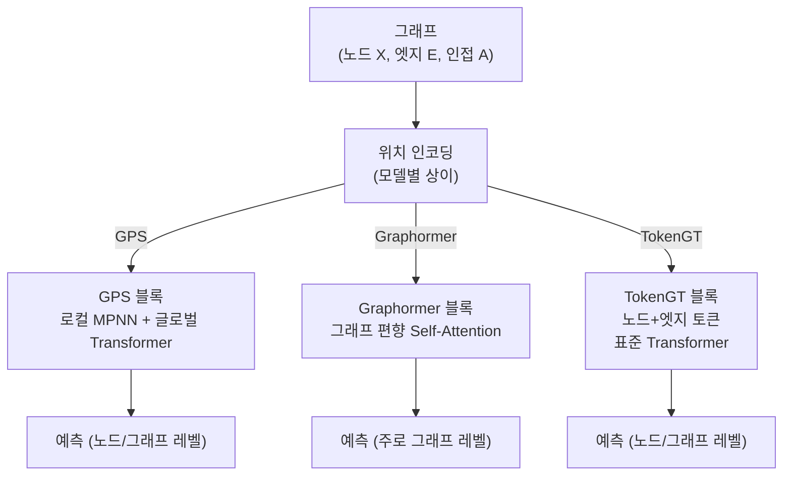
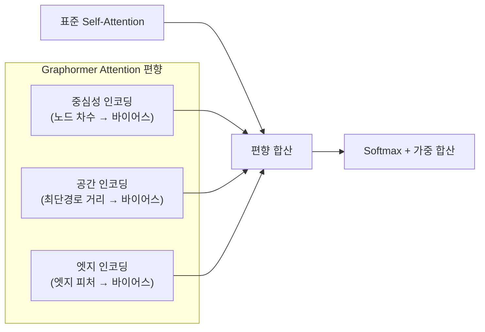
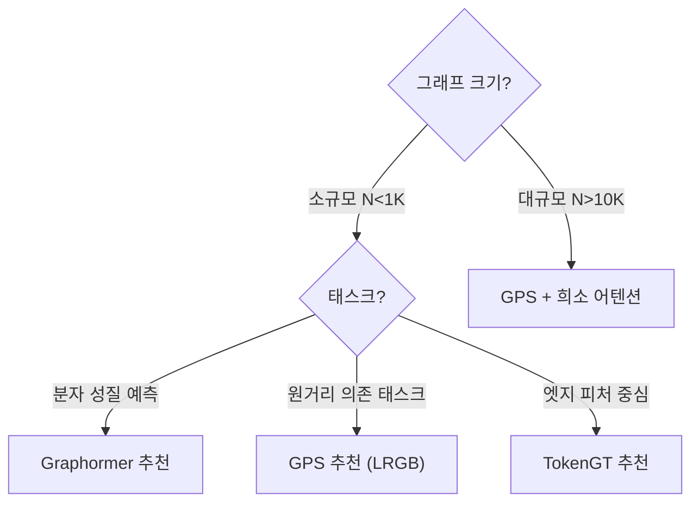

# 그래프 트랜스포머 비교 - GPS, Graphormer, TokenGT

## 개요

[[graph-transformer]]는 트랜스포머의 어텐션 메커니즘을 [[graph-neural-networks]]에 결합하는 방향으로 빠르게 발전했다. 2022-2023년 사이 GPS(General, Powerful, Scalable), Graphormer, TokenGT 세 모델이 각기 다른 방식으로 이 문제를 풀어, 그래프 ML 벤치마크(LRGB, PCQM4Mv2, OGB)를 기준으로 비교 대상이 되었다.

이 페이지는 세 모델의 설계 철학, 위치 인코딩 방식, 계산 복잡도, 적합한 사용 사례를 비교한다.

## 배경: 왜 그래프에서 트랜스포머가 필요한가

기본 GNN의 근본적 한계:

- **과도한 평활화(over-smoothing)**: 레이어가 깊어질수록 노드 임베딩이 수렴
- **과도한 압축(over-squashing)**: 긴 거리 의존성을 병목 엣지가 차단
- **표현력 상한**: WL(Weisfeiler-Leman) 동형 테스트와 동등한 표현력에 한정

트랜스포머의 전역 어텐션은 이론적으로 임의 거리의 노드 쌍을 직접 연결해 위 세 한계를 완화한다.

## 세 모델 비교 개요



## GPS (General, Powerful, Scalable Graph Transformer)

**핵심 아이디어**: MPNN(메시지 전달)과 글로벌 어텐션을 **병렬로** 실행하고 결합하는 모듈식 설계.

```
GPS 블록 = MPNN(로컬 구조) || Global-Attn(원거리 의존) + FFN
```

```python
# GPS 레이어 (개념)
def gps_layer(x, edge_index):
    # 로컬: 이웃 메시지 전달
    local_out = mpnn(x, edge_index)        # GINE, PNA 등 교체 가능
    # 글로벌: 전체 노드 간 어텐션
    global_out = transformer_attn(x)       # 표준 Multi-head attention
    # 결합
    return layer_norm(local_out + global_out + ffn(x))
```

**위치 인코딩**: LapPE(라플라시안 고유벡터), RWSE(랜덤 워크 구조적 인코딩), SignNet 등 플러그인 방식으로 교체 가능.

**계산 복잡도**: $O(N^2)$ (전역 어텐션) - 소규모~중규모 그래프 적합. 대규모 그래프에서는 BigBird 등 희소 어텐션으로 대체.

**강점**:
- 모듈식 설계로 MPNN 백본과 PE 방식 자유 선택
- Long-Range Graph Benchmark(LRGB)에서 SOTA
- 코드 재현성과 확장성이 우수

## Graphormer

**핵심 아이디어**: 그래프 구조 정보를 **어텐션 편향(attention bias)**으로 주입. 표준 Transformer에 세 가지 그래프 편향을 추가한다.

$$\text{Attn}(i, j) = \frac{(x_i W_Q)(x_j W_K)^T}{\sqrt{d}} + b_{\phi(v_i)} + b_{\phi(v_j)} + c_{(i \to j)}$$

- $b_{\phi(v)}$: **중심성 인코딩(Centrality Encoding)** - 노드 차수(degree)에 기반한 스칼라 편향
- $c_{(i \to j)}$: **공간 인코딩(Spatial Encoding)** - 최단 경로 거리 $d_{ij}$에 기반한 학습 가능 편향
- 엣지 피처를 어텐션에 직접 주입하는 **엣지 인코딩(Edge Encoding)**



**적합 도메인**: 분자 그래프(PCQM4Mv2, OGB-LSC). 양자 화학 성질 예측에서 GNN 대비 큰 성능 개선.

**한계**:
- 최단 경로 거리 계산 비용 ($O(N \cdot E)$ Floyd-Warshall 또는 BFS)
- 매우 큰 그래프(수만 노드 이상) 적용 어려움

## TokenGT (Token Graphormer / Tokenized Graph Transformer)

**핵심 아이디어**: 그래프를 **노드와 엣지 모두 토큰**으로 변환해 표준 트랜스포머에 입력. 그래프 전용 구조 없이 시퀀스 모델을 그대로 활용.

```
입력 시퀀스 = [node_1, node_2, ..., node_N, edge_{1,2}, edge_{2,3}, ...]
```

각 노드/엣지 토큰은 다음으로 구성된다:
- 고유한 랜덤 특징 벡터 (직교 랜덤 피처 - ORF)
- 타입 식별자 (노드인지 엣지인지)
- 연결 정보 임베딩

**위치 인코딩**: ORF(Orthogonal Random Features) 기반. 두 노드가 연결된 엣지는 해당 노드 식별자의 합으로 위치를 표현.

```python
# TokenGT 토큰 구성 (개념)
node_tokens = node_features + node_identifier(orf_dim=128)
edge_tokens = edge_features + node_id[src] + node_id[dst]  # 두 노드 식별자 합산
all_tokens = torch.cat([node_tokens, edge_tokens], dim=0)
output = standard_transformer(all_tokens)  # 표준 트랜스포머 그대로
```

**강점**:
- 표준 Transformer 코드 재사용 가능
- 엣지 피처를 일등 시민(first-class)으로 처리
- 이론적 표현력: 1-WL을 초월하는 것을 증명

**한계**:
- 노드 수 $N$에 엣지 수 $E$까지 토큰 시퀀스 길이 증가 → $O((N+E)^2)$ 어텐션 비용
- 밀집 그래프(dense graph)에서 확장성 문제

## 종합 비교표

| 항목 | GPS | Graphormer | TokenGT |
|------|-----|-----------|---------|
| 설계 철학 | 로컬+글로벌 병렬 | 구조 편향 주입 | 노드+엣지 토큰화 |
| 위치 인코딩 | LapPE / RWSE (플러그인) | 차수 + 최단경로 | ORF (직교 랜덤) |
| 엣지 피처 | MPNN 통해 간접 처리 | 어텐션 편향으로 직접 | 독립 토큰으로 직접 |
| 계산 복잡도 | $O(N^2)$ | $O(N^2 + NE)$ | $O((N+E)^2)$ |
| 최적 도메인 | 소셜, 인용, 범용 | 분자, 양자화학 | 분자, 엣지 중요 그래프 |
| 코드 재사용성 | 모듈식 | 맞춤형 편향 필요 | 표준 Transformer |

## 벤치마크 선택 가이드



## 관련 문서

- [[graph-transformer]] - 그래프 트랜스포머 개념 개요 및 공통 기반
- [[graph-neural-networks]] - GNN 전반 (GCN, GAT, MPNN)
- [[heterogeneous-graph-transformer]] - 이종 그래프 특화 트랜스포머(HGT)
