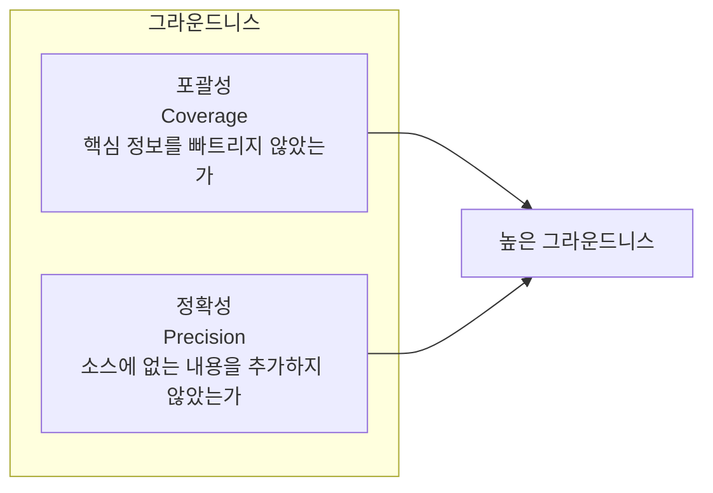
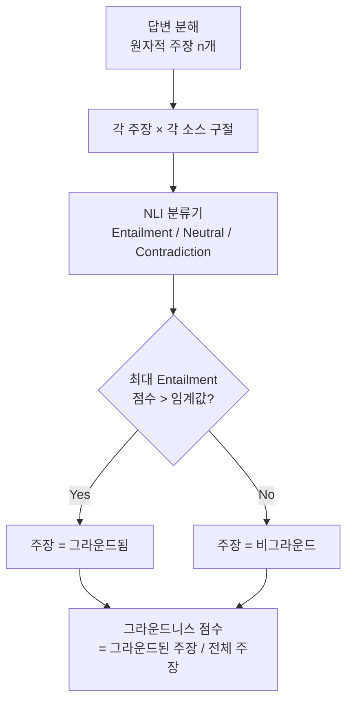
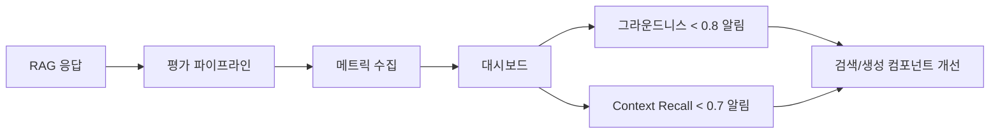

# 그라운드니스 평가 (Groundedness Evaluation)

## 정의 / 본질

**그라운드니스(groundedness)**는 생성된 답변이 특정 근거(ground) -- 보통 검색된 소스 문서 -- 에 단단히 발 딛고 있는지를 나타내는 성질이다. RAG (Retrieval-Augmented Generation) 시스템에서 가장 핵심적인 품질 지표로, "모델이 임의로 지어낸 것이 아니라 실제 제공된 문서에서 도출된 답변인가?"를 측정한다.

충실성(faithfulness)과 그라운드니스는 종종 혼용되지만 미묘한 차이가 있다.

- **충실성**: 생성 내용이 컨텍스트에 *논리적으로 수반(entail)*되는가 (이진/점수 판단)
- **그라운드니스**: 답변이 전반적으로 컨텍스트를 *증거(evidence)로서 활용*하는가 (더 넓은 개념, 출처 사용 방식 포함)

실용적으로는 두 개념을 같은 측정 파이프라인으로 다루는 프레임워크가 많다. 이 페이지는 평가 메트릭 설계와 측정 방법론에 집중한다.

## 핵심 아이디어

### 그라운드니스의 두 차원



두 차원의 트레이드오프가 존재한다. 소스를 그대로 복사하면 정확성은 높지만 압축·합성 능력이 없다. 반대로 풍부하게 합성하면 포괄성은 올라가지만 비그라운드 주장이 섞일 위험이 커진다.

### NLI 기반 그라운드니스 측정

자연어 추론(NLI, Natural Language Inference) 모델을 판단기(judge)로 사용하는 것이 가장 일반적인 접근이다.



각 주장은 검색된 모든 소스 구절과 대조되며, 하나라도 Entailment를 충족하면 "그라운드된(grounded)" 주장으로 판정한다.

### 핵심 메트릭 정리

| 메트릭 | 계산 공식 | 범위 | 의미 |
|--------|-----------|------|------|
| **Groundedness Score** | 그라운드된 주장 수 / 전체 주장 수 | 0~1 | 비그라운드 주장 비율 역수 |
| **Context Precision** | 관련 소스 구절 수 / 검색된 소스 구절 수 | 0~1 | 검색 노이즈 측정 |
| **Context Recall** | 답변에 활용된 소스 구절 수 / 관련 소스 구절 수 | 0~1 | 소스 활용 완전성 |
| **Answer Relevance** | 답변이 질문에 얼마나 관련되는가 | 0~1 | 질문 일탈 측정 |

이 네 지표를 함께 보면 RAG 시스템의 검색 품질과 생성 품질을 분리해서 진단할 수 있다.

## 평가 방법론 비교

### LLM-as-Judge 방식

GPT-4, Claude 같은 강력한 모델을 판단기로 사용. 프롬프트로 채점 기준을 지정하고 1-5점 또는 0/1 이진 판단을 요청.

**장점**: 유연하고 다단계 추론 가능, 별도 모델 훈련 불필요  
**단점**: 비용, 속도, 판단 일관성 문제. 채점기 모델 자체의 편향이 전이됨.

```python
GROUNDING_PROMPT = """
다음 답변이 제공된 컨텍스트에 기반하고 있는지 평가하세요.

컨텍스트: {context}
답변: {answer}

컨텍스트에서 지지되지 않는 주장이 있다면 "NON_GROUNDED"로,
모든 주장이 컨텍스트에서 도출된다면 "GROUNDED"로 판정하세요.
"""
```

### 파인튜닝된 분류기 방식

NLI 모델(DeBERTa, RoBERTa 기반)을 그라운드니스 판단용으로 파인튜닝.

**장점**: 빠르고 저렴, 일관성 높음  
**단점**: 훈련 데이터 레이블링 필요, 도메인 외 일반화 약함

### 통계적 방식 (BLEURT, BERTScore)

임베딩 유사도 기반. 의미적 겹침을 측정하지만 진정한 수반 관계를 포착하지 못함. 단독으로 사용하기에는 부정확.

## 주요 평가 프레임워크에서의 구현

### RAGAS

```python
from ragas.metrics import (
    faithfulness,      # 그라운드니스와 동의어로 사용
    context_precision,
    context_recall,
    answer_relevancy
)
```

RAGAS에서 `faithfulness`가 실질적으로 그라운드니스를 측정한다. 내부적으로 LLM을 사용해 주장 분해 → NLI 판단을 수행.

### TruLens

TruLens는 그라운드니스를 "Groundedness" 지표로 명시적으로 분리한다.

```python
from trulens_eval.feedback.provider import OpenAI
from trulens_eval import Feedback

provider = OpenAI()
groundedness = Feedback(
    provider.groundedness_measure_with_cot_reasons
).on_input_output()
```

`on_input_output()`은 (검색된 컨텍스트, 생성된 답변) 쌍에 대한 평가를 수행.

### DeepEval

```python
from deepeval.metrics import GEval
from deepeval.test_case import LLMTestCase

groundedness_metric = GEval(
    name="Groundedness",
    criteria="Determine whether the response is grounded in the given context",
    evaluation_params=[LLMTestCaseParams.INPUT, LLMTestCaseParams.ACTUAL_OUTPUT, LLMTestCaseParams.RETRIEVAL_CONTEXT]
)
```

## 실제 사례 / 응용

### RAG 품질 대시보드

프로덕션 RAG 시스템에서는 그라운드니스를 실시간 모니터링 지표로 추적한다.



### 그라운드니스 기반 답변 필터링

그라운드니스 점수가 임계값 이하인 답변은 사용자에게 전달하지 않고 "소스에서 확인되지 않음"을 반환하는 안전장치.

```python
GROUNDING_THRESHOLD = 0.85

def safe_rag_answer(query: str, docs: list[str]) -> str:
    answer = generate_answer(query, docs)
    score = measure_groundedness(answer, docs)

    if score < GROUNDING_THRESHOLD:
        return "죄송합니다. 제공된 문서에서 신뢰할 수 있는 답변을 찾지 못했습니다."
    return answer
```

### A/B 테스트에서의 그라운드니스

서로 다른 검색 전략(BM25 vs. Dense Retrieval vs. 하이브리드)이나 프롬프트 전략을 비교할 때 그라운드니스를 주요 승패 기준으로 삼는다. 관련: [[ab-testing-llms]].

## 한계 / 비판

### 자동 측정의 신뢰성 한계

LLM 기반 그라운드니스 측정은 평가 모델 자체의 오류를 내포한다. "자동 평가가 인간 평가와 얼마나 일치하는가"(inter-annotator agreement) 검증이 필수.

### 다중 홉 추론의 어려움

소스 A에서 X를 알 수 있고, 소스 B에서 Y를 알 수 있을 때, "X와 Y를 조합하면 Z" 같은 다중 홉 추론은 어떤 단일 소스에도 직접 수반되지 않는다. 이 경우 그라운드니스 점수가 불공정하게 낮게 측정됨.

### 소스 품질에 대한 무감각

소스 자체가 오류 있는 정보를 포함하면 그라운드된 답변도 사실 오류가 된다. 그라운드니스는 소스에 대한 내적 일관성이지, 소스의 정확성을 보장하지 않는다.

### 측정 비용

고품질 LLM-as-Judge 방식은 응답 하나당 여러 번의 LLM 호출이 필요해 대규모 평가 시 비용이 급증한다.

## 관련 문서

- [[faithfulness-attribution]] -- 충실성과 출처 귀속 (관련 개념 비교)
- [[evidence-attribution]] -- 증거 귀속과 인용 생성
- [[hallucination-mitigation]] -- 환각 완화 전략 전반
- [[advanced-rag-patterns]] -- RAG 고급 패턴에서 그라운드니스 통합
- [[agent-trajectory-evaluation]] -- 에이전트 궤적 평가에서의 그라운드니스
