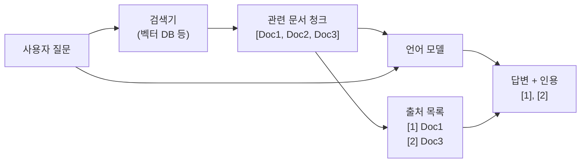

# 그라운딩과 출처 귀속

## 개요

**그라운딩(grounding)** 은 LLM의 출력을 검증 가능한 외부 소스에 연결하는 과정이다. 모델이 "스스로 알고 있다고 생각하는 것"에서 "실제 확인 가능한 소스에서 온 것"으로 지식의 근거를 이동시킨다.

**출처 귀속(attribution)** 은 그라운딩의 구체적 구현으로, 모델이 생성한 각 클레임(claim)이 어떤 소스 문서의 어느 부분에서 왔는지 추적하는 것이다.

이 두 개념은 LLM의 가장 심각한 문제인 **환각(hallucination)** 을 완화하는 핵심 기술이다.

## 왜 그라운딩이 필요한가

LLM은 학습 데이터에서 통계적 패턴을 학습하며, 이는 다음과 같은 문제를 낳는다:

- **사실 오류**: 학습 데이터에 없거나 잘못 학습된 정보를 자신있게 생성
- **지식 컷오프**: 최신 정보가 없음
- **검증 불가**: 출처가 없으면 사용자가 확인할 방법이 없음
- **편향 증폭**: 학습 데이터의 편향이 확신에 찬 오류로 나타남

그라운딩은 이러한 문제를 원천적으로 줄인다.

## RAG: 대표적 그라운딩 메커니즘

**검색 증강 생성(Retrieval-Augmented Generation, RAG)** 은 가장 널리 사용되는 그라운딩 메커니즘이다.



모델은 검색된 문서만을 기반으로 답변하도록 프롬프팅된다. 모델의 파라메트릭 지식(parametric knowledge)보다 컨텍스트 문서를 신뢰하도록 유도한다.

## 인용 생성 (Citation Generation)

단순한 그라운딩에서 나아가, 모델이 생성한 각 문장 또는 클레임에 구체적인 인용(citation)을 붙이는 것이 출처 귀속이다.

### 후인용 방식 (Post-hoc Attribution)

1. 먼저 답변을 생성
2. 각 클레임에 대해 소스 문서에서 지지 문장 찾기
3. 일치도 기반으로 인용 할당

장점: 유연성 높음. 단점: 답변이 실제로 소스에서 오지 않았더라도 사후에 소스를 찾아 붙일 수 있음.

### 인라인 인용 방식 (Inline Citation)

답변 생성 시 인용을 동시에 출력하도록 모델을 파인튜닝하거나 프롬프팅.

```
서울의 인구는 약 950만 명이다 [1]. 
대한민국 전체 인구의 약 18%를 차지한다 [1][2].

출처:
[1] 서울시 통계 2024
[2] 통계청 인구 조사 2024
```

## Google의 그라운딩 API

Google Gemini API는 **그라운딩 with Google Search** 기능을 제공한다. 모델 응답에 실시간 Google 검색 결과를 자동으로 통합하고, 인용 메타데이터를 구조화된 형태로 반환한다.

응답에는 `groundingMetadata`가 포함되어 각 클레임이 어떤 검색 결과에 기반하는지 추적 가능하다.

## Bing 그라운딩 (Microsoft)

Bing 기반 검색 그라운딩은 Azure OpenAI Service에서 "data source" 옵션으로 제공된다. 엔터프라이즈 RAG 시나리오에서 내부 문서와 웹 검색을 결합하는 데 활용된다.

## 귀속 품질 측정 (Attribution Metrics)

그라운딩 품질을 측정하는 주요 지표:

### 귀속 정밀도 (Attribution Precision)

모델이 인용한 소스 중 실제로 해당 클레임을 지지하는 비율.

$$\text{Precision} = \frac{|\text{지지 인용}|}{|\text{전체 인용}|}$$

### 귀속 재현율 (Attribution Recall)

실제 소스로 지지받아야 할 클레임 중 올바르게 인용된 비율.

$$\text{Recall} = \frac{|\text{인용된 지지 클레임}|}{|\text{전체 지지 가능 클레임}|}$$

### ALCE 벤치마크

"Enabling Large Language Models to Generate Text with Citations" (Gao et al. 2023). ALCE(Automatic LLMs' Citation Evaluation)는 인라인 인용의 자동 평가 프레임워크로, 사실성(faithfulness)과 인용 품질을 분리 측정한다.

| 지표 | 측정 대상 | 이상적 값 |
|------|-----------|-----------|
| 정밀도 | 인용의 정확성 | 높을수록 좋음 |
| 재현율 | 인용의 완전성 | 높을수록 좋음 |
| 사실성 | 소스 기반 답변 비율 | 높을수록 좋음 |

## 세분화 귀속 (Fine-grained Attribution)

문서 수준이 아닌 **문장 수준** 또는 **구 수준**으로 귀속을 추적하는 기술.

- 같은 문서 내에서도 특정 문단, 문장만을 인용
- 여러 소스에서 각기 다른 부분 조합
- 모순된 소스가 있을 때 어느 소스를 따랐는지 명확히

이는 특히 의료, 법률, 금융 등 고위험 도메인에서 감사 추적(audit trail)을 위해 중요하다.

## 그라운딩 vs 환각

그라운딩과 환각 방지는 같은 문제의 다른 면이다:

- **강한 그라운딩**: 소스 없이는 답변하지 않음. "제 컨텍스트에는 해당 정보가 없습니다."
- **약한 그라운딩**: 소스가 있어도 파라메트릭 지식을 혼합
- **그라운딩 실패**: 소스와 모순되는 답변 생성

현재 최신 모델들도 완벽한 그라운딩은 달성하지 못했으며, 특히 긴 컨텍스트에서 소스를 무시하는 경향이 있다.

## 관련 문서
- [[ai-research-assistant]] -- AI 연구 보조 시스템 (AI Research Assistant)

- [[RAG 파이프라인]] - RAG 구현의 전체 아키텍처
- [[환각]] - 그라운딩이 해결하고자 하는 핵심 문제
- [[agentic-rag|에이전틱 RAG]] - 에이전트가 동적으로 검색·그라운딩하는 고급 패턴
- [[벡터 데이터베이스]] - 그라운딩을 위한 문서 검색 인프라
