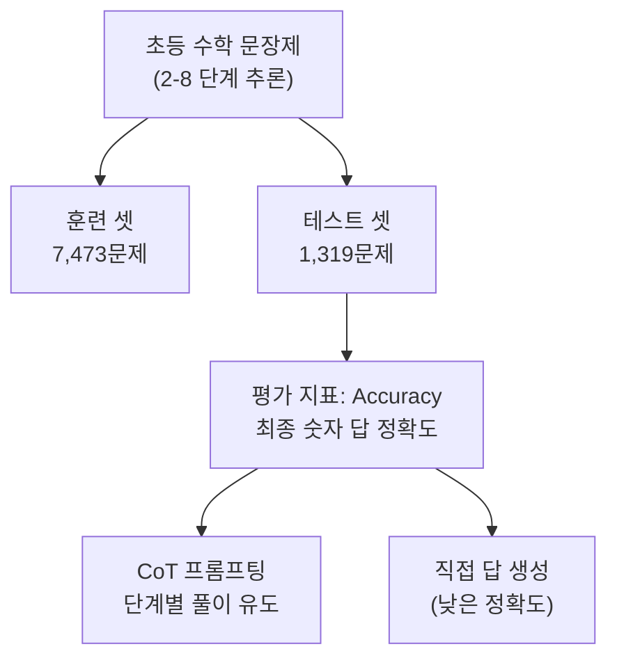
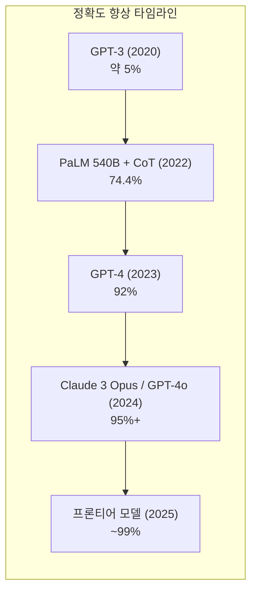

# GSM8K - 초등 수학 벤치마크

GSM8K(Grade School Math 8K)는 OpenAI가 2021년 발표한 8,500개 규모의 초등학교 수준 수학 문장제(word problem) 데이터셋이다. 다단계 풀이 과정이 필요한 문제들로 구성되어 있으며, CoT(Chain-of-Thought) 프롬프팅의 효과를 측정하는 표준 벤치마크로 자리잡았다.

## 데이터셋 구성

GSM8K는 7,473개의 훈련 문제와 1,319개의 테스트 문제로 나뉜다. 모든 문제는 실제 초등학교 수학 교사들이 작성했으며, 각 문제에는 단계별 풀이(solution)가 함께 제공된다. 문제의 특징:

- 2~8 단계의 추론 과정 필요
- 사칙연산, 분수, 비율, 단위 변환 등 기초 수학 개념
- 현실적인 맥락(쇼핑, 요리, 스포츠 등)을 배경으로 한 서술



## CoT 평가의 표준으로 자리잡은 이유

Kojima et al.(2022)의 "Large Language Models are Zero-Shot Reasoners" 논문에서 GSM8K가 핵심 벤치마크로 사용되었다. "Let's think step by step" 프롬프트만으로 GPT-3의 GSM8K 정확도가 10.4%에서 40.7%로 대폭 향상되었고, 이는 단순한 프롬프트 한 줄로 멀티스텝 추론 능력을 이끌어낼 수 있음을 보였다.

Wei et al.(2022)의 Few-shot CoT 연구에서도 GSM8K가 핵심 실험 대상이었다. PaLM 540B + CoT 조합이 당시 최고 성능인 74.4%를 달성하며 모델 규모와 CoT의 시너지를 입증했다.

## 프론티어 모델의 포화 (2024-2025)



2024년 말~2025년부터 GPT-4o, Claude 3.5 Sonnet, Gemini 1.5 Pro 등 프론티어 모델들이 GSM8K에서 95% 이상을 기록하며 사실상 포화 상태에 이르렀다. 벤치마크로서의 변별력이 낮아지자 후속 과제들이 등장했다.

## GSM8K-Platinum: 오류 정제

GSM8K 원본에는 약 2~3%의 문제에서 오답이나 모호한 풀이가 포함되어 있다는 비판이 있었다. GSM8K-Platinum은 이를 수작업으로 검증하고 수정한 정제 버전이다. 모델 비교 시 통계적으로 더 신뢰할 수 있는 결과를 제공한다.

## 후속 벤치마크

| 벤치마크 | 특징 | 난이도 대비 GSM8K |
|----------|------|-------------------|
| MATH | 경시 수학 (AMC, AIME 수준), 7개 하위 영역 | 훨씬 어려움 |
| MathOdyssey | 올림피아드 수준, 개방형 증명 포함 | 극도로 어려움 |
| MGSM | GSM8K의 다국어 버전 (10개 언어) | 동일 난이도, 언어 다양성 |
| GSM-Symbolic | 기호 치환으로 암기 방지 | GSM8K와 동등하나 신선 |
| AIME 2024 | 미국 수학 경시 실제 문제 | 최고 난이도 |

## 평가 방법론

GSM8K 평가 시 최종 숫자 답만 추출해 정확 매칭(exact match)으로 채점한다. 풀이 과정의 정확성은 별도로 평가하지 않는다는 점이 한계다. 일부 모델이 올바른 답을 내놓지만 잘못된 추론 경로를 거쳤을 가능성(충실도 문제)이 있다.

```python
# 전형적인 GSM8K 문제와 CoT 풀이 예시 구조
문제 = """
나탈리는 사탕 3개를 갖고 있었다. 어머니가 사탕 5개를 주셨고,
오빠가 그 중 2개를 가져갔다. 나탈리에게 사탕은 몇 개 남았나?
"""

CoT_풀이 = """
1단계: 처음 사탕 수 = 3
2단계: 어머니가 주신 후 = 3 + 5 = 8
3단계: 오빠가 가져간 후 = 8 - 2 = 6
정답: 6
"""
```

## 실무적 시사점

모델 개발 중간 평가나 SFT(Supervised Fine-Tuning) 효과 측정에는 여전히 GSM8K가 유용하다. 훈련 데이터에 포함 여부를 확인해 데이터 오염(contamination)을 차단하는 것이 중요하다. 연구 발표 시 GSM8K 단독 결과보다 MATH, AIME 등을 함께 보고하는 것이 현재 표준이 되고 있다.

## 관련 문서

- [[chain-of-thought-prompting]] - GSM8K에서 극적인 성능 향상을 보여준 기법
- [[big-bench-hard]] - 논리·추론 영역의 보완적 벤치마크
- [[tree-of-thought]] - GSM8K보다 어려운 문제에서의 추론 전략
