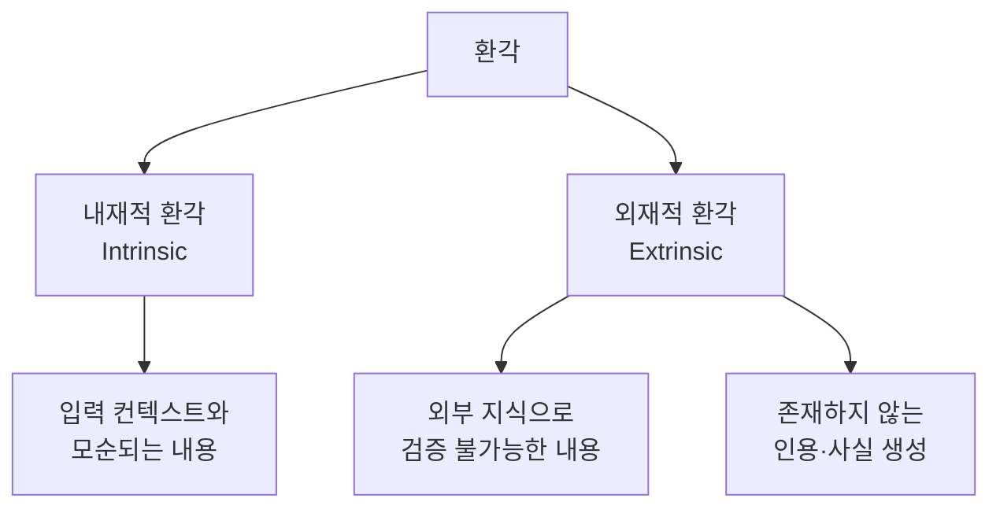
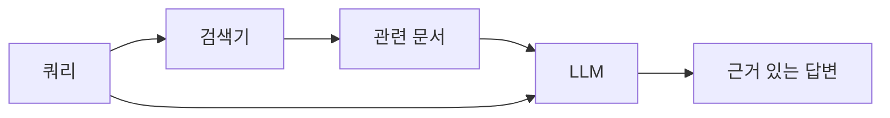
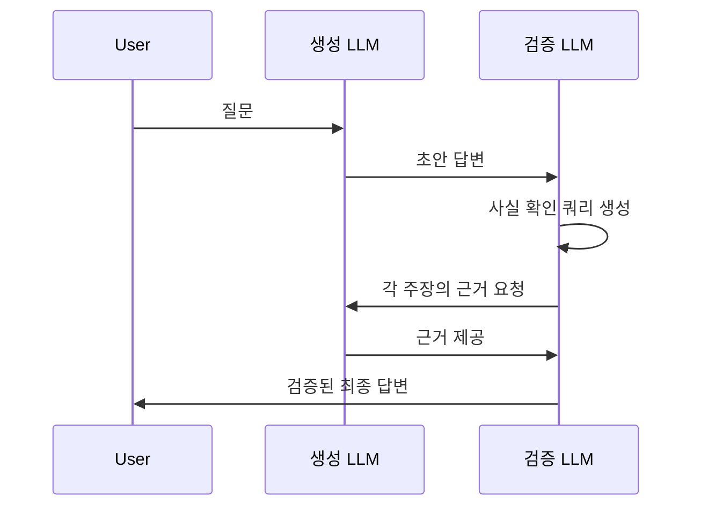

# 환각 완화 (Hallucination Mitigation)

## 개요

LLM 환각(hallucination)이란 모델이 **사실과 다르거나 검증 불가능한 정보를 마치 사실인 것처럼 생성**하는 현상이다. 전체 문장의 유창성은 유지하면서 내용이 틀린다는 점에서 일반적인 오류와 다르다. 고신뢰 응용(의료, 법률, 금융)에서 심각한 위험을 초래하며, LLM 신뢰성의 핵심 과제다.

## 환각의 분류

- **내재적 환각(Intrinsic)**: 주어진 입력(문서, 지시)과 모순되는 출력. 요약 작업에서 원문에 없는 내용 추가
- **외재적 환각(Extrinsic)**: 외부 세계 사실과 다른 출력. 없는 논문 인용, 잘못된 날짜, 가공의 인물

## 환각의 원인

### 학습 데이터 노이즈
- 인터넷 텍스트에는 오류, 편향, 모순이 다수 포함
- 모델이 잘못된 사실도 학습 확률 분포에 흡수

### 지식 컷오프 (Knowledge Cutoff)
- 학습 이후 발생한 사건 정보 없음
- 오래된 정보를 최신인 것처럼 답변

### 신뢰도 보정 실패 (Calibration)
- 모델은 "모르는 것"을 "모른다"고 표현하지 않고 그럴싸한 답변 생성
- 불확실한 영역에서도 동일하게 자신감 있는 어조 유지

### 컨텍스트 무시
- 긴 입력에서 관련 부분을 놓치고 파라메트릭 지식(내부 기억)에 의존

## 완화 전략

### 1. RAG (Retrieval-Augmented Generation)

가장 실용적이고 널리 사용되는 방법.

- 외부 지식 베이스에서 관련 문서 검색
- 모델은 검색된 문서를 근거로 답변 생성
- 학습 컷오프 문제와 외재적 환각을 동시에 완화

### 2. 그라운딩과 출처 귀속 (Grounding & Citation)

- 모든 주장에 출처 문서의 구체적 구절을 인용하도록 지시
- 인용 없이는 주장하지 않도록 프롬프트 설계
- Bing AI, Perplexity AI 등에서 적극 활용

### 3. 자기 일관성 (Self-Consistency)

동일 쿼리에 여러 번 응답하고 결과를 비교.

- 여러 샘플에서 일관되게 등장하는 답변 신뢰
- 불일치하는 답변은 불확실 표시

### 4. 검증 체인 (Verification Chain)

- SELF-RAG: 모델이 스스로 "검색이 필요한가?"를 판단하고 검색 후 자기 비판
- Chain-of-Verification(CoVe): 초안 → 검증 질문 생성 → 각 질문 독립 답변 → 최종 수정

### 5. RLHF와 정직성 학습

- 사실과 다른 응답에 낮은 보상을 주는 보상 모델 설계
- Constitutional AI(Anthropic): "출처 없는 주장을 하지 말라"는 원칙 포함
- 불확실할 때 "모르겠습니다"라고 말하도록 학습

## 탐지 방법

### SelfCheckGPT

Manakul et al.(2023). 비용이 큰 외부 DB 없이 환각을 탐지하는 방법.

- 같은 프롬프트로 N번 샘플링
- 샘플들 간의 일관성을 측정
- 일관성이 낮은 주장 = 환각 가능성 높음

### NLI 기반 탐지

자연어 추론(Natural Language Inference)으로 생성 텍스트와 소스 간 모순 탐지.

- 모델 응답의 각 문장을 클레임(claim)으로 추출
- 클레임이 소스 문서에 의해 지지되는지 NLI 모델로 판단

## 벤치마크

| 벤치마크 | 측정 대상 | 특징 |
|---------|---------|------|
| TruthfulQA | 의도적으로 틀리기 쉬운 질문에 대한 정직한 답변 | 인간도 자주 틀리는 미신, 오해 포함 |
| HaluEval | 요약, QA, 대화에서의 환각 탐지 | GPT-4 생성 환각 예시 포함 |
| FActScore | 전기 문서의 사실 정확성 | 원자적 사실로 분해 후 위키피디아 교차 검증 |
| FEVER | 사실 검증 | 위키피디아 기반 주장 참/거짓 분류 |

## 환각과 신뢰 보정

환각 문제의 근본 원인 중 하나는 모델의 **신뢰 보정(calibration) 실패**다. 잘 보정된 모델은 정확도 70%인 문제에 70% 확신을 표현해야 한다. 현실의 LLM은 특히 사실 지식 영역에서 과신(overconfidence) 경향이 있다.

표현 수준의 완화책: "확실하지 않습니다", "~라고 알려져 있습니다" 등 불확실성 표현을 유도하는 프롬프트 설계. 하지만 이는 실제 정확도를 높이지 않고 표현만 바꾸는 임시방편.

## 실무 관점

환각을 "0%"로 만드는 것은 현재 기술로 불가능하다. 실용적 접근은 **환각 위험을 관리 가능한 수준으로 낮추고, 남은 위험을 시스템 설계로 처리**하는 것이다. 고신뢰 응용에서는 RAG + 출처 귀속 + 사람 검토 체계를 결합하는 것이 현재 최선에 가깝다.

## 관련 문서

- [[RAG 파이프라인]]
- [[그라운딩과 출처 귀속]]
- [[검증자/비평가 모델]]
- [[자기 일관성 (Self-Consistency)]]
- [[RLHF (인간 피드백 강화학습)]]
- [[LLM 지식 증류]]
