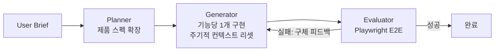

# Harness Engineering (하네스 엔지니어링)

## 정의

**Harness Engineering**은 2026년 초부터 지배적이 된 AI 개발 패러다임이다. 핵심 질문은 "**모델을 감싸는 어떤 시스템을 구축해야 원하는 동작이 나올까?**"다. [[relocating-rigor|엄밀함]]의 위치는 컨텍스트 창 구성에서 **시스템 아키텍처**로 이동했다.

## 핵심 공식

> **Agent = Model + Harness (모델을 제외한 모든 것)**

**하네스(harness)**는 모델 주변을 둘러싼 모든 것을 뜻한다: 시스템 프롬프트, 도구, 규칙 파일, 린터, 테스트 러너, 오케스트레이션 루프, 보안 가드레일 등. 이 중 시스템 동작을 실제로 제약하는 핵심 요소들을 [[load-bearing-harness|load-bearing harness]]라고 부른다. 모델 자체는 중심 컴포넌트이지만 시스템의 성능을 결정하는 레버는 대부분 **하네스에 있다**.

## 기원: 2026년 2월 다중 발견

Mitchell Hashimoto의 "[My AI Adoption Journey](https://mitchellh.com/writing/my-ai-adoption-journey)"가 시작을 알렸다. 핵심 주장:

> "When agents make mistakes, change the system so the same mistake cannot structurally recur."
> ("에이전트가 실수할 때, 같은 실수가 구조적으로 재발하지 못하도록 시스템을 바꾼다.")

2주 안에 OpenAI, Martin Fowler/Birgitta Böckeler, Ethan Mollick이 독립적으로 정렬된 결론을 발표했다. 이를 저자는 **다중 발견(multiple discovery)** 이라 부른다.

## 왜 하네스로 이동했는가

[[context-engineering|context engineering]] 시대의 세 가지 한계가 드러났다:

1. **단일 턴 중심** — 멀티턴 결정 체인을 커버 못 함
2. **에러 복구 부재** — 실수를 시스템적으로 교정할 메커니즘 없음
3. **보안 공백** — 프롬프트 인젝션 공격 차단 불가 ([[lethal-trifecta]])

컨텍스트만으로는 부족했다. **시스템 전체가 에이전트의 동작을 규정**해야 했다.

## [[harness-quadrants|하네스 4사분면]]

Fowler와 Böckeler가 제시한 2×2 분류:

|  | **Feedforward (사전 유도)** | **Feedback (사후 교정)** |
|---|---|---|
| **Deterministic** | Guides: AGENTS.md, .cursorrules, 컨벤션 | Computational: 컴파일러, 타입 체커, 린터 |
| **Non-deterministic** | System prompts: 역할 정의, 행동 제약, few-shot 예시 | Inferential: LLM-as-a-judge, 시맨틱 코드 리뷰 |

- **좌상 (Guides)**: 제로 비용 유도. 강제력 없음. 무시될 수 있음
- **우상 (Computational)**: 기계적 강제. 구조 위반 포착
- **좌하 (System prompts)**: 뉘앙스를 다루는 행동 가이드라인
- **우하 (Inferential)**: LLM 기반 품질 평가. 시맨틱 에러 포착

네 사분면 모두를 조합해야 엄밀한 하네스가 된다. 상세는 [[harness-quadrants]] 참조.

## 대표 케이스 스터디

### 1. Anthropic의 3-Agent 아키텍처

**비용**: $200 vs $9 (22배 높음)
**완성도**: 비교 불가할 정도로 우수

정답이 "더 큰 모델 하나"가 아니라 "역할이 나뉜 여러 모델 + 피드백 루프"였다는 것이 핵심.

### 2. OpenAI Codex 5개월 실험

- 수동 작성 코드: **0줄**
- 생성 코드: 약 **100만 라인**
- PR: 약 **1,500개**
- 속도: **10배** 향상

**핵심 발견**: 엔지니어들은 코드를 쓰지 않았다. 그들은 **컨텍스트 생성 환경을 설계**했다:
1. **지식 체계화**: 이전엔 tribal하던 아키텍처 결정을 문서화
2. **기계적 강제**: 커스텀 린터가 인간 코드 리뷰를 대체
3. **점진적 공개**: 에이전트에게 매뉴얼 대신 **지도(map)** 를 제공

### 3. Ralph Pattern

PRD(제품 요구사항 문서) 완료까지 자동 루프. 반복마다 클린 컨텍스트 리셋. 상태는 git history와 파일에 유지.

이 패턴은 [[omc-ralph-mode|OMC의 Ralph 모드]]로도 구현되어 있으며, 하네스의 **feedback 루프 + 외부 상태 저장** 원칙을 드러낸다.

## 보안: [[lethal-trifecta]] & Rule of Two

하네스 엔지니어링의 보안 레이어에 대한 두 가지 원칙:

### Lethal Trifecta (Simon Willison)

에이전트가 다음 셋을 동시에 갖추면 **보안 사고는 불가피**:
1. 비신뢰 입력 처리
2. 민감 시스템/데이터 접근
3. 상태 수정 능력

### Meta의 Rule of Two

에이전트는 위 셋 중 **최대 두 개까지만** 동시 보유 가능. 세 개가 필요하면 **human-in-the-loop** 승인 필수.

## 실무 시사점

- **코드 작성은 더 이상 병목이 아니다**: 엔지니어가 하루에 쓸 수 있는 코드 양이 1000배 증가했지만, 버그와 보안 이슈도 증가했다
- **레버리지는 시스템 설계에 있다**: 어떤 린터를 설치할지, 어떤 AGENTS.md를 작성할지, 어떤 E2E 테스트를 자동화할지가 실제 승부처
- **"엔지니어링은 여전히 하드"** : [[relocating-rigor]]는 살아있다. 엄밀함이 시스템 설계로 이동했을 뿐

## 앞으로의 지평

- **Guardian Agent**: 정책 위반 배포를 막는 실시간 감시. 엄밀함이 "실행"에서 "감독"으로
- **Evaluation Engineering**: 벤치마크 점수 → 실제 작업 완료율. 검증 불가 보상 문제 대응
- **Knowledge Engines**: 코드 그래프 + 커밋 히스토리 + 프로젝트 설계 의도 통합

## 관련 문서

- [[evolution-of-agentic-patterns]] — 3 에라 연대기에서 Era 3
- [[prompt-engineering]] — Era 1
- [[context-engineering]] — Era 2
- [[harness-quadrants]] — 4사분면 상세
- [[lethal-trifecta]] — 보안 원칙
- [[relocating-rigor]] — 엄밀함 이동 메타 원칙
- [[subagents]] — 3-Agent 아키텍처 기반
- [[coding-agent]] — 하네스의 핵심 실행 주체
- [[better-code-with-agents]] — 하네스 완성도가 낳는 결과
