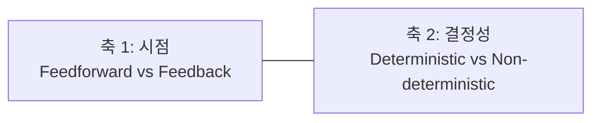
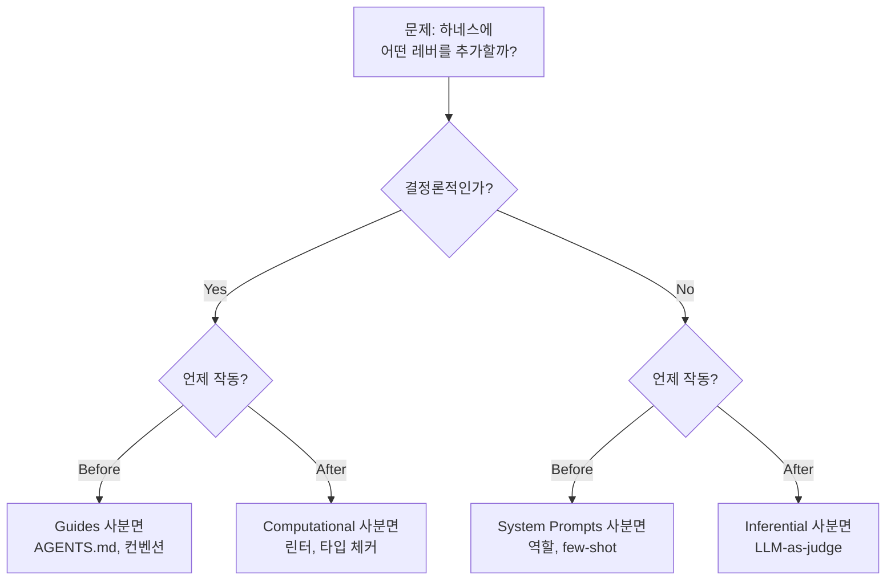

# Harness Quadrants (하네스 4사분면)

## 정의

**Harness Quadrants**는 Martin Fowler와 Birgitta Böckeler(ThoughtWorks)가 2026년 2월에 제시한 **하네스 구성요소의 2×2 분류 체계**다. [[harness engineering]]에서 "모델을 제외한 모든 것"에 해당하는 하네스를 네 영역으로 쪼개 어떤 레버를 선택할지 판단할 수 있게 해준다.

## 두 축

- **축 1 — 시점(timing)**:
  - *Feedforward(사전 유도)*: 모델이 행동하기 **전**에 방향을 잡아준다
  - *Feedback(사후 교정)*: 모델이 행동한 **후**에 결과를 검증·교정한다
- **축 2 — 결정성(determinism)**:
  - *Deterministic*: 같은 입력에 같은 출력. 기계적·규칙 기반
  - *Non-deterministic*: LLM이 개입. 같은 입력에도 결과가 달라질 수 있음

## 4사분면

|  | **Feedforward (사전 유도)** | **Feedback (사후 교정)** |
|---|---|---|
| **Deterministic** | **Guides** (좌상) | **Computational** (우상) |
| **Non-deterministic** | **System Prompts** (좌하) | **Inferential** (우하) |

### 좌상: Guides (가이드)

- **정의**: 결정론적 사전 유도. 규칙 문서와 컨벤션
- **대표 예시**:
  - `AGENTS.md`, `.cursorrules`, `CLAUDE.md`
  - 코딩 컨벤션, 네이밍 규칙
  - 디렉토리 구조 규약
- **특성**: 제로 비용으로 방향을 잡지만 **강제력이 없다**. 에이전트가 읽지 않거나 무시할 수 있다
- **실무 팁**: "중요한 것은 중복해서 쓰고 간결하게 써라"

### 우상: Computational (연산적)

- **정의**: 결정론적 사후 교정. 기계적으로 검증·수정
- **대표 예시**:
  - 컴파일러, 타입 체커 (TypeScript, mypy)
  - 린터 (ESLint, Ruff), 포매터
  - 단위 테스트, 통합 테스트
  - 커스텀 검증 스크립트 (OpenAI Codex 팀의 "아키텍처 린터")
- **특성**: **강제력이 있다**. 위반 시 빌드 실패. 에이전트가 스스로 고쳐야 함
- **핵심 가치**: "피드백이 기계적이면 에이전트가 자기 교정 루프를 돌 수 있다"

### 좌하: System Prompts (시스템 프롬프트)

- **정의**: 비결정론적 사전 유도. 자연어로 행동 가이드
- **대표 예시**:
  - 역할 정의 ("너는 선임 엔지니어다")
  - 행동 제약 ("코드를 쓰기 전에 먼저 테스트를 읽어라")
  - few-shot 예시
  - 출력 포맷 명세
- **특성**: 뉘앙스를 다룰 수 있지만 **비결정적**. 지키지 않을 수 있다
- **역할**: [[prompt engineering]] 시대의 레거시. 여전히 필요하지만 전부가 아니다

### 우하: Inferential (추론적)

- **정의**: 비결정론적 사후 교정. LLM 기반 검증
- **대표 예시**:
  - LLM-as-a-judge (다른 모델이 품질 평가)
  - 시맨틱 코드 리뷰 (의도가 맞는가 판단)
  - Anthropic 3-Agent 아키텍처의 Evaluator 역할
- **특성**: 시맨틱 오류를 포착할 수 있다. 컴파일되지만 의미가 틀린 코드를 잡는다
- **한계**: 비용과 latency가 높고, 평가 모델 자체의 편향을 물려받는다

## 왜 2×2가 유용한가

- 비어 있는 사분면이 약점이다. 네 영역을 모두 갖춘 하네스가 견고하다
- **가이드만 있는 하네스**는 강제력이 없어 금방 무너진다
- **시스템 프롬프트만 있는 하네스**는 [[prompt engineering]] 시대의 한계를 답습한다
- **연산적 피드백이 없는 하네스**는 타입 에러와 컴파일 에러를 사람이 잡아줘야 한다
- **추론적 피드백이 없는 하네스**는 의미가 틀린 코드를 잡지 못한다

## 사분면 조합의 실례

### Anthropic 3-Agent 아키텍처

| 컴포넌트 | 주요 사분면 |
|---------|-----------|
| Planner 시스템 프롬프트 | System Prompts (좌하) |
| `AGENTS.md`, 컨벤션 | Guides (좌상) |
| Playwright E2E 자동 실행 | Computational (우상) |
| Evaluator 모델 검증 | Inferential (우하) |

네 사분면이 모두 활용된 정석 사례.

### OpenAI Codex 실험의 교훈

- 가장 레버가 컸던 것은 **Computational (커스텀 린터)** 이었다
- "아키텍처 규칙을 린터로 표현할 수 있으면 에이전트가 자기 교정 가능"
- 인간 코드 리뷰를 **결정론적 피드백으로 대체**한 것이 10× 속도의 핵심

## 관련 개념

- **[[prompt engineering]]의 레거시**: 좌하 사분면만 있던 시대
- **[[context engineering]]의 레거시**: 좌하 + 부분적인 우하
- **[[harness engineering]]의 핵심**: 네 사분면 전체 조합

## 실무 체크리스트

새 에이전트 시스템을 설계할 때 각 사분면이 채워졌는지 점검한다:

- [ ] **Guides**: `AGENTS.md`/`CLAUDE.md`/컨벤션 문서가 있는가?
- [ ] **System Prompts**: 역할, 제약, 예시가 명확히 정의되어 있는가?
- [ ] **Computational**: 린터/타입 체커/테스트가 CI에 연결되어 있는가?
- [ ] **Inferential**: LLM-as-judge나 시맨틱 리뷰 단계가 있는가?

네 칸이 모두 채워져 있지 않으면 그 빈칸이 가장 약한 고리다.

## 관련 문서

- [[harness engineering]] — 이 분류의 부모 개념
- [[evolution of agentic patterns]] — 3 에라 연대기
- [[prompt engineering]] — 좌하 사분면만 있던 시대
- [[context engineering]] — 이 분류 직전의 패러다임
- [[relocating rigor]] — 엄밀함이 네 사분면에 분산되는 원리
- [[lethal trifecta]] — 보안 사분면이 필요한 이유
