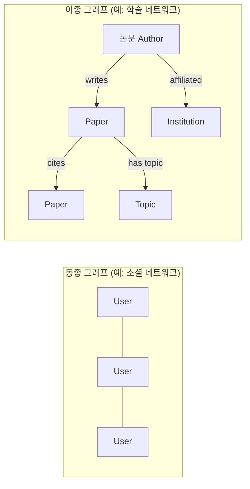
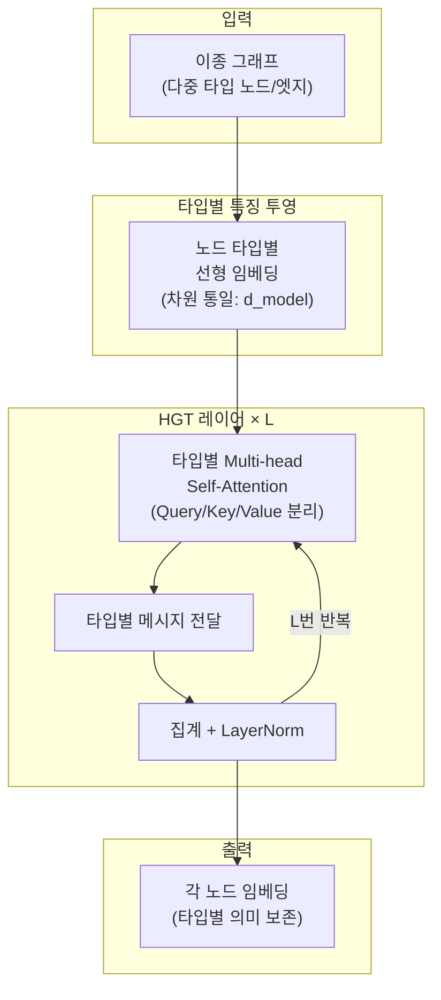

# 이종 그래프 트랜스포머 (Heterogeneous Graph Transformer, HGT)

## 개요

이종 그래프 트랜스포머(HGT, Heterogeneous Graph Transformer)는 **다중 타입의 노드와 엣지**가 공존하는 이종 그래프(heterogeneous graph)를 처리하기 위해 설계된 [[graph-transformer]] 변형 아키텍처다. 동종(homogeneous) 그래프를 가정하는 기본 [[graph-attention-network]](GAT)나 GCN과 달리, HGT는 노드 타입과 엣지 타입에 따라 **타입별 파라미터**를 분리해 이종 구조를 직접적으로 모델링한다.

2020년 Hu et al.이 WWW에 발표한 논문 "Heterogeneous Graph Transformer"에서 처음 제안되었으며, 주로 학술 지식 그래프, 추천 시스템, 생물정보학 이종 네트워크에 적용된다.

## 이종 그래프란



이종 그래프는 형식적으로 $G = (V, E, \phi, \psi)$로 정의된다:
- $V$: 노드 집합
- $E$: 엣지 집합
- $\phi: V \to \mathcal{T}_V$: 노드 타입 매핑 (예: Author, Paper, Topic)
- $\psi: E \to \mathcal{T}_E$: 엣지 타입 매핑 (예: writes, cites)

## HGT의 핵심 메커니즘

### 타입별 어텐션 (Type-Specific Attention)

기본 [[graph-attention-network]]에서 어텐션은 모든 노드 쌍에 동일한 파라미터를 사용하지만, HGT는 **엣지 타입 $(s \xrightarrow{\tau} t)$마다 별도의 선형 변환**을 적용한다.

$$\text{Attn}(s, \tau, t) = \text{Softmax}_{s \in N(t)} \left( \bigparallel_{i=1}^{h} Q^i_{\phi(t)}(H^{l-1}[t]) K^{T,i}_{\tau}(H^{l-1}[s]) \right) / \sqrt{d}$$

- $Q^i_{\phi(t)}$: 목표 노드 타입 $\phi(t)$에 특화된 Query 투영
- $K^{T,i}_\tau$: 엣지 타입 $\tau$에 특화된 Key 투영
- $h$: 어텐션 헤드 수

### 타입별 메시지 전달

메시지도 소스 노드 타입과 엣지 타입에 따라 다르게 구성된다:

$$\text{MSG}(s, \tau, t) = V_\tau(H^{l-1}[s]) W_\tau$$

각 엣지 타입 $\tau$마다 별도의 Value 행렬 $V_\tau$와 가중치 행렬 $W_\tau$를 가진다.

### 집계 및 업데이트

```python
# HGT 단일 레이어 (개념 코드)
def hgt_layer(graph, H, node_types, edge_types):
    H_new = {}
    for target_type in node_types:
        msgs = []
        for src_type, edge_type, _ in edge_types:
            if _ != target_type:
                continue
            # 타입별 어텐션 계산
            attn = type_aware_attention(
                H[target_type], H[src_type],
                Q_proj[target_type], K_proj[edge_type]
            )
            # 타입별 메시지
            msg = H[src_type] @ V_proj[edge_type]
            msgs.append(attn * msg)

        # 집계 및 정규화
        H_new[target_type] = layer_norm(
            linear_proj[target_type](sum(msgs))
        )
    return H_new
```

## 아키텍처 전체 흐름



입력 노드들은 타입마다 다른 원본 특징 차원을 가질 수 있으므로, 먼저 타입별 선형 투영으로 **공통 차원 $d$로 통일**한 뒤 HGT 레이어를 통과한다.

## 비교: 이종 그래프 처리 모델

| 모델 | 핵심 방식 | 이종성 처리 |
|------|----------|------------|
| HAN (Heterogeneous Attention Network) | 메타패스 기반 어텐션 | 메타패스 수작업 설계 필요 |
| RGCN (Relational GCN) | 관계별 파라미터 행렬 | 엣지 타입 분리 (노드 타입 미분리) |
| **HGT** | 노드+엣지 타입 모두 분리 | 완전 자동, 메타패스 불필요 |
| ie-HGCN | 계층적 이종 합성곱 | 타입별 집계 + 상위 레벨 정보 |

HAN이 메타패스(meta-path, 예: Author-Paper-Author)를 수작업으로 정의해야 하는 것과 달리, HGT는 메타패스 없이도 이종 구조를 자동 학습한다.

## 적용 도메인

- **학술 지식 그래프**: Microsoft Academic Graph(MAG)에서 논문 추천, 인용 예측
- **추천 시스템**: 사용자-아이템-속성-카테고리의 이종 그래프
- **생물정보학**: 유전자-단백질-질병-약물 네트워크
- **지식 그래프 완성**: 관계 타입이 다양한 KG에서 링크 예측
- [[social-network-analysis-gnn]]: 다양한 역할(사용자, 콘텐츠, 그룹)이 혼재하는 소셜 네트워크

## 확장: HGT의 한계와 개선

**파라미터 폭발 문제**: 타입 수가 많을수록 타입별 행렬 수가 증가. 해결책으로 **공유 기저 분해(shared basis decomposition)**를 적용하는 변형이 있다.

**귀납적(inductive) 추론**: 새로운 노드 타입이 추가될 때 기존 투영 행렬을 재활용하기 어려움. 메타 러닝 접근이 연구되고 있다.

## 관련 문서
- [[graph-transformer-comparison]] -- 그래프 트랜스포머 비교 - GPS, Graphormer, TokenGT

- [[graph-transformer]] - 동종 그래프에서의 트랜스포머 적용
- [[graph-attention-network]] - HGT의 어텐션 구조가 확장하는 기반 모델
- [[social-network-analysis-gnn]] - 이종 그래프가 등장하는 실세계 네트워크 분석
