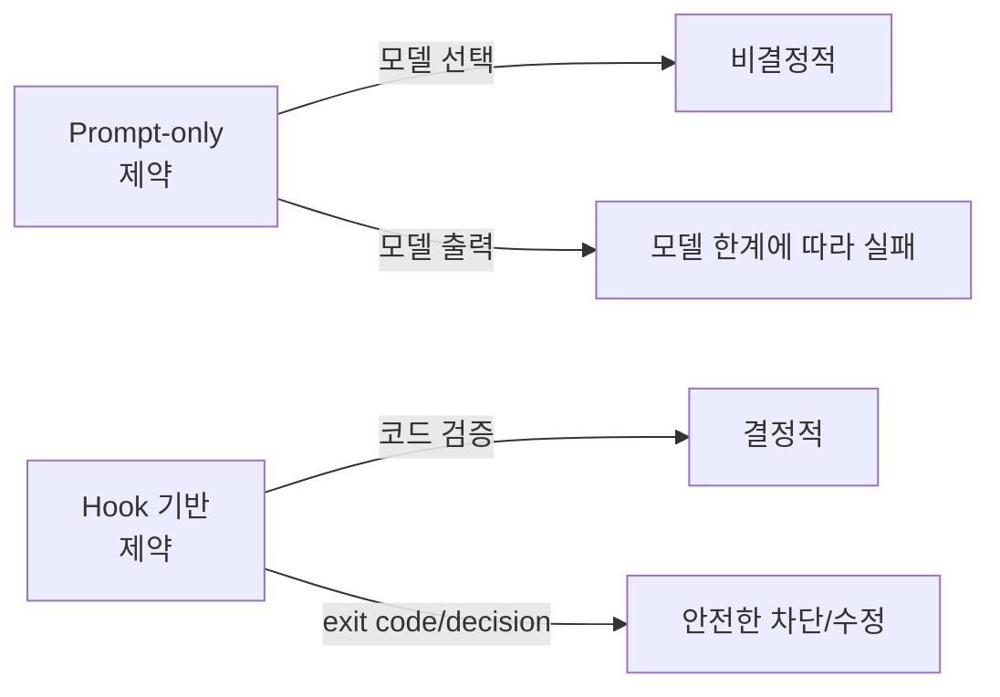
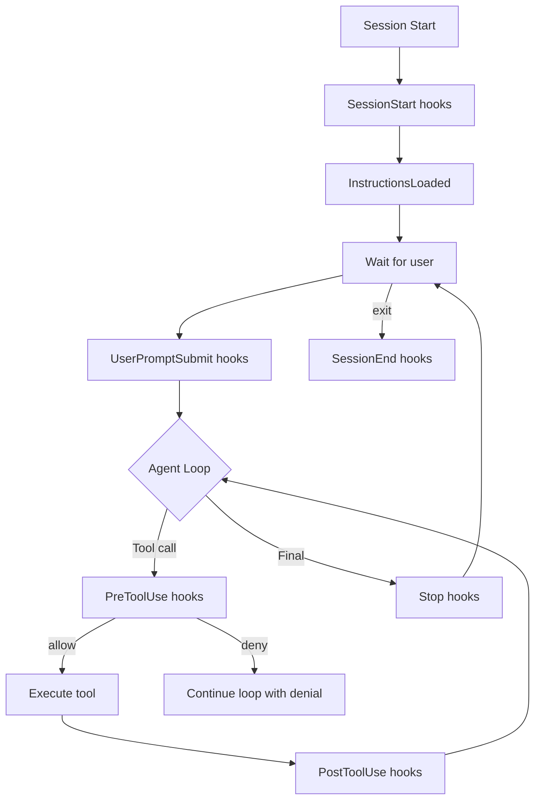
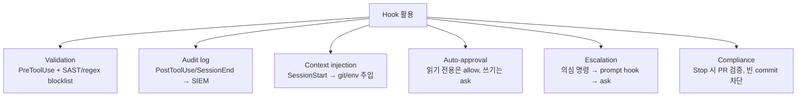

# Hook System Patterns

LLM 코딩 에이전트의 행동을 결정론적으로 통제하려면 모델 자체에만 의존하기보다 **이벤트 훅(event hook)** 으로 lifecycle을 둘러싸는 방식이 안정적이다. 30+ 종의 이벤트와 5종의 handler 타입으로 구성된 표준 훅 시스템 패턴을 정리한다.

> 기존 [[claude-code-hooks-system]], [[omc-hook-system]] 와 차별화 — 이 페이지는 source-agnostic한 훅 패턴 일반론, 라이프사이클 분류, handler 타입 5가지, 입출력 규약(exit code, JSON response, updatedInput)에 초점을 맞춘다. 특정 프로젝트 디테일은 entity 페이지에서 다룬다.

## 1. 왜 훅인가



> "에이전트의 판단에 맡길 것과 결정론적 코드로 제어할 것을 분리한다"

훅이 없으면 모든 제약이 프롬프트에 의존 → 불안정. 훅을 사용하면 위험 행동을 코드 수준에서 막을 수 있어 안전성과 예측 가능성이 향상된다.

## 2. 라이프사이클 cadence 3분류

### Once per session (세션 단위)

| 이벤트 | 발생 시점 |
|--------|-----------|
| `SessionStart` | 세션 시작 (matcher: `startup\|resume\|clear\|compact`) |
| `SessionEnd` | 세션 종료 |
| `Setup` | CLI flag 시점 (matcher: `init\|maintenance`) |

### Once per turn (턴 단위)

| 이벤트 | 발생 시점 |
|--------|-----------|
| `UserPromptSubmit` | 사용자 프롬프트 제출 |
| `Stop` | 응답 정상 완료 |
| `StopFailure` | 응답 실패 (matcher: `rate_limit\|authentication_failed`) |

### Every tool call (도구 단위)

| 이벤트 | 발생 시점 |
|--------|-----------|
| `PreToolUse` | 도구 실행 직전 (가장 강한 enforcement point) |
| `PostToolUse` | 도구 실행 직후 |
| `PostToolUseFailure` | 도구 실행 실패 |
| `PostToolBatch` | 배치 종료 |

### Async events (비동기, 임의 시점)

| 이벤트 | 활용 |
|--------|------|
| `FileChanged` | 감시 파일 변경 시 |
| `ConfigChange` | 설정 변경 (`user_settings\|project_settings\|local_settings\|policy_settings\|skills`) |
| `CwdChanged` | 작업 디렉토리 변경 |
| `Notification` | 알림 발생 |
| `SubagentStart` / `SubagentStop` | 서브 에이전트 lifecycle |
| `InstructionsLoaded` | CLAUDE.md 등 instructions 로딩 |
| `PreCompact` / `PostCompact` | 컨텍스트 압축 직전/후 (matcher: `manual\|auto`) |
| `Elicitation` / `ElicitationResult` | 사용자 정보 추가 요청 |
| `WorktreeCreate` / `WorktreeRemove` | git worktree 생성/제거 |
| `UserPromptExpansion` | 프롬프트 확장 |
| `PermissionRequest` / `PermissionDenied` | 권한 흐름 |
| `TaskCreated` / `TaskCompleted` | 태스크 lifecycle |
| `TeammateIdle` | 팀 에이전트 idle |

## 3. Handler 5가지 타입

### A. Command hook
```json
{
  "type": "command",
  "command": "\"$PROJECT_DIR\"/.hooks/script.sh",
  "async": false,
  "shell": "bash"
}
```
stdin으로 JSON 받고, exit code + stdout으로 응답. 가장 단순하고 빠름.

### B. HTTP hook
```json
{
  "type": "http",
  "url": "http://localhost:8080/hooks/endpoint",
  "timeout": 30,
  "headers": {"Authorization": "Bearer $MY_TOKEN"},
  "allowedEnvVars": ["MY_TOKEN"]
}
```
JSON POST. `allowedEnvVars`로 환경변수 노출 화이트리스트. 마이크로서비스로 훅 로직 위임 가능.

### C. MCP tool hook
```json
{
  "type": "mcp_tool",
  "server": "my_server",
  "tool": "security_scan",
  "input": {"file_path": "${tool_input.file_path}"}
}
```
연결된 [[mcp-protocol-deep-dive|MCP 서버]]의 tool을 호출. 보안 스캐너, 정책 엔진 등 통합.

### D. Prompt hook
```json
{
  "type": "prompt",
  "prompt": "Should this command be allowed? $ARGUMENTS",
  "model": "claude-3-5-sonnet-20241022",
  "timeout": 30
}
```
LLM에게 yes/no 결정을 위임. 정적 규칙으로 다 표현하기 어려운 정책에 사용.

### E. Agent hook (experimental)
```json
{
  "type": "agent",
  "prompt": "Verify this configuration is safe: $ARGUMENTS",
  "model": "claude-3-5-sonnet-20241022",
  "timeout": 60
}
```
[[subagent-spawning|서브에이전트]]를 spawn해서 검증. 가장 강력하지만 비용도 큼.

## 4. Matcher 패턴

| 패턴 | 의미 |
|------|------|
| `*` 또는 `""` 또는 omit | 모두 매치 |
| `Bash` | 정확히 일치 |
| `Edit\|Write` | OR (pipe-separated) |
| `^Bash`, `mcp__.*` | JavaScript regex (특수문자 포함 시) |

이벤트별 matcher 의미가 다르다. PreToolUse는 도구명, SessionStart는 startup/resume/clear/compact 같은 phase, FileChanged는 literal 파일명(regex 아님) 등.

## 5. 훅 입출력 규약

### 공통 입력 (stdin JSON)
```json
{
  "session_id": "abc123",
  "transcript_path": "/path/to/transcript.jsonl",
  "cwd": "/current/working/dir",
  "permission_mode": "default|plan|acceptEdits|auto|dontAsk|bypassPermissions",
  "hook_event_name": "PreToolUse",
  "agent_id": "subagent-123",
  "agent_type": "Explore"
}
```

### Exit Code 규약
| Code | 의미 | 동작 |
|------|------|------|
| 0 | 성공 | stdout 파싱 후 진행 |
| 2 | 차단 에러 | stderr를 모델에 전달, 도구 실행 차단 |
| 그 외 | 비차단 에러 | stderr 첫 줄만 transcript에 표시, 진행 |

### JSON 응답 포맷
```json
{
  "continue": true,
  "stopReason": "Build failed",
  "suppressOutput": false,
  "systemMessage": "Warning",
  "decision": "block",
  "reason": "Reason for blocking",
  "hookSpecificOutput": {
    "hookEventName": "PreToolUse",
    "additionalContext": "Context for the model",
    "permissionDecision": "allow|deny|ask|defer",
    "permissionDecisionReason": "Reason"
  }
}
```

### PreToolUse 결정값
- `allow`: permission prompt 건너뜀
- `deny`: 도구 호출 차단 (모델에게 메시지)
- `ask`: 사용자에게 컨펌 요청
- `defer`: graceful exit, 나중에 재개 (non-interactive 전용)

### updatedInput 패턴

PreToolUse는 도구 입력 자체를 수정 가능:
```json
{
  "hookSpecificOutput": {
    "hookEventName": "PreToolUse",
    "permissionDecision": "allow",
    "updatedInput": {"command": "npm run lint"}
  }
}
```

`npm test` 호출이 `npm run lint`로 변경되는 식. 안전하지 않은 명령을 안전한 변형으로 자동 치환할 수 있다.

## 6. 컨텍스트 주입 한도

> "Output injected into context (additionalContext, systemMessage, plain stdout) is capped at 10,000 characters. Excess is saved to file with preview and path."

10K 문자 cap. 초과 시 파일로 저장되고 preview만 주입.

## 7. 라이프사이클 다이어그램



## 8. 보안 모델

- 모든 hook은 호스트 환경/권한으로 실행
- HTTP hook은 status code만으로 차단 불가 → JSON `decision` 필수
- `PreToolUse`가 가장 강한 enforcement point (실행 전)
- `PostToolUse`는 informational, 이미 실행된 행동을 막지 못함
- 엔터프라이즈는 managed policy로 user/project/plugin hook 차단 가능

## 9. 6가지 활용 패턴



## 10. 실전 예시: 위험 명령 차단

```bash
#!/bin/bash
COMMAND=$(jq -r '.tool_input.command' < /dev/stdin)

if echo "$COMMAND" | grep -q 'rm -rf'; then
  jq -n '{
    hookSpecificOutput: {
      hookEventName: "PreToolUse",
      permissionDecision: "deny",
      permissionDecisionReason: "Destructive rm -rf blocked"
    }
  }'
else
  exit 0
fi
```

설정:
```json
{
  "hooks": {
    "PreToolUse": [
      {
        "matcher": "Bash",
        "hooks": [
          {
            "type": "command",
            "if": "Bash(rm *)",
            "command": "$PROJECT_DIR/.hooks/block-rm.sh"
          }
        ]
      }
    ]
  }
}
```

## 11. Anti-pattern

- `PostToolUse`에서 destructive command를 막으려 함 (이미 실행됨, 불가)
- HTTP hook을 timeout 짧게 → permission flow 자체가 hang
- `additionalContext`에 10K 초과 텍스트 주입 → 자동 truncate됨
- `prompt` hook을 모든 도구에 적용 → LLM 호출 비용 폭증
- 동일 훅을 여러 위치(global/project/plugin)에 중복 등록 → 우선순위 혼선

## 관련 문서

- [[claude-code-hooks-system]] — 특정 구현체의 디테일
- [[omc-hook-system]] — 프로젝트 내 훅 시스템 사례
- [[harness-engineering]] — 훅이 구성하는 더 큰 그림
- [[anthropic-harness-design]] — 훅 + 에이전트 분리의 design rationale
- [[skill-system-architecture]] — skill의 hooks 필드와 lifecycle
- [[mcp-protocol-deep-dive]] — MCP tool hook 통합
- [[agent-event-driven-pattern]] — 더 일반화된 이벤트 기반 에이전트
