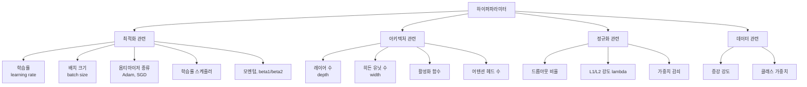
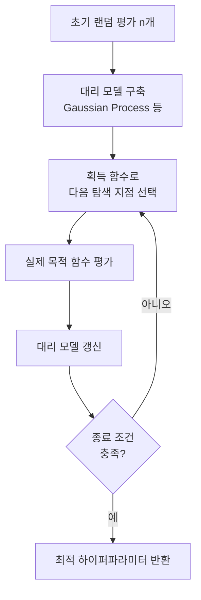
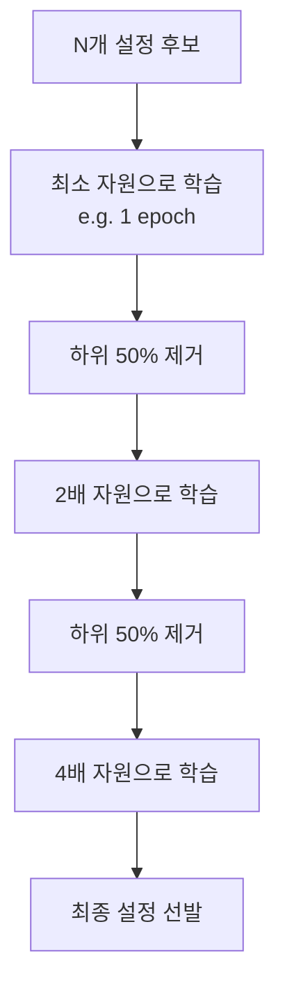
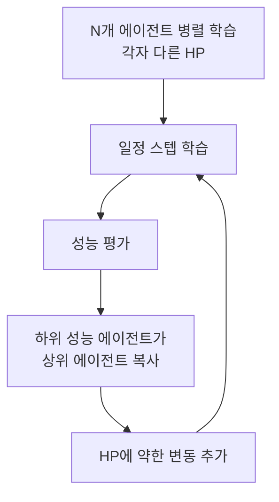
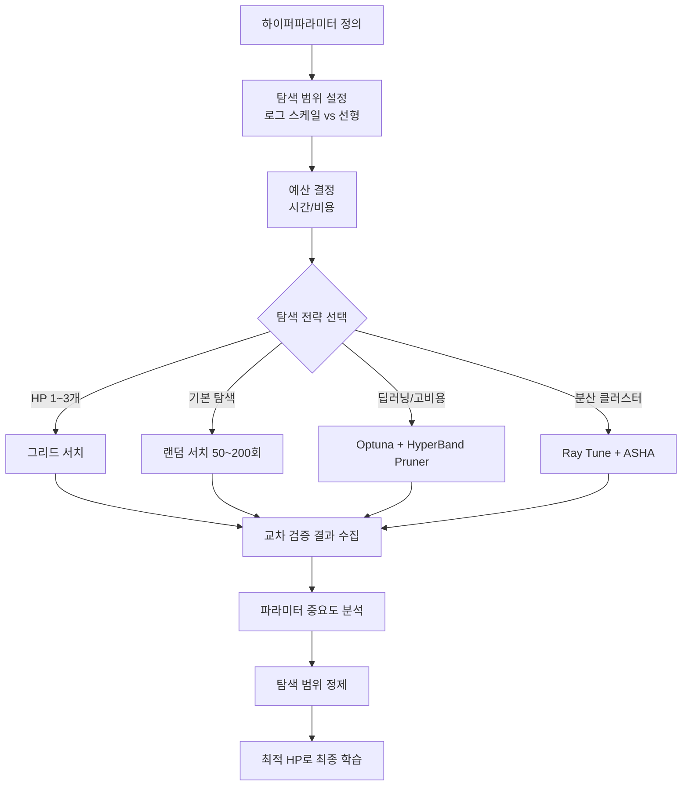

# 하이퍼파라미터 튜닝 (Hyperparameter Tuning)

## 개요

하이퍼파라미터(hyperparameter)는 학습 알고리즘이 자동으로 최적화하지 않고, **사람이나 외부 알고리즘이 사전에 설정해야 하는 설정값**이다. 학습률(learning rate), 배치 크기(batch size), 네트워크 깊이, 정규화 강도 등이 대표적이다.

하이퍼파라미터 튜닝은 이 값들의 최적 조합을 찾는 과정이다. 모델 파라미터(가중치)는 역전파로 자동 학습되지만, 하이퍼파라미터는 별도의 탐색 전략이 필요하다.

## 하이퍼파라미터의 분류



## 탐색 전략 1: 그리드 서치 (Grid Search)

모든 하이퍼파라미터 조합을 완전 탐색한다.

```python
from sklearn.model_selection import GridSearchCV
from sklearn.ensemble import RandomForestClassifier

param_grid = {
    "n_estimators": [100, 200, 500],
    "max_depth": [3, 5, 10, None],
    "min_samples_split": [2, 5, 10],
}

clf = RandomForestClassifier(random_state=42)
grid_search = GridSearchCV(
    clf,
    param_grid,
    cv=5,               # 5-fold 교차 검증
    scoring="f1_macro",
    n_jobs=-1,          # 병렬 실행
    verbose=2,
)
grid_search.fit(X_train, y_train)

logger.info("최적 파라미터: %s", grid_search.best_params_)
logger.info("최적 CV 점수: %.4f", grid_search.best_score_)
```

**특성:**
- **장점**: 재현 가능, 모든 조합 보장, 구현 단순
- **단점**: 조합 수 지수 증가 (차원의 저주), 실제로는 중요하지 않은 파라미터에도 동등한 비용

그리드 서치는 하이퍼파라미터가 3~4개 이하이고 각 범위가 좁을 때 실용적이다.

## 탐색 전략 2: 랜덤 서치 (Random Search)

Bergstra & Bengio (2012)가 그리드 서치보다 **랜덤 서치가 더 효율적임을 이론적으로 증명**했다.

```python
from sklearn.model_selection import RandomizedSearchCV
from scipy.stats import randint, loguniform

param_distributions = {
    "n_estimators": randint(100, 1000),
    "max_depth": randint(3, 20),
    "learning_rate": loguniform(1e-4, 1e-1),  # 로그 균등 분포
    "subsample": (0.5, 0.8, 1.0),
}

random_search = RandomizedSearchCV(
    estimator,
    param_distributions,
    n_iter=50,          # 50개 조합만 시도
    cv=5,
    scoring="roc_auc",
    n_jobs=-1,
    random_state=42,
)
random_search.fit(X_train, y_train)
```

**왜 랜덤 서치가 효율적인가?**

그리드 서치에서 중요하지 않은 파라미터의 격자가 탐색 예산을 낭비한다. 랜덤 서치는 같은 예산으로 **각 중요한 파라미터에 더 다양한 값을 시도**할 수 있다.

| 방법 | 100회 시도 시 각 파라미터 탐색 범위 |
|------|-----------------------------------|
| 그리드 (10x10) | 파라미터 A: 10가지, 파라미터 B: 10가지 |
| 랜덤 (100회) | 파라미터 A: 100가지, 파라미터 B: 100가지 |

## 탐색 전략 3: 베이지안 최적화 (Bayesian Optimization)

이전 평가 결과를 활용하여 다음 시도할 지점을 지능적으로 선택한다. **탐험(exploration)과 활용(exploitation)의 균형**을 맞추면서 적은 시도로 최적값에 수렴한다.



**핵심 구성 요소:**

1. **대리 모델(Surrogate Model)**: 목적 함수(validation loss)의 확률적 근사
   - Gaussian Process (GP): 예측 불확실성 정량화 가능
   - Tree-structured Parzen Estimator (TPE): Optuna의 기본 알고리즘
   - Random Forest Surrogate: SMAC에서 사용

2. **획득 함수(Acquisition Function)**: 대리 모델을 바탕으로 다음 탐색 지점을 선택
   - **EI (Expected Improvement)**: 현재 최적 대비 개선 기댓값 최대화
   - **UCB (Upper Confidence Bound)**: 불확실성이 높거나 기대값이 높은 지점 선호
   - **PI (Probability of Improvement)**: 개선 확률 최대화

```python
# GPyOpt를 이용한 베이지안 최적화 개념 예시
# (실제로는 Optuna 사용 권장)

def objective(params: dict) -> float:
    """최적화할 목적 함수 (낮을수록 좋음)"""
    lr = params["learning_rate"]
    wd = params["weight_decay"]
    # ... 모델 학습 및 검증 손실 반환
    return validation_loss

# Optuna로 실제 베이지안 최적화 구현
import optuna

def optuna_objective(trial: optuna.Trial) -> float:
    lr = trial.suggest_float("learning_rate", 1e-5, 1e-1, log=True)
    wd = trial.suggest_float("weight_decay", 1e-6, 1e-2, log=True)
    batch_size = trial.suggest_categorical("batch_size", [16, 32, 64, 128])
    n_layers = trial.suggest_int("n_layers", 2, 8)

    # 모델 학습
    val_loss = train_and_evaluate(lr, wd, batch_size, n_layers)
    return val_loss

study = optuna.create_study(
    direction="minimize",
    sampler=optuna.samplers.TPESampler(seed=42),
)
study.optimize(optuna_objective, n_trials=100, timeout=3600)

logger.info("최적 파라미터: %s", study.best_params)
logger.info("최적 값: %.4f", study.best_value)
```

## Optuna - 실용적인 베이지안 최적화

Akiba et al. (2019, Preferred Networks)가 개발한 하이퍼파라미터 최적화 프레임워크다. TPE 알고리즘을 기반으로 하며, **파이썬 함수 형태의 목적 함수**를 직접 최적화한다.

```python
import optuna
from optuna.pruners import HyperbandPruner
from optuna.samplers import TPESampler
import torch
import torch.nn as nn

def create_model(trial: optuna.Trial, input_dim: int, output_dim: int) -> nn.Module:
    """Trial에 따라 동적으로 모델 구조 결정"""
    n_layers = trial.suggest_int("n_layers", 1, 4)
    layers = []
    in_features = input_dim

    for i in range(n_layers):
        out_features = trial.suggest_int(f"n_units_l{i}", 64, 512, step=64)
        dropout_rate = trial.suggest_float(f"dropout_l{i}", 0.1, 0.5)
        layers += [
            nn.Linear(in_features, out_features),
            nn.ReLU(),
            nn.Dropout(dropout_rate),
        ]
        in_features = out_features

    layers.append(nn.Linear(in_features, output_dim))
    return nn.Sequential(*layers)


def objective(trial: optuna.Trial) -> float:
    device = "cuda" if torch.cuda.is_available() else "cpu"

    model = create_model(trial, input_dim=784, output_dim=10).to(device)

    lr = trial.suggest_float("lr", 1e-5, 1e-1, log=True)
    optimizer_name = trial.suggest_categorical("optimizer", ["Adam", "SGD", "AdamW"])
    optimizer_cls = getattr(torch.optim, optimizer_name)
    optimizer = optimizer_cls(model.parameters(), lr=lr)

    # 학습 루프 (간소화)
    for epoch in range(20):
        val_acc = train_epoch_and_eval(model, optimizer, device)

        # 조기 종료 통합 (Pruning)
        trial.report(val_acc, epoch)
        if trial.should_prune():
            raise optuna.exceptions.TrialPruned()

    return val_acc


# HyperBand pruner 적용 - 성능 낮은 trial 조기 종료
study = optuna.create_study(
    direction="maximize",
    sampler=TPESampler(n_startup_trials=10, seed=42),
    pruner=HyperbandPruner(min_resource=3, max_resource=20, reduction_factor=3),
)
study.optimize(objective, n_trials=200, n_jobs=4)

# 결과 시각화
fig = optuna.visualization.plot_optimization_history(study)
fig.show()

fig2 = optuna.visualization.plot_param_importances(study)
fig2.show()
```

**Optuna 주요 기능:**
- `suggest_float`, `suggest_int`, `suggest_categorical` - 파라미터 유형별 제안
- Pruning 통합 - 학습 중 조기 종료로 비효율 시도 제거
- 분산 최적화 - 여러 워커에서 병렬 탐색
- 시각화 - 최적화 히스토리, 파라미터 중요도, 파레토 프론트

## HyperBand와 BOHB

### HyperBand

Li et al. (2018)이 제안한 연속 반감법(Successive Halving) 기반 알고리즘이다. 적은 예산으로 많은 설정을 탐색하고, 유망한 설정에만 더 많은 자원을 투입한다.



- **장점**: 자원 효율성 높음, 병렬화 용이
- **단점**: 초기 성능이 최종 성능을 잘 예측해야 효과적

### BOHB (Bayesian Optimization + HyperBand)

Falkner et al. (2018)이 제안한 HyperBand와 베이지안 최적화의 결합이다.

- HyperBand의 자원 효율성 + 베이지안 최적화의 정보 활용
- 낮은 자원 평가 결과를 통해 높은 자원 평가 지점을 지능적으로 선택
- Ray Tune, SMAC3 등에서 구현 제공

## Ray Tune - 분산 하이퍼파라미터 탐색

Liaw et al. (2018)이 개발한 분산 ML 프레임워크 Ray 위에서 동작하는 하이퍼파라미터 탐색 라이브러리다.

```python
from ray import tune
from ray.tune.schedulers import ASHAScheduler
from ray.tune.search.optuna import OptunaSearch

def train_func(config: dict) -> None:
    """Ray Tune이 실행하는 학습 함수"""
    model = build_model(config["hidden_size"], config["n_layers"])
    optimizer = torch.optim.Adam(model.parameters(), lr=config["lr"])

    for epoch in range(config.get("max_epochs", 30)):
        train_loss = train_one_epoch(model, optimizer)
        val_acc = evaluate(model)

        # Ray Tune에 중간 결과 보고
        tune.report({"val_acc": val_acc, "train_loss": train_loss})


search_space = {
    "lr": tune.loguniform(1e-5, 1e-1),
    "hidden_size": tune.choice([128, 256, 512]),
    "n_layers": tune.randint(1, 5),
    "batch_size": tune.choice([16, 32, 64]),
}

# ASHA (Asynchronous Successive Halving) + Optuna 탐색기 조합
scheduler = ASHAScheduler(
    max_t=30,
    grace_period=3,
    reduction_factor=2,
)
searcher = OptunaSearch(metric="val_acc", mode="max")

tuner = tune.Tuner(
    train_func,
    param_space=search_space,
    tune_config=tune.TuneConfig(
        metric="val_acc",
        mode="max",
        scheduler=scheduler,
        search_alg=searcher,
        num_samples=100,
        max_concurrent_trials=8,  # 병렬 실행 수
    ),
)
results = tuner.fit()
best_config = results.get_best_result(metric="val_acc", mode="max").config
logger.info("최적 설정: %s", best_config)
```

**Ray Tune 장점:**
- 다양한 탐색 알고리즘 플러그인 (Optuna, HyperOpt, Nevergrad)
- 다양한 스케줄러 (ASHA, HyperBand, PBT)
- 분산 클러스터에서 수백~수천 trial 병렬 실행
- PyTorch, TensorFlow, JAX, XGBoost 등 프레임워크 무관

## PBT (Population Based Training)

DeepMind (Jaderberg et al., 2017)가 제안한 방법으로, 학습 도중 하이퍼파라미터를 동적으로 변화시킨다.



- 학습률 스케줄링과 HP 탐색을 동시에 수행
- 분산 학습 환경에서 강력한 성능
- 강화 학습 에이전트 학습에서 특히 효과적

## AutoML과의 연계

하이퍼파라미터 튜닝은 AutoML([[automl]])의 핵심 구성 요소다.

| AutoML 도구 | 탐색 전략 | 특징 |
|------------|----------|------|
| Auto-sklearn | Bayesian (SMAC) | 사이킷런 파이프라인 자동화 |
| NAS (Neural Architecture Search) | RL, 진화 알고리즘 | 아키텍처 구조 탐색 포함 |
| Ludwig | 그리드/랜덤/베이지안 | 로우코드 ML 플랫폼 |
| Google Vertex AI AutoML | 내부 베이지안 | 클라우드 관리형 |
| Amazon SageMaker HP Tuning | Bayesian | AWS 통합 |

## 탐색 전략 비교

```mermaid
flowchart LR
    subgraph STRATEGIES[탐색 전략 효율 비교]
        GRID[그리드 서치\nO(n^k)] -->|최악 효율| PERF
        RANDOM[랜덤 서치\nO(n)] -->|중간 효율| PERF
        BAYES[베이지안 최적화\n정보 활용] -->|높은 효율| PERF
        HYPERBAND[HyperBand\n자원 효율] -->|매우 높음| PERF
        BOHB[BOHB\n결합] -->|최고 효율| PERF
    end
    PERF[성능/비용]
```

| 전략 | 파라미터 수 | 평가 비용 | 병렬화 | 권장 상황 |
|------|-----------|---------|--------|----------|
| 그리드 서치 | 1~3개 | 저비용 | 쉬움 | 소규모 탐색 |
| 랜덤 서치 | 3~10개 | 중간 | 쉬움 | 기본 탐색 |
| 베이지안 최적화 | 5~20개 | 고비용 | 가능 | 정밀 탐색 |
| HyperBand | 제한 없음 | 중간 | 필수 | 딥러닝 |
| BOHB | 5~20개 | 중간 | 필수 | 딥러닝 + 정밀도 |

## 실무 권장 워크플로



**실무 팁:**

1. **로그 스케일 사용**: 학습률, 가중치 감쇠 등은 `loguniform` 분포로 탐색 (1e-5~1e-1이 1e-3~1e-1보다 훨씬 중요)
2. **중요한 HP 먼저**: 학습률이 가장 중요. 배치 크기 > 네트워크 크기 > 드롭아웃 순서로 탐색
3. **조기 종료 활용**: 10 에폭에서 나쁜 설정은 100 에폭 시도 필요 없음
4. **시드 고정**: 재현성을 위해 `random_state`, `seed` 설정

```python
# 실무에서 가장 많이 쓰는 Optuna 빠른 시작
import optuna

optuna.logging.set_verbosity(optuna.logging.WARNING)

def objective(trial: optuna.Trial) -> float:
    params = {
        "learning_rate": trial.suggest_float("lr", 1e-5, 5e-3, log=True),
        "weight_decay": trial.suggest_float("wd", 1e-6, 1e-2, log=True),
        "dropout": trial.suggest_float("dropout", 0.0, 0.5),
        "batch_size": trial.suggest_categorical("bs", [16, 32, 64]),
    }
    return run_experiment(params)  # 검증 손실 반환

study = optuna.create_study(direction="minimize")
study.optimize(objective, n_trials=100, timeout=7200, n_jobs=4)

logger.info("최적 파라미터: %s", study.best_params)
logger.info("파라미터 중요도: %s",
            optuna.importance.get_param_importances(study))
```

## 관련 문서

- [[bayesian-optimization]] - 베이지안 최적화 이론
- [[optuna-hyperparam]] - Optuna 상세 사용법
- [[ray-distributed]] - Ray Tune 분산 탐색
- [[automl]] - AutoML 전체 파이프라인
- [[cross-validation]] - HP 탐색의 평가 기반
- [[regularization]] - 정규화 관련 하이퍼파라미터
- [[neural-architecture-search]] - 아키텍처 탐색으로 확장
