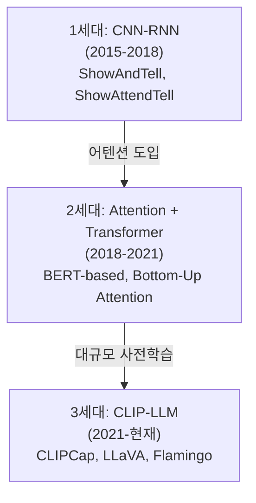
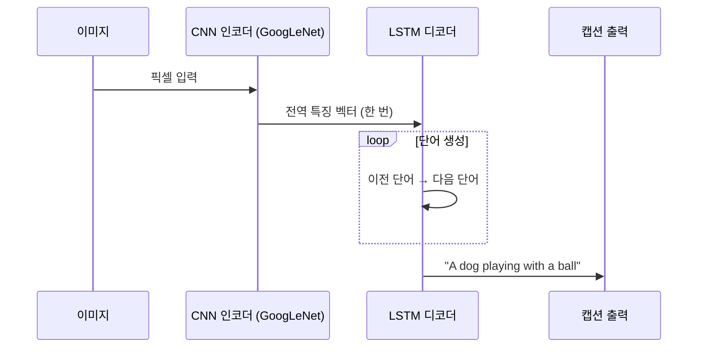
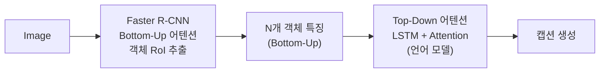

# 이미지 캡셔닝 아키텍처

## 개요

이미지 캡셔닝(Image Captioning)은 이미지를 입력받아 해당 이미지를 설명하는 자연어 문장을 생성하는 태스크다. 컴퓨터 비전과 자연어 처리의 교차점에 위치하며, 시각 장애인 보조, 이미지 검색, 의료 리포트 자동 생성 등에 활용된다.

아키텍처 패러다임은 크게 세 세대로 진화해 왔다: **CNN-RNN 인코더-디코더** → **어텐션 기반 모델** → **[[vision-language-model-architectures|CLIP-LLM 연결 모델]]**. 이 진화는 [[cross-attention]] 메커니즘의 발전과 밀접하게 연결된다.

## 세대별 아키텍처 진화

## 1세대: CNN-RNN 인코더-디코더

### Show and Tell (2015, Vinyals et al.)

가장 기본적인 구조다. CNN으로 이미지를 인코딩하고, RNN(LSTM)으로 단어를 순차적으로 생성한다.

**한계**: 이미지 특징을 LSTM 초기 상태로만 넘기므로, 긴 캡션 생성 시 시각 정보를 잊어버린다.

### Show, Attend and Tell (2015, Xu et al.)

[[cross-attention]]을 도입해 단어 생성 시마다 이미지의 다른 영역을 참조한다.

$$\alpha_{i,t} = \text{softmax}(e_{i,t}), \quad e_{i,t} = f_{att}(a_i, h_{t-1})$$

- $a_i$: CNN의 공간 특징 맵 각 위치의 특징 벡터
- $h_{t-1}$: 이전 LSTM 상태
- $\alpha_{i,t}$: $t$번째 단어 생성 시 위치 $i$의 어텐션 가중치

"dog"를 생성할 때는 강아지 영역에, "ball"을 생성할 때는 공 영역에 집중하는 효과가 나타난다.

## 2세대: Bottom-Up & Top-Down Attention (2018, Anderson et al.)

Faster R-CNN으로 객체 영역(RoI)을 추출하고, 각 객체 특징에 어텐션을 적용한다. "이미지 격자"가 아닌 "의미 있는 객체 단위"로 어텐션한다는 점이 혁신이다.

MS-COCO 리더보드에서 당시 SOTA를 달성했다.

## 3세대: CLIP 기반 및 LLM 연결

### CLIPCap (2021)

CLIP의 이미지 인코더로 특징을 추출하고, GPT-2 등 언어 모델에 prefix로 주입한다.

$$\text{prefix} = \text{MLP}(\text{CLIP}(I)), \quad \text{캡션} = \text{GPT-2}(\text{prefix} + \text{[start]})$$

MLP만 학습하고 CLIP, GPT-2는 동결(freeze)하는 경량 접근법이다.

### Flamingo (2022, DeepMind)

대규모 비전-언어 사전학습 모델. 이미지와 텍스트를 인터리빙(interleaving)하여 few-shot 캡셔닝이 가능하다.

### LLaVA (2023)

비주얼 인스트럭션 튜닝 방식. CLIP 비주얼 인코더 + 프로젝션 레이어 + LLaMA/Vicuna 구조로, 복잡한 이미지 이해와 대화형 캡셔닝을 지원한다. [[vision-language-model-architectures]] 문서 참조.

## 평가 지표

| 지표 | 설명 | 특징 |
|------|------|------|
| BLEU-4 | n-gram 정밀도 (n=4) | 정밀도 중심, 짧은 문장 선호 |
| METEOR | 동의어·어간 일치 고려 | BLEU보다 인간 판단과 상관도 높음 |
| CIDEr | TF-IDF 가중 n-gram | 캡셔닝 특화, 다양성 반영 |
| SPICE | 장면 그래프 기반 의미 유사도 | 의미론적 정확성 측정 |
| CLIPScore | CLIP 임베딩 코사인 유사도 | 참조 캡션 불필요 |

CIDEr와 SPICE가 현재 캡셔닝 연구의 주요 평가 기준이다.

## 실무 적용 관점

**왜 중요한가**: 이미지 캡셔닝은 멀티모달 AI의 가장 기초적인 생성 태스크다. 이 아키텍처 패턴(시각 인코더 + 언어 디코더 + 연결 메커니즘)은 VQA, 의료 리포트 생성, 자율주행 상황 설명 등 수많은 파생 태스크의 기반이 된다.

**실무에서 어떻게 쓰이나**:
- 접근성(Accessibility): 스크린 리더용 이미지 대체 텍스트 자동 생성
- 이커머스: 상품 이미지 자동 설명 생성
- 의료: X-ray·병리 슬라이드 초안 리포트 생성
- 소셜미디어: 이미지 콘텐츠 자동 태깅 및 검색 인덱싱

## 관련 문서

- [[vision-language-model-architectures]] - 비전-언어 모델의 전반적 아키텍처 패턴
- [[cross-attention]] - 이미지-텍스트 크로스 어텐션 메커니즘
- [[visual-question-answering]] - 캡셔닝과 유사한 멀티모달 추론 태스크
- [[clip]] - 이미지-텍스트 대조 학습 기반 모델
