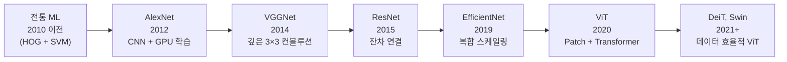
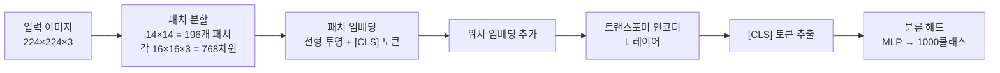
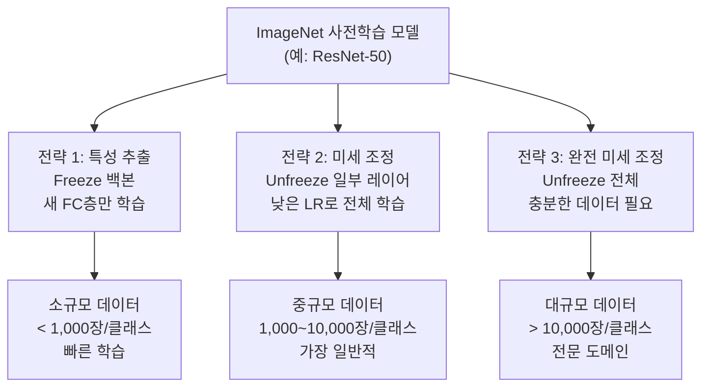

# 이미지 분류 (Image Classification)

이미지 분류(Image Classification)는 입력 이미지를 사전 정의된 카테고리 집합 중 하나 이상에 할당하는 컴퓨터 비전의 가장 기본적인 과제다. ImageNet Large Scale Visual Recognition Challenge (ILSVRC)를 중심으로 알고리즘이 급격히 발전했으며, 이 과정에서 탄생한 모델들이 현대 딥러닝의 근간을 이루고 있다.

## 왜 중요한가

- **전이 학습의 기반**: ImageNet 사전학습 모델은 물체 감지, 세그멘테이션, 의료 영상 분석 등 거의 모든 비전 태스크의 백본(backbone)으로 활용된다.
- **산업 응용**: AI 품질 검사([[ai-quality-inspection]]), 의료 진단, 자율주행, 콘텐츠 모더레이션 등 실무 전반에 적용된다.
- **벤치마크 역할**: 새로운 아키텍처의 성능을 검증하는 표준 테스트베드다.

---

## ImageNet과 역사적 전환점

### ImageNet 데이터셋

- **규모**: 1,400만 장 이상의 이미지, 1,000개 클래스 (ILSVRC 기준)
- **출처**: WordNet 계층 구조 기반 웹 스크래핑 + 인간 레이블링 (Amazon Mechanical Turk)
- **표준 분할**: 학습 120만, 검증 5만, 테스트 10만 장

### ILSVRC 연도별 Top-5 오류율 추이

| 연도 | 우승 모델 | Top-5 오류율 | 의의 |
|------|-----------|-------------|------|
| 2010 | NEC-UIUC (SVM/HOG) | 28.2% | DNN 이전 시대 |
| 2012 | AlexNet (CNN) | 16.4% | 딥러닝 혁명의 시작 |
| 2014 | GoogLeNet/VGGNet | 6.7% / 7.3% | 깊은 네트워크 본격화 |
| 2015 | ResNet | 3.57% | 잔차 연결로 인간 수준(5.1%) 초월 |
| 2017 | SENet | 2.25% | 채널 어텐션 도입 |
| 2021 | ViT 계열 | ~1.5% | Transformer 시대 |



---

## 핵심 아키텍처 진화

### AlexNet (2012) - CNN의 부활

```
입력 224×224×3 → Conv(11×11, 96) → MaxPool → Conv(5×5, 256) → MaxPool
→ Conv(3×3, 384) × 3 → MaxPool → FC(4096) × 2 → FC(1000) → Softmax
```

핵심 기여:
- **ReLU 활성화**: Sigmoid/Tanh 대비 빠른 수렴
- **Dropout(0.5)**: 과적합 방지
- **데이터 증강**: 무작위 자르기, 좌우 반전
- **GPU 병렬 학습**: 2개 GPU로 분산 학습

### ResNet (2015) - 잔차 연결

[[resnet-original-paper]]에서 심화 다루는 핵심 아이디어: **숏컷 연결(shortcut connection)**로 그래디언트 소실 문제 해결.

$$\mathcal{F}(x) + x$$

- 이론상 더 깊은 층이 얕은 층보다 나빠질 수 없음 (항등 함수 학습 가능)
- ResNet-50 (25M 파라미터) → ResNet-152 (60M) 모두 안정 학습
- 현재도 가장 많이 사용되는 백본 아키텍처 중 하나

```python
import torch
import torch.nn as nn

class ResidualBlock(nn.Module):
    """기본 ResNet 잔차 블록 (ResNet-18/34용)."""
    
    def __init__(self, in_channels: int, out_channels: int, stride: int = 1):
        super().__init__()
        self.conv1 = nn.Conv2d(in_channels, out_channels, 3, stride, padding=1, bias=False)
        self.bn1   = nn.BatchNorm2d(out_channels)
        self.conv2 = nn.Conv2d(out_channels, out_channels, 3, 1, padding=1, bias=False)
        self.bn2   = nn.BatchNorm2d(out_channels)
        self.relu  = nn.ReLU(inplace=True)
        
        # 차원이 달라지면 숏컷도 변환
        self.shortcut = nn.Sequential()
        if stride != 1 or in_channels != out_channels:
            self.shortcut = nn.Sequential(
                nn.Conv2d(in_channels, out_channels, 1, stride, bias=False),
                nn.BatchNorm2d(out_channels)
            )
    
    def forward(self, x: torch.Tensor) -> torch.Tensor:
        out = self.relu(self.bn1(self.conv1(x)))
        out = self.bn2(self.conv2(out))
        out += self.shortcut(x)      # 잔차 연결
        return self.relu(out)
```

### DenseNet (2017) - 밀집 연결

[[densenet-dense-connections]]에서 상세히 다루는 DenseNet은 각 레이어가 이전 모든 레이어와 연결된다. KV 캐시가 ResNet의 잔차 연결을 더 극단적으로 발전시킨 구조다.

### ViT (Vision Transformer, 2020)

[[vit]]에서 상세히 다루는 ViT는 이미지를 16×16 패치로 분할하고 트랜스포머로 처리한다.



- 대규모 데이터(JFT-300M)로 사전학습 시 ResNet을 능가
- 데이터 효율이 낮아 일반 크기 데이터셋에서는 DeiT(Data-efficient ViT) 사용 권장

---

## 평가 지표

### Top-K 정확도 (Top-K Accuracy)

**Top-1 정확도**: 모델이 예측한 가장 높은 확률 클래스가 정답인 비율.

$$\text{Top-1 Accuracy} = \frac{1}{N} \sum_{i=1}^{N} \mathbb{1}[\hat{y}_i^{(1)} = y_i]$$

**Top-5 정확도**: 모델이 예측한 상위 5개 클래스 중 정답이 포함된 비율. ImageNet처럼 유사한 클래스가 많은 경우 더 현실적인 지표다.

$$\text{Top-5 Accuracy} = \frac{1}{N} \sum_{i=1}^{N} \mathbb{1}[y_i \in \{\hat{y}_i^{(1)}, ..., \hat{y}_i^{(5)}\}]$$

```python
import torch

def top_k_accuracy(logits: torch.Tensor, targets: torch.Tensor, k: int = 5) -> float:
    """Top-K 정확도 계산."""
    _, top_k_preds = logits.topk(k, dim=1)           # (N, k)
    correct = top_k_preds.eq(targets.view(-1, 1).expand_as(top_k_preds))
    return correct.any(dim=1).float().mean().item()

# 다중 K 동시 평가
def accuracy_at_k(logits: torch.Tensor, targets: torch.Tensor) -> dict:
    results = {}
    for k in [1, 5]:
        results[f"top{k}"] = top_k_accuracy(logits, targets, k)
    return results
```

### 다중 레이블 분류 지표

단일 이미지에 여러 레이블이 있는 경우(예: COCO 분류):
- **mAP (mean Average Precision)**: 클래스별 AP 평균
- **F1 Score**: 정밀도와 재현율의 조화평균

---

## 전이 학습 표준 패턴

ImageNet 사전학습 모델을 새 태스크에 적용하는 3가지 전략:



```python
import torchvision.models as models

def build_classifier(
    num_classes: int,
    pretrained: bool = True,
    freeze_backbone: bool = True
) -> models.ResNet:
    """ImageNet 사전학습 ResNet-50 기반 분류기 구축."""
    model = models.resnet50(weights="IMAGENET1K_V2" if pretrained else None)
    
    if freeze_backbone:
        for param in model.parameters():
            param.requires_grad = False
    
    # 분류 헤드 교체
    in_features = model.fc.in_features
    model.fc = torch.nn.Sequential(
        torch.nn.Dropout(0.3),
        torch.nn.Linear(in_features, num_classes)
    )
    return model

# 커스텀 클래스 수에 맞게 분류 헤드만 학습
clf = build_classifier(num_classes=10, freeze_backbone=True)
trainable_params = sum(p.numel() for p in clf.parameters() if p.requires_grad)
print(f"학습 파라미터: {trainable_params:,}")  # 약 20,490개 (헤드만)
```

---

## 데이터 증강 (Data Augmentation)

```python
from torchvision import transforms

# 학습용 증강 파이프라인 (표준 ImageNet 학습 방식)
train_transform = transforms.Compose([
    transforms.RandomResizedCrop(224, scale=(0.08, 1.0)),
    transforms.RandomHorizontalFlip(p=0.5),
    transforms.ColorJitter(brightness=0.4, contrast=0.4,
                           saturation=0.4, hue=0.1),
    transforms.RandomGrayscale(p=0.2),
    transforms.ToTensor(),
    transforms.Normalize(mean=[0.485, 0.456, 0.406],
                         std=[0.229, 0.224, 0.225]),  # ImageNet 통계
])

# 검증/테스트용 (증강 없음)
val_transform = transforms.Compose([
    transforms.Resize(256),
    transforms.CenterCrop(224),
    transforms.ToTensor(),
    transforms.Normalize(mean=[0.485, 0.456, 0.406],
                         std=[0.229, 0.224, 0.225]),
])
```

### 고급 증강 기법

| 기법 | 설명 | 효과 |
|------|------|------|
| **Mixup** | 두 이미지를 선형 결합 | 결정 경계 부드럽게 |
| **CutMix** | 이미지 일부를 다른 이미지로 교체 | 지역 특성 학습 강화 |
| **AutoAugment** | 강화학습으로 증강 정책 최적화 | ImageNet +1-2% |
| **RandAugment** | 무작위 증강 조합 | AutoAugment보다 단순 |
| **AugMix** | 여러 증강 혼합 | 분포 이동(OOD) 강인성 |

---

## 주요 모델 성능 비교

| 모델 | 파라미터 | ImageNet Top-1 | 추론 속도 | 비고 |
|------|---------|----------------|-----------|------|
| AlexNet | 61M | 56.5% | 빠름 | 역사적 의의 |
| ResNet-50 | 25M | 76.1% | 중간 | 가장 많이 사용 |
| EfficientNet-B4 | 19M | 82.9% | 중간 | 효율 최적화 |
| ViT-B/16 | 86M | 81.8% | 느림 | JFT 사전학습 필요 |
| DeiT-B | 86M | 81.8% | 중간 | ImageNet만으로 훈련 |
| Swin-T | 28M | 81.3% | 중간 | 계층적 ViT |
| ConvNeXt-B | 89M | 83.8% | 중간 | CNN + ViT 설계 |

---

## 실무 응용 패턴

### 산업 품질 검사

[[ai-quality-inspection]] 사례에서 이미지 분류는 양품/불량품 이진 분류로 시작해 결함 유형 다중 분류로 확장된다. 특이점:
- **클래스 불균형**: 불량품은 전체의 1~5%에 불과. Focal Loss나 오버샘플링 필요
- **도메인 이동**: 제조 라인 조명 변경, 카메라 교체 시 성능 저하 위험
- **설명 가능성**: 불량 판정 근거가 필요. Grad-CAM 활성화 지도 활용

```python
# Grad-CAM 활성화 지도 생성 (설명 가능성)
import torch
import torch.nn.functional as F
import numpy as np

class GradCAM:
    """ResNet 계열 모델용 Grad-CAM 구현."""
    
    def __init__(self, model: torch.nn.Module, target_layer: torch.nn.Module):
        self.model = model
        self.target_layer = target_layer
        self.gradients = None
        self.activations = None
        
        target_layer.register_forward_hook(self._save_activation)
        target_layer.register_backward_hook(self._save_gradient)
    
    def _save_activation(self, module, input, output):
        self.activations = output.detach()
    
    def _save_gradient(self, module, grad_input, grad_output):
        self.gradients = grad_output[0].detach()
    
    def generate(self, x: torch.Tensor, class_idx: int = None) -> np.ndarray:
        logits = self.model(x)
        if class_idx is None:
            class_idx = logits.argmax(dim=1).item()
        
        self.model.zero_grad()
        logits[0, class_idx].backward()
        
        # 그래디언트 전역 평균 풀링
        weights = self.gradients.mean(dim=[2, 3], keepdim=True)
        cam = (weights * self.activations).sum(dim=1, keepdim=True)
        cam = F.relu(cam)
        cam = F.interpolate(cam, size=x.shape[-2:], mode='bilinear', align_corners=False)
        
        cam_np = cam.squeeze().cpu().numpy()
        return (cam_np - cam_np.min()) / (cam_np.max() - cam_np.min() + 1e-8)
```

---

## 한계와 현재 트렌드

### CNN vs ViT 상호 수렴

ConvNeXt(2022)는 표준 CNN에 ViT 설계 원칙(패치 임베딩, GELU, LN 등)을 적용해 ViT와 유사한 성능을 달성했다. "적절한 설계 선택이 아키텍처 계열보다 중요하다"는 교훈.

### 자기지도 학습의 부상

MAE(Masked Autoencoders), DINO, CLIP 등 레이블 없이 사전학습하는 방식이 ImageNet 지도 학습을 능가하거나 견줄 수 있게 됐다. 레이블 비용이 높은 도메인(의료, 위성 이미지)에서 특히 유망하다.

---

## 관련 문서

- [[resnet-original-paper]] - ResNet 원논문 심화 분석
- [[vit]] - Vision Transformer 아키텍처 상세
- [[densenet-dense-connections]] - DenseNet 밀집 연결 구조
- [[ai-quality-inspection]] - 산업 품질 검사 실무 응용
- [[transfer-learning]] - 전이 학습 전반 개념
- [[self-supervised-learning]] - 레이블 없는 비전 사전학습
