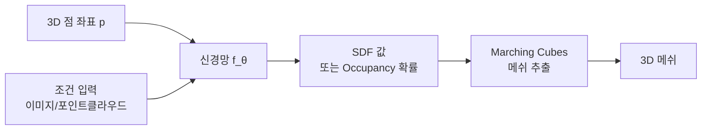
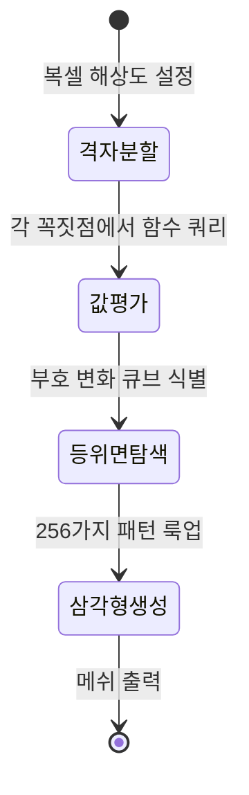
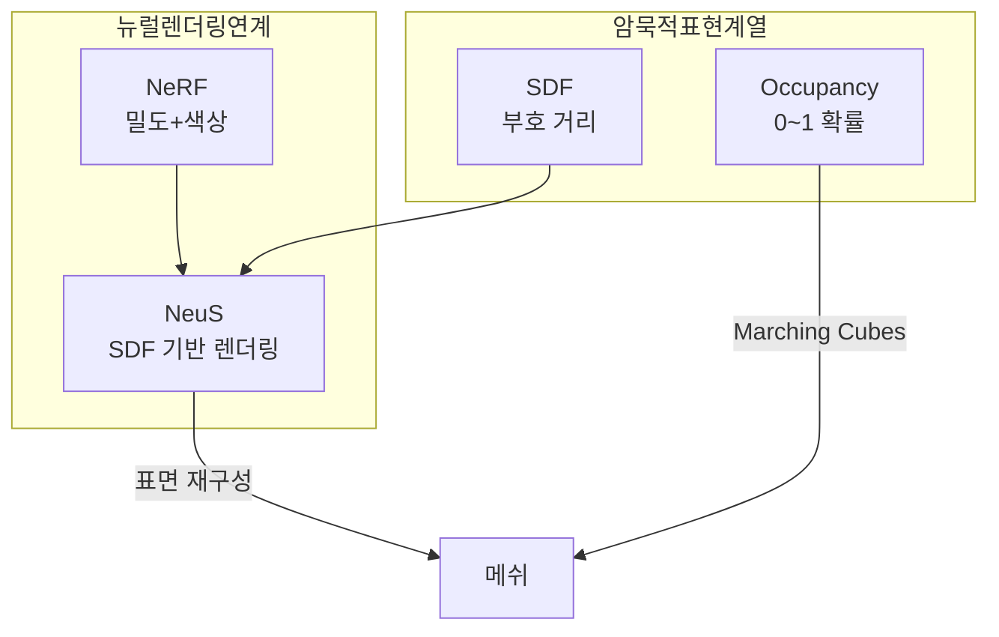

# 암묵적 표면 표현 (Implicit Surface Representation)

암묵적 표면 표현은 3D 표면을 명시적인 메쉬(vertices + faces)나 점군(point cloud)으로 저장하는 대신, 공간의 모든 점에서 연속 함수값을 정의하고 그 등위면(level set)으로 표면을 암묵적으로 나타내는 방식이다. 해상도에 독립적이며 임의의 위상(topology)을 자연스럽게 표현할 수 있다는 것이 핵심 장점이다.

## 두 가지 핵심 표현

### 1. SDF (Signed Distance Function, 부호 거리 함수)

공간의 임의 점 $p$에서 가장 가까운 표면까지의 부호 있는 거리를 반환한다.

$$
\text{SDF}(p) = \begin{cases} -d(p, \mathcal{S}) & \text{if } p \text{ 표면 내부} \\ 0 & \text{if } p \in \mathcal{S} \text{ (표면)} \\ +d(p, \mathcal{S}) & \text{if } p \text{ 표면 외부} \end{cases}
$$

- 등위면 $\text{SDF}(p) = 0$이 곧 표면
- 내부: 음수, 외부: 양수 (또는 반대 부호 규약)
- 경사(gradient)의 크기 = 1 (Eikonal 방정식: $|\nabla \text{SDF}| = 1$)

### 2. Occupancy Network

공간의 임의 점이 객체 내부인지 외부인지를 확률로 예측한다.

$$
f_\theta(p) \in [0, 1], \quad \text{표면} \approx \{p \mid f_\theta(p) = 0.5\}
$$

- Mescheder et al. (2019) "Occupancy Networks: Learning 3D Reconstruction in Function Space"
- 분류 문제처럼 접근: 0(외부)~1(내부) 연속값

## 표면 추출: Marching Cubes

암묵적 표현에서 명시적 메쉬를 추출할 때 Marching Cubes 알고리즘을 사용한다.

1. 공간을 균일한 복셀 격자로 나눔
2. 각 격자 꼭짓점에서 SDF/Occupancy 값 평가
3. 등위면(SDF=0 또는 Occupancy=0.5)이 통과하는 큐브 식별
4. 룩업 테이블로 삼각형 생성

해상도가 높을수록 세밀한 메쉬가 나오지만 메모리와 시간이 크게 증가한다. 적응형 Marching Cubes(Octree 기반)로 중요 영역에만 높은 해상도를 적용하는 방법이 있다.

## 신경망 기반 암묵적 표현

### DeepSDF (Park et al., 2019)

- 잠재 벡터(latent code) $z$와 쿼리 점 $p$를 입력받아 SDF 값 출력
- $f_\theta(z, p) \approx \text{SDF}(p)$
- Auto-decoder 구조로 잠재 공간 학습

### NeRF와의 관계

[[nerf-neural-radiance-fields|NeRF]]는 볼류메트릭 밀도($\sigma$)와 색상($c$)을 학습하는 방식으로, SDF와 개념적으로 연관된다.

- NeRF의 밀도 $\sigma$는 SDF에서 변환 가능: $\sigma = \frac{1}{\beta} \Psi(-\text{SDF}/\beta)$ (NeuS 방법)
- **NeuS** (Wang et al., 2021): NeRF 렌더링 방식으로 SDF를 학습. 표면 재구성 품질 향상
- **VolSDF** (Yariv et al., 2021): 볼류메트릭 렌더링에서 SDF를 밀도로 변환하는 공식 제안

## [[implicit-neural-representations]] (INR)과의 구분

암묵적 표면 표현은 [[implicit-neural-representations]]의 한 응용이다.

| 구분 | 암묵적 표면 표현 | 일반 INR |
|------|----------------|---------|
| 출력 | SDF 또는 Occupancy | 임의 신호(색상, 음성 등) |
| 목표 | 3D 표면 재구성 | 연속 신호 표현 |
| 등위면 | 핵심 개념 | 해당 없음 |
| 예시 | DeepSDF, NeuS | SIREN, NeRF |

## 장단점

| 항목 | 장점 | 단점 |
|------|------|------|
| 해상도 | 연속 함수 → 임의 해상도 | 메쉬 추출 시 해상도 필요 |
| 위상 | 복잡한 위상 자연스럽게 표현 | - |
| 편집 | 집합 연산(CSG) 쉬움 | 직관적 버텍스 편집 어려움 |
| 렌더링 | 레이캐스팅 직접 가능 | 실시간 렌더링은 메쉬 변환 필요 |
| 메모리 | 신경망 가중치로 압축 | 쿼리마다 신경망 추론 비용 |

## 실무 활용

- **3D 스캔 재구성**: 노이즈 있는 점군 → SDF → 깔끔한 메쉬
- **CAD 편집**: SDF 연산(합집합, 차집합, 교집합)으로 불리언 편집
- **충돌 검출**: SDF를 부호 거리 필드로 활용
- **NeRF 후처리**: NeRF 학습 후 NeuS로 표면 품질 향상

## 관련 문서

- [[nerf-neural-radiance-fields|NeRF]] - 볼류메트릭 렌더링과 SDF를 결합한 NeuS 등으로 연결
- [[implicit-neural-representations]] - 암묵적 표면의 상위 개념
- [[3d-gaussian-splatting]] - 명시적 표현과의 대조적 접근
- [[structure-from-motion]] - SfM 점군을 암묵적 표현으로 변환하는 파이프라인
