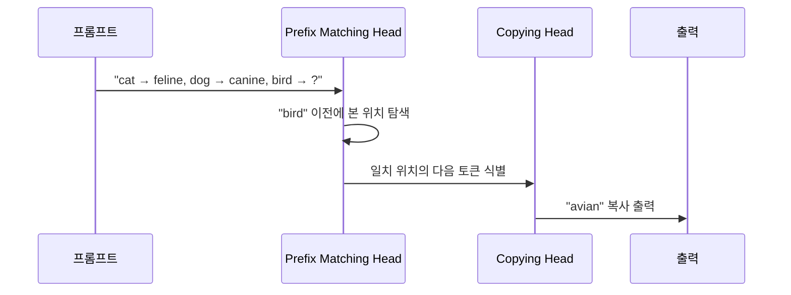

# In-Context Learning 메커니즘

## 개요

In-Context Learning(ICL)은 파라미터 업데이트 없이 프롬프트에 포함된 예시들로부터 새로운 태스크를 수행하는 능력이다. [[in-context-learning]]이 "무엇인가"에 대한 문서라면, 이 페이지는 ICL이 **내부적으로 어떻게 작동하는가**에 대한 메커니즘 연구를 다룬다. 2022년 이후 mechanistic interpretability 연구의 핵심 주제가 되었다.

## 핵심 질문들

ICL 메커니즘 연구는 다음 질문들에 답하려 한다:

1. 모델은 in-context 예시에서 "실제로 학습"하는가, 아니면 사전학습에서 본 패턴을 검색하는가?
2. Attention head들은 어떤 역할을 분담하는가?
3. Transformer의 어느 레이어에서 ICL이 일어나는가?
4. 예시의 레이블이 틀려도 왜 성능이 유지되는가?

## 주요 가설: Task Recognition vs. Task Learning

```mermaid
flowchart LR
    subgraph TR["Task Recognition 가설"]
        A1[프롬프트 예시] --> B1[사전학습에서 본\n유사 패턴 검색]
        B1 --> C1[검색된 패턴 활용]
    end
    subgraph TL["Task Learning 가설"]
        A2[프롬프트 예시] --> B2[In-context gradient\n계산 (암묵적 학습)]
        B2 --> C2[새로운 함수 근사]
    end
    TR --> D[실제: 두 메커니즘 모두 작동]
    TL --> D
```

### Task Recognition (패턴 검색)

Razeghi et al.(2022) 등의 연구는 ICL 성능이 사전학습 데이터에서 해당 패턴의 등장 빈도와 강한 상관관계가 있음을 보였다. 즉, ICL의 상당 부분은 새로운 학습이 아니라 사전학습 지식의 검색(retrieval)이다.

### Task Learning (암묵적 경사 하강)

Akyurek et al.(2022)과 Von Oswald et al.(2023)은 Transformer의 attention 메커니즘이 linear regression의 gradient descent와 수학적으로 동등함을 보였다. 이 관점에서 ICL은 forward pass만으로 "암묵적 경사 하강"을 수행하는 것으로 해석된다.

## 핵심 메커니즘: Induction Heads

Olsson et al.(2022)의 연구는 "induction head"라 불리는 attention head의 쌍이 ICL의 핵심 역할을 한다는 것을 발견했다:

- **Prefix matching head**: "이전에 이 토큰이 등장했을 때..."를 찾는다
- **Copying head**: "...다음에 오던 토큰을 현재 위치에 복사한다"

이 두 head의 조합이 "A→B 패턴을 보았으니 A가 다시 나오면 B를 출력하라"는 ICL의 핵심 동작을 구현한다.



## 예시의 어떤 정보가 중요한가?

Min et al.(2022)의 분석에서 흥미로운 발견이 있었다:

| 정보 유형 | 중요도 |
|-----------|--------|
| 입력-출력 형식(format) | 매우 높음 |
| 레이블 공간(output space) | 높음 |
| 레이블의 정확성 | 중간 (무작위 레이블도 어느 정도 효과) |
| 입력 분포 | 높음 |

레이블이 무작위여도 성능이 크게 떨어지지 않는다는 발견은 ICL이 입력-출력 매핑을 처음부터 학습하는 것이 아니라, 사전학습에서 획득한 태스크 구조를 활성화하는 것임을 시사한다.

## [[few-shot-learning]]과의 관계

[[few-shot-learning]]이 파라미터 업데이트를 포함한 빠른 적응을 연구한다면, ICL은 파라미터 고정 상태에서의 적응에 집중한다. 그러나 두 분야의 경계가 흐려지고 있다:

- ICL은 MAML 등 메타학습과 수학적 유사성을 공유
- 대형 언어모델의 등장으로 ICL이 사실상 few-shot learning의 주류가 됨
- ICL의 메커니즘 이해가 better prompt engineering으로 이어짐

## 레이어별 역할 분담

연구들은 ICL에서 레이어별로 다른 역할이 있음을 발견했다:

- **초반 레이어**: 입력 표현 구성, 패턴 검색
- **중간 레이어**: 태스크 벡터(task vector) 형성, 핵심 변환
- **후반 레이어**: 출력 공간으로 매핑

특히 "task vector"라 불리는 residual stream의 특정 방향이 ICL에서의 태스크 정체성을 담는다는 분석이 있다.

## 실무 함의

1. **예시 순서**: 후반 예시가 더 강한 영향을 미치는 "recency bias" 존재
2. **예시 선택**: 입력 분포와 유사한 예시 선택이 중요
3. **형식 일관성**: 레이블보다 형식(format)이 더 중요할 수 있음
4. **예시 수**: 성능은 로그 스케일로 향상되며, 16개 이상에서는 효과가 줄어드는 경향

## 관련 문서

- [[in-context-learning]] - ICL 개념 전반 소개
- [[few-shot-learning]] - 소수 예시 기반 학습의 넓은 맥락
- [[mechanistic-interpretability-2026|mechanistic-interpretability]] - Transformer 내부 메커니즘 해석 연구
- [[attention-mechanism-overview]] - ICL 메커니즘의 핵심인 attention 구조
