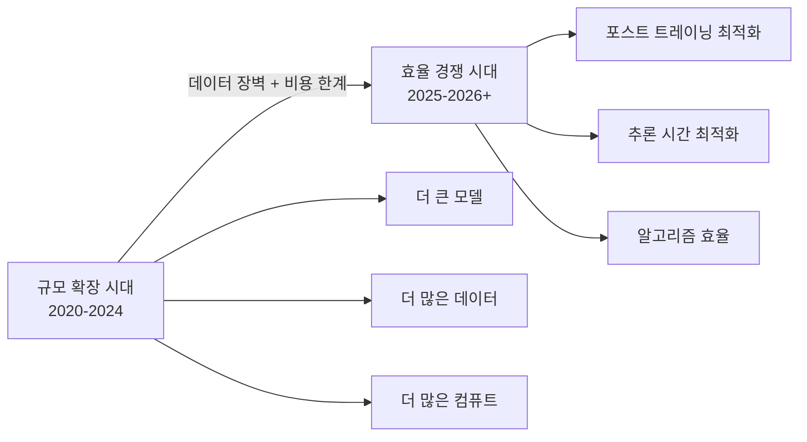
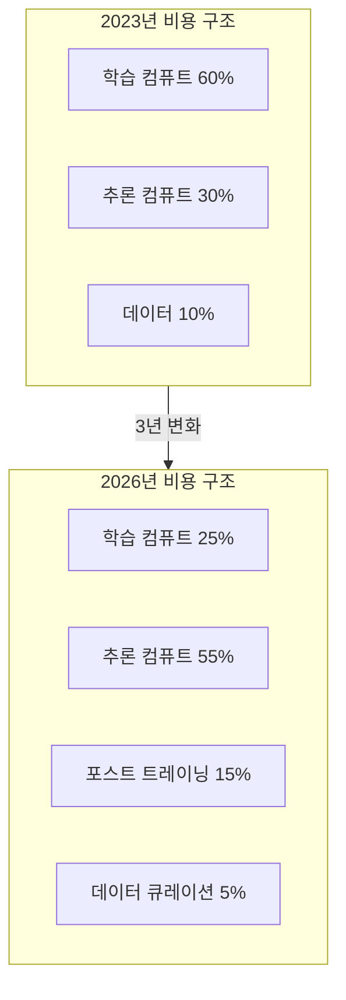

# AI 추론 컴퓨트 경제학 (Inference Compute Economics)

## 패러다임 전환: Scale -> Efficiency

2022-2024년 AI 발전은 "더 큰 모델 = 더 좋은 성능"이라는 스케일링 법칙(scaling law)이 주도했다. 2025-2026년 들어 이 공식의 한계가 드러나면서 **효율(efficiency) 중심으로 혁신 축이 이동**하고 있다.

## 데이터 장벽 (Data Wall)

**고품질 사전학습 데이터가 사실상 고갈**되고 있다는 것이 업계 공통 인식이다.

- Common Crawl, Books, Wikipedia 등 공개 텍스트는 이미 대부분 소진
- 합성 데이터(synthetic data)로 일부 보완하나 품질 한계 존재
- 데이터 품질이 데이터 양보다 중요해짐 (큐레이션 비용 증가)

데이터 장벽은 단순 규모 확장 전략의 한계를 만들었다. "더 많은 데이터"를 구할 수 없다면 "같은 데이터를 더 잘 쓰는 방법"으로 전환할 수밖에 없다.

## 경제적 유용성 전환 질문

> "어떤 스케일링이 실제 경제적 가치로 전환되는가?"

이것이 2026년 AI 산업의 핵심 질문이다.

| 스케일링 종류 | 비용 구조 | 경제적 가치 전환 |
|-------------|---------|----------------|
| 사전학습 규모 | 1회 고정 투자 | 모든 쿼리에 분산 |
| 파인튜닝 | 중간 비용 | 특정 도메인 강화 |
| 추론 컴퓨트 (TTC) | 쿼리당 변동 | 복잡 태스크에 집중 |
| 하드웨어 효율 | CAPEX 절감 | 마진 직접 개선 |

성능과 비용의 프론티어가 이동하고 있다. 2023년에 $1,000/월이었던 성능이 2026년에는 $10/월로 가능해지는 속도의 게임이 시작되었다.

## 혁신 축의 이동

### 포스트 트레이닝 최적화

사전학습 후 추가 최적화로 성능을 끌어올리는 방향이 강화되었다.

- **RLHF / DPO / GRPO**: 인간 선호 또는 검증 가능 보상으로 정렬
- **SFT + 데이터 큐레이션**: 소량 고품질 데이터로 전문 영역 강화
- **모델 합병(Model Merging)**: 여러 파인튜닝 모델을 비용 없이 통합

### 추론 시간 최적화

- **테스트 타임 컴퓨트(TTC)**: 추론 단계에서 더 많은 컴퓨트로 성능 향상
- **양자화(Quantization)**: INT4/FP8로 메모리·속도·비용 개선
- **KV 캐시 최적화**: 반복 쿼리에서 컴퓨트 재사용
- **스펙디코딩(Speculative Decoding)**: 초안 모델로 후보 생성, 대형 모델로 검증

## 비용 구조 진화

## 경쟁 구도 변화

| 경쟁 영역 | 2023 | 2026 |
|-----------|------|------|
| 핵심 무기 | 학습 컴퓨트 + 데이터 규모 | 알고리즘 + 추론 효율 |
| 진입 장벽 | 자본 집약적 | 낮아짐 (소형 모델로 경쟁 가능) |
| 차별화 포인트 | 모델 크기 | 특정 도메인 정확성 + 비용 |
| 주요 플레이어 | 대형 연구소 독점 | 스타트업 경쟁 심화 |

## 실무 의사결정 프레임워크

1. **태스크 매핑**: 해결하려는 문제가 큰 모델이 필요한가, 아니면 효율적 추론으로 충분한가?
2. **비용 예산 설정**: 쿼리당 허용 비용 → 사용 가능한 모델 크기/TTC 전략 역산
3. **캐싱 전략**: 반복 쿼리에 KV 캐시 또는 RAG 캐시 적용으로 비용 절감
4. **온디바이스 이전 검토**: 프라이버시 민감 또는 대량 반복 쿼리는 온디바이스 이전 고려

## 관련 문서

- [[test-time-compute]] - 추론 컴퓨트 스케일링의 핵심 전략
- [[inference-chip-market-shift]] - 경제 전환의 하드웨어 반영
- [[inference-distribution-tiers]] - 비용 최적화를 위한 계층 구조
- [[scaling-laws]] - 규모 확장 시대의 이론적 기반
