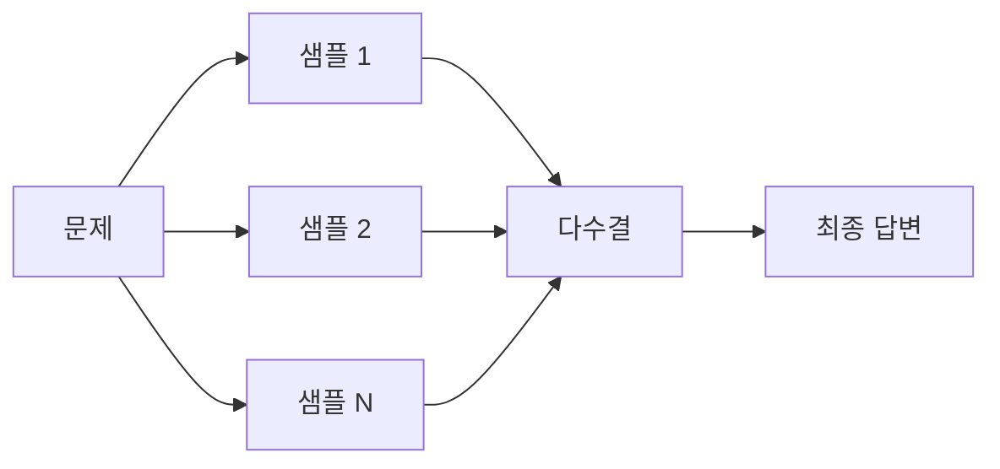
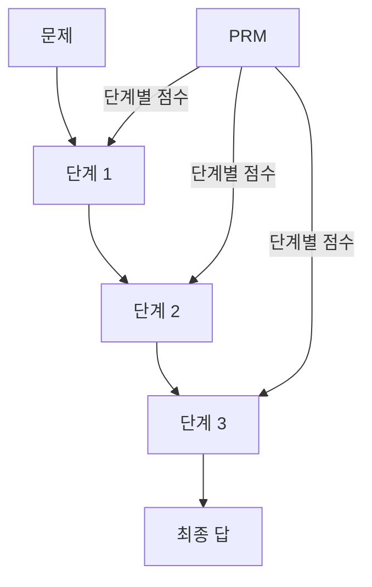

# 추론 시점 계산 스케일링 (Test-Time Compute)

## 개요

추론 시점 계산 스케일링(test-time compute scaling)이란 학습 단계가 아닌 **추론 단계에서 계산량을 늘려 모델 성능을 향상**시키는 패러다임이다. 전통적인 스케일링 법칙이 "더 많은 데이터, 더 큰 모델, 더 많은 학습 연산"에 집중했다면, 이 접근은 "고정된 모델을 문제 하나에 얼마나 더 오래 생각하게 할 것인가"라는 질문에 답한다.

## 배경: 왜 Test-Time Compute인가

Snell et al.(2024) "Scaling LLM Test-Time Compute"는 체계적으로 이 질문을 탐구한 핵심 연구다. 핵심 발견은 다음과 같다.

- 동일한 추론 예산(FLOP)을 학습보다 추론에 쓰는 것이 특정 조건에서 더 효율적
- 쉬운 문제에는 효과가 작고, 모델 능력의 한계 근처 난이도(75-80번째 퍼센타일)에서 가장 효과적
- 모델이 "잘 모르지만 노력하면 풀 수 있는" 문제에 집중 계산하는 전략이 최적

## 핵심 기법

### 1. 자기 일관성 (Self-Consistency)

Wang et al.(2022)이 제안. 동일 문제에 대해 N개의 독립적인 연쇄 추론(chain-of-thought)을 샘플링하고, 최종 답에 대해 다수결을 취한다. 비용은 N배지만 정확도가 유의미하게 향상된다.

- 수학, 코딩, 논리 추론 등 정답이 검증 가능한 문제에서 효과적
- 온도(temperature) 조정으로 다양성 확보 필요
- 단순 다수결 외에 가중 다수결(confidence-weighted)도 사용

### 2. 빔 서치 기반 생각 탐색 (Beam Search over Thoughts)

연쇄 추론의 각 단계를 노드로 보고, 여러 후보 생각 경로를 동시에 추적한다.

- **Tree of Thoughts(ToT)**: Yao et al.(2023). 각 "생각" 단계에서 여러 후보를 생성하고 평가해 유망한 경로만 유지
- **Graph of Thoughts**: 트리 구조를 넘어 임의의 그래프로 생각 경로를 연결
- 가지치기 기준: 프로세스 보상 모델(PRM) 또는 자체 평가

### 3. 프로세스 보상 모델 (Process Reward Model, PRM)

최종 답(outcome)만 평가하는 ORM(Outcome Reward Model)과 달리, 풀이 과정의 **각 중간 단계**를 평가한다.

- Lightman et al.(2023) "Let's Verify Step by Step" — PRM800K 데이터셋으로 수학 문제 풀이 단계 품질 판정
- 오류가 발생한 단계를 조기에 탐지해 재탐색(backtrack)
- 테스트 시점에 빔 서치와 결합하면 동일 모델 크기에서 성능 대폭 향상

### 4. 반복 정제 (Iterative Refinement)

모델이 자신의 이전 답변을 다시 읽고 수정한다.

- **Self-Refine**: Madaan et al.(2023). 피드백 생성 → 수정 반복
- **Reflexion**: 실패 경험을 언어적 반성으로 축적해 다음 시도에 활용
- 개방형 생성 문제(에세이, 코드)에서 효과적. 객관식/수학보다 검증 기준이 주관적

### 5. o1/o3 방식: 내부 연쇄 사고 (Internal Chain-of-Thought)

OpenAI의 o1(2024)은 이전 방식과 근본적으로 다른 접근을 취한다.

- 모델이 응답 전에 **비공개 "사고 토큰(thinking tokens)"**을 생성
- 강화학습으로 유익한 사고 패턴을 직접 학습
- 사용자에게 보이는 답변 전에 수천~수만 토큰의 내부 추론 진행
- 계산 예산을 늘릴수록(thinking token 한도 상향) 성능이 예측 가능하게 향상

## 계산-최적 추론 (Compute-Optimal Inference)

핵심 질문: "고정된 추론 예산이 있을 때, 작은 모델을 오래 생각시키는 것이 나은가, 큰 모델을 빠르게 한 번 쓰는 것이 나은가?"

Snell et al.(2024)의 결론:
- **문제 난이도가 모델 능력의 75-80번째 퍼센타일**에 있을 때 test-time compute가 가장 효율적
- 너무 쉬운 문제: 모델이 이미 알고 있어서 추가 계산이 낭비
- 너무 어려운 문제: 모델의 기저 능력 밖이라 아무리 반복해도 개선 없음

## Training Scaling vs Test-Time Scaling

| 축 | 특징 | 비용 구조 | 적합한 상황 |
|----|------|-----------|------------|
| 학습 스케일링 | 모델 크기, 데이터, 학습 연산 증가 | 선불(upfront) 고정 비용 | 광범위한 능력 향상 필요 |
| 추론 스케일링 | 같은 모델을 더 오래 생각시킴 | 쿼리당 가변 비용 | 정확도가 중요한 고가치 쿼리 |

두 축은 **상호 보완적**이다. 강력한 기반 모델(학습 스케일)을 추론 시점 전략으로 활용할 때 최대 효과를 냄.

## 실무 적용

- **수학/코딩 문제**: 자기 일관성 + PRM이 가장 검증된 조합
- **복잡한 에이전트 작업**: 내부 계획 단계를 더 많이 생성하고 검증
- **비용 민감 서비스**: 문제 난이도를 사전 추정해 쉬운 쿼리는 일반 모드, 어려운 쿼리만 extended thinking 모드로 라우팅

## 관련 문서

- [[자기 일관성 (Self-Consistency)]]
- [[프로세스 보상 모델]]
- [[연쇄 추론 (Chain-of-Thought)]]
- [[복합 AI 시스템 (Compound AI Systems)]]
- [[neural-scaling-laws|Neural Scaling Laws]]
