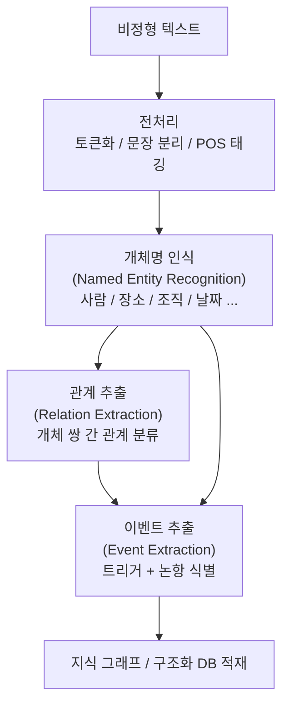
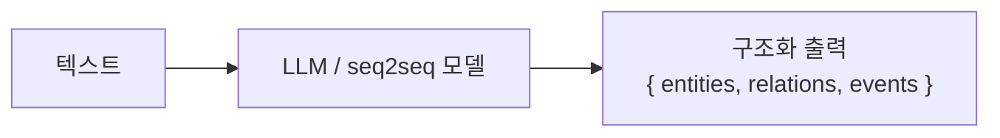

# 정보 추출 파이프라인 (Information Extraction Pipeline)

정보 추출(Information Extraction, IE)은 비정형 텍스트에서 **구조화된 정보**를 자동으로 추출하는 NLP 분야 전반을 가리킨다. 실무에서는 여러 서브태스크를 순서대로 또는 동시에 처리하는 **파이프라인(pipeline)** 형태로 구성된다.

## 파이프라인의 3대 레이어

정보 추출 파이프라인은 일반적으로 NER -> RE -> EE의 3단계 레이어로 이루어진다.



각 단계는 이전 단계의 출력을 입력으로 받는다. 단, 공동 학습(joint learning) 방식에서는 여러 단계를 동시에 처리하여 단계 간 상호 정보를 활용한다.

## 각 구성 요소

### 1단계: 개체명 인식 (NER)

**Named Entity Recognition**은 텍스트에서 고유한 의미를 가진 개체(entity)를 식별하고 분류한다. 인물(PER), 조직(ORG), 장소(LOC), 날짜(DATE) 등의 유형이 일반적이다. NER은 파이프라인의 가장 기초 레이어로, 이후 단계의 입력을 제공한다.

### 2단계: 관계 추출 (RE)

[[relation-extraction]]은 NER이 식별한 개체 쌍 사이의 의미적 관계를 분류한다.

> 예시: `(삼성, 본사위치, 서울)` - 조직과 장소 개체 사이의 "본사위치" 관계

### 3단계: 이벤트 추출 (EE)

[[event-extraction]]은 텍스트에서 발생한 사건과 그 참여자를 구조화된 레코드로 추출한다.

> 예시: `{이벤트: 인수합병, 트리거: "인수했다", 논항: [{삼성: 인수자}, {하만: 피인수자}]}`

## 파이프라인 vs. 공동 학습

| 구분 | 파이프라인 방식 | 공동 학습 방식 |
|------|----------------|----------------|
| 구조 | 단계별 순차 처리 | 단일 모델로 다중 태스크 동시 예측 |
| 장점 | 모듈화, 디버깅 용이 | 오류 전파 없음, 단계 간 정보 공유 |
| 단점 | 오류 전파(error propagation) | 구현 복잡도 높음 |
| 대표 예시 | spaCy 파이프라인 | DyGIE++, PURE, OneIE |

## 현대적 접근: 엔드-투-엔드 생성 모델

최근에는 세 단계를 별도로 구성하지 않고, 텍스트를 입력받아 구조화된 출력(트리플, JSON, 이벤트 레코드)을 직접 생성하는 **엔드-투-엔드 생성 방식**이 주류가 되고 있다.



GPT-4, Claude, Llama 등 대규모 언어모델에 적절한 프롬프트와 스키마를 제공하면 단일 추론으로 NER + RE + EE를 동시에 수행할 수 있다.

## 실무 파이프라인 구성 예시

```python
# spaCy 기반 파이프라인 예시 (개념 수준)
import spacy

nlp = spacy.load("ko_core_news_lg")

def extract_information(text: str) -> dict:
    doc = nlp(text)

    # NER
    entities = [(ent.text, ent.label_) for ent in doc.ents]

    # RE: 커스텀 관계 추출 컴포넌트 가정
    relations = extract_relations(doc)

    # EE: 커스텀 이벤트 추출 컴포넌트 가정
    events = extract_events(doc)

    return {"entities": entities, "relations": relations, "events": events}
```

## 평가 방법론

파이프라인 전체 평가는 각 단계를 독립적으로 평가하는 방식과 엔드-투-엔드로 평가하는 방식이 있다.

- **단계별 평가**: 각 태스크의 표준 벤치마크(CoNLL-2003, ACE 2005 등)에서 Precision / Recall / F1 측정
- **엔드-투-엔드 평가**: 최종 지식 그래프 품질을 기준으로 평가 (트리플 F1)
- **오류 분석**: 파이프라인에서 오류가 어느 단계에서 발생했는지 역추적

## 적용 도메인

| 도메인 | 추출 대상 | 활용 예시 |
|--------|-----------|-----------|
| 금융 | 기업, 금액, 인수합병 이벤트 | 투자 정보 자동화 |
| 의료 | 질병, 약물, 부작용, 진단 이벤트 | 임상 정보 추출 |
| 법률 | 법인, 조항, 판결 이벤트 | 계약 분석 자동화 |
| 뉴스 | 인물, 사건, 발언 | 뉴스 요약, 사건 추적 |
| 과학 | 물질, 반응, 실험 결과 | 논문 지식 추출 |

## 관련 문서

- [[relation-extraction]] - 파이프라인 2단계, 개체 간 관계 분류
- [[event-extraction]] - 파이프라인 3단계, 이벤트와 논항 구조화
- [[named-entity-recognition]] - 파이프라인 1단계, 모든 후속 단계의 기반
