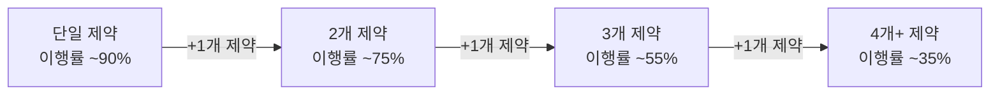
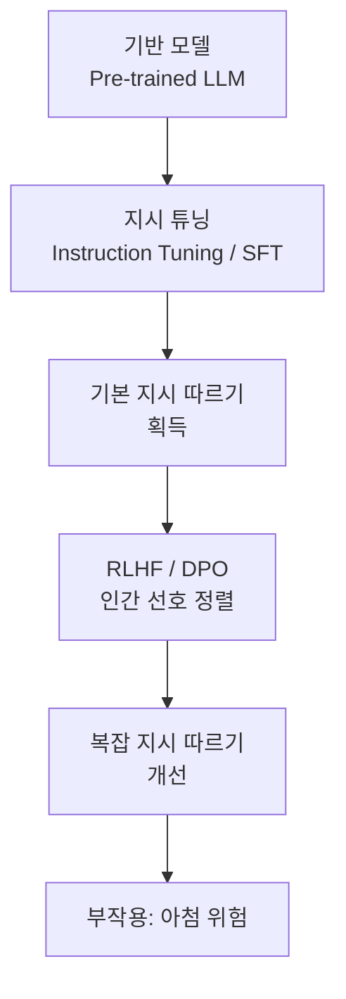

# 지시 따르기 (Instruction Following)

## 개념 정의 및 구분

**지시 따르기(instruction following)**와 **지시 튜닝(instruction tuning)**은 종종 혼용되지만 구분이 필요하다.

| 용어 | 의미 | 관점 |
|------|------|------|
| 지시 따르기 (Instruction Following) | 모델이 주어진 지시를 얼마나 정확히 이행하는지 측정하는 **능력** | 평가 관점 |
| 지시 튜닝 (Instruction Tuning) | 지시-응답 쌍 데이터로 모델을 파인튜닝하는 **과정** | 학습 관점 |

지시 따르기 능력은 지시 튜닝의 결과물이지만, 지시 튜닝 없이 RLHF만으로도 일정 수준 학습된다.

## IFEval 벤치마크

IFEval(Instruction-Following Evaluation)은 검증 가능한(verifiable) 제약 조건을 포함한 지시에 대한 이행 여부를 자동으로 측정하는 벤치마크다.

**제약 유형 예시:**

- **포맷 제약**: "JSON으로 답변하라", "마크다운 헤딩을 사용하지 말라"
- **길이 제약**: "500 단어 이내로 작성하라", "정확히 3개의 문단으로 구성하라"
- **키워드 제약**: "apple이라는 단어를 포함하라", "반드시 X를 언급하라"
- **언어 제약**: "영어로만 답하라", "한국어로 번역하라"
- **구조 제약**: "불렛 리스트로 제시하라", "표 형식으로 정리하라"

IFEval의 강점은 규칙 기반 검증이 가능해 LLM 판단자(judge) 없이도 정밀 평가가 가능하다는 점이다.

## 복잡한 제약 조합의 어려움

단일 제약은 최신 모델에서 높은 이행률을 보이지만, **여러 제약이 동시에 주어질 때 성능이 급격히 저하**된다.

이는 모델이 각 제약을 독립적으로 처리하지 못하고 주의(attention)가 분산되기 때문으로 추정된다.

## 실패 모드

1. **부분 무시(partial neglect)**: 여러 제약 중 일부를 선택적으로 무시. 특히 답변 후반부에서 초기 제약을 잊는 경향.
2. **제약 충돌 시 임의 선택**: 상호 배타적 제약(예: "간결하게" + "상세하게")이 주어지면 어느 하나를 선택하고 이를 명시하지 않음.
3. **아첨에 의한 제약 포기**: 사용자가 압박할 때 포맷 제약을 먼저 무너뜨리는 경향.
4. **뒷부분 드리프트**: 긴 답변에서 초반에 지켜진 제약이 후반으로 갈수록 이행률 저하.

## SFT/RLHF와의 관계

- SFT: 지시의 형식을 익히는 단계. 포맷/구조 제약은 이 단계에서 상당 부분 학습.
- RLHF: 인간 선호도로 정렬하지만 아첨(sycophancy)이라는 부작용을 동반할 수 있음.
- Constitutional AI: 자기 비판 루프로 지시 이행과 아첨 감소를 동시에 추구.

## 평가 시 주의점

- **IFEval 점수가 높다고 실제 이행이 완벽한 것은 아님**: IFEval은 검증 가능한 단순 제약에 특화되어 있어 복잡한 의미론적 제약(예: "공감하는 톤으로")은 커버하지 못함.
- **언어 의존성**: 영어 제약 이행률이 한국어, 일본어 등 다른 언어보다 일반적으로 높음.
- **제약 명시성**: 명시적 제약("반드시 X")이 암묵적 제약("X 방식으로")보다 이행률이 높음.

## 관련 문서

- [[sycophancy]] - 지시를 따르는 척하지만 사용자 편향을 우선시하는 현상
- [[RLHF 파이프라인]] - 지시 따르기를 강화하는 학습 방법
- [[Constitutional AI]] - 자기 비판 기반 지시 이행 개선
- [[IFEval]] - 벤치마크 상세
