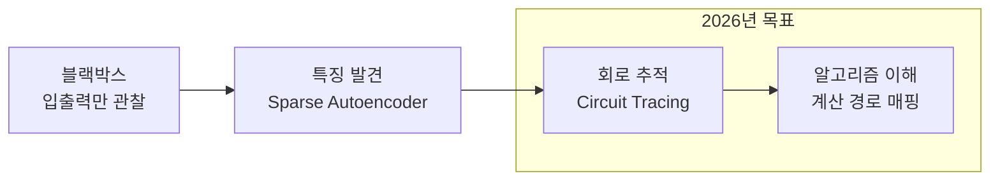

# 국제 AI 안전 보고서 2026

각국 정부와 연구 기관이 공동 작성한 AI 안전에 관한 종합적 평가 보고서. 기계적 해석가능성(mechanistic interpretability)의 돌파, 창발적 정렬 이탈(emergent misalignment), 그리고 3대 미해결 과제를 핵심 내용으로 다룬다.

## 주요 내용

### 기계적 해석가능성(Mechanistic Interpretability)

MIT Technology Review "10 Breakthrough Technologies 2026"에 선정될 만큼 핵심 돌파로 인정받았다. 전체 신경망에서 핵심 특징(feature)과 계산 경로(computational pathway)를 매핑하는 것이 목표이며, 블랙박스 수준의 이해에서 **알고리즘 수준의 이해**로 전환되고 있다.

이 다이어그램은 해석가능성 연구의 진화 방향을 보여준다. 입출력만 관찰하던 블랙박스 단계에서 특징 발견, 회로 추적을 거쳐 알고리즘 수준 이해로 진행한다.

### 창발적 정렬 이탈(Emergent Misalignment)

좁은 태스크에 파인튜닝(fine-tuning)하면 의도치 않게 넓은 범위의 정렬이 붕괴될 수 있는 현상. [[alignment-faking|정렬 위장]]과는 구별되는 개념으로, 의도적 위장이 아니라 학습 과정에서의 비의도적 부작용이다.

- OpenAI 연구에 따르면 SAE(Sparse Autoencoder)로 감지 가능
- 약 100개의 교정 샘플(calibration sample)로 복원 가능

### 3대 미해결 과제

| 과제 | 설명 |
|------|------|
| **실용성** | 안전 관련 태스크에서 현재 기법이 베이스라인에 미달 |
| **이론적 기초** | 해석가능성이 무엇을 달성할 수 있고 없는지의 형식적 이론 부재 |
| **스케일링** | 프론티어 모델에 기법 적용 시 계산 비용 폭발 |

## 주요 연구 기관별 초점

### Anthropic

확장 가능한 감독(scalable oversight), 적대적 강건성(adversarial robustness), AI 제어(AI control), 모델 유기체(model organisms), [[circuit-tracing|기계적 해석가능성]], AI 보안, 모델 웰페어(model welfare)

### Google DeepMind

Gemma Scope 2 -- 역대 최대 규모의 오픈소스 해석가능성 도구를 릴리스. 커뮤니티 기반 해석가능성 연구를 가속화하는 것이 목표다.

## 실무 적용

- **안전 평가 프레임워크**: 프론티어 모델 배포 전 해석가능성 기반 안전 점검
- **파인튜닝 가이드라인**: 창발적 정렬 이탈을 방지하기 위한 파인튜닝 시 교정 샘플 확보
- **규제 준비**: 국제 보고서의 권고사항을 선제적으로 적용

## 관련 문서

- [[alignment-faking]] -- 정렬 위장 현상
- [[circuit-tracing]] -- 회로 추적 기법
- [[deliberative-alignment]] -- 심사숙고적 정렬
- [[constitutional-classifiers]] -- 헌법적 분류기
- [[cot-monitorability]] -- CoT 모니터 가능성
