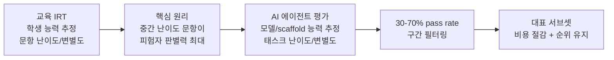

# IRT 기반 벤치마크 설계 (Item Response Theory for AI Evaluation)

IRT(Item Response Theory, 문항 반응 이론)는 원래 교육 심리측정학에서 시험 문항의 난이도·변별도·추측도를 통계적으로 모델링하기 위해 개발된 이론이다. **AI 에이전트 평가**에서 같은 원리를 적용하면, 전체 태스크 풀에서 평가 비용 대비 정보량을 최대화하는 대표 서브셋을 식별할 수 있다.

## 교육 IRT에서 AI 평가로

## 핵심 원리: 왜 중간 난이도가 중요한가

- **너무 쉬운 태스크** (pass rate > 70%): 거의 모든 에이전트가 통과 → 변별력 없음
- **너무 어려운 태스크** (pass rate < 30%): 거의 모든 에이전트가 실패 → 변별력 없음
- **중간 난이도 태스크** (30-70% pass rate): 에이전트 간 능력 차이가 드러남 → 정보량 최대

이 구간의 태스크만으로 전체 태스크 풀의 44-70%를 제거해도 에이전트 간 **순위(rank-order)**는 안정적으로 유지된다.

## Optimization-Free 프로토콜

IRT를 AI 평가에 적용할 때 가장 실용적인 접근은 **가중치 학습 없이 pass rate 통계만 활용**하는 방식이다:

1. 초기 소규모 평가로 각 태스크의 pass rate 추정
2. 30-70% 구간 태스크 선별
3. 이후 모든 평가는 서브셋으로만 수행

## 순위 안정성 vs 절대 점수의 비대칭성

IRT 서브셋 평가에서 나타나는 핵심 비대칭성:

| 예측 대상 | 안정성 | 사용 가능 상황 |
|-----------|--------|----------------|
| Rank-order (순위) | 안정적 | 리더보드, 모델 비교, A/B 테스트 |
| Absolute score (절대 점수) | 불안정 | 사용 시 주의 필요 |

이 비대칭성은 scaffold(실행 환경) 변화, 시간에 따른 분포 이동(temporal shift)에도 지속적으로 관찰된다. 리더보드나 반복적 개발 사이클에서는 순위 안정성만으로도 충분한 경우가 많다.

## AI 평가 맥락에서의 실용적 가이드

- **빠른 반복 개발**: 매 이터레이션마다 전체 벤치마크 대신 IRT 서브셋으로 빠른 순위 체크
- **벤치마크 설계**: 태스크 풀 구성 시 pass rate 분포를 의도적으로 균형 있게 배치
- **비용 장벽 완화**: 고비용 에이전트 평가에서 중소 팀도 경쟁적 평가 수행 가능

## 한계와 주의사항

- 초기 pass rate 추정을 위한 선행 비용이 필요
- 새 모델 세대가 등장하면 난이도 분포가 달라져 서브셋 재보정이 필요
- 절대 성능 기준이 중요한 사용 사례(릴리즈 검증, 규제 준수)에는 서브셋만으로 불충분

## 관련 문서

- [[efficient-benchmarking-paper]] -- IRT 필터를 에이전트 평가에 적용한 논문 (2603.23749)
- [[ai-benchmarks-overview]] -- AI 벤치마크 전반 개요
- [[long-horizon-agent-benchmarks]] -- 장기 실행 에이전트 벤치마크 생태계
- [[agent-benchmark-comparison-2026-04]] -- 2026년 4월 에이전트 벤치마크 비교
