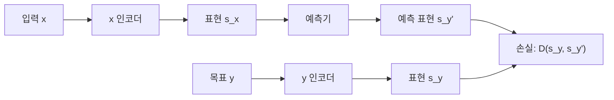
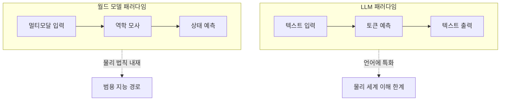

## 개요

JEPA(Joint Embedding Predictive Architecture)는 Yann LeCun이 제안한 프레임워크로, **고차원 원시 데이터가 아닌 추상적 표현 공간(abstract representation space)에서 미래 상태를 예측**하는 아키텍처이다. 기존 생성 모델이 픽셀 단위의 디테일을 예측하려다 본질적 부정확성에 빠지는 문제를 해결한다.

월드 모델(World Model)은 환경의 역학을 내부적으로 모사하는 AI 모델이다. JEPA는 월드 모델 구축의 핵심 경로로 주목받고 있으며, 2026년 현재 AMI Labs를 포함한 주요 연구 기관이 이 접근을 추진 중이다.

## 왜 중요한가

- 현재 LLM은 텍스트 토큰 예측에 특화 -- 물리적 세계의 동역학을 모사하지 못함
- 로보틱스, 자율주행, 산업 시뮬레이션 등에서 "물리 세계를 이해하는 AI"가 필수
- LeCun의 주장: "현재 LLM 집착은 잘못된 방향, 월드 모델이 진정한 AGI 경로"
- 자기지도학습(self-supervised learning)으로 라벨 없이 시각적/물리적 표현 학습 가능

## 핵심 메커니즘

JEPA의 핵심 구조: 입력과 목표를 각각 동일한 임베딩 공간에 매핑한 후, **표현 수준에서 예측**한다. 픽셀/파형이 아닌 의미적 표현의 거리를 최소화.

### JEPA vs 생성 모델

| 측면 | 생성 모델(Generative) | JEPA |
|------|----------------------|------|
| 예측 대상 | 고차원 원시 데이터(픽셀, 파형) | 추상적 표현 벡터 |
| 학습 방식 | 재구성 손실 | 표현 거리 손실 |
| 불필요한 디테일 | 모두 예측 시도 | "중요한 것"만 학습 |
| 계산 효율 | 높은 비용 | 상대적으로 효율적 |

### I-JEPA (Image JEPA)

Meta에서 2023년 발표한 LeCun 비전의 최초 실현체:

- 이미지의 일부(마스크된 패치)에서 나머지를 **표현 공간에서 예측**
- 픽셀 단위 재구성이 아닌 의미적 표현 예측
- 자기지도학습으로 라벨 없이 시각적 표현 학습
- MAE(Masked Autoencoder) 대비 하위 태스크 전이 성능 우수

## 2026년 월드 모델 경쟁

| 주체 | 접근 | 비고 |
|------|------|------|
| AMI Labs (LeCun) | JEPA 기반 | $1.03B 시드 라운드 |
| Google DeepMind | Genie 2, 시뮬레이션 기반 | 게임/환경 생성 |
| NVIDIA Cosmos | Physical AI 플랫폼 | 로보틱스/산업 시뮬레이션 |

### LLM vs 월드 모델

LLM과 월드 모델은 서로 다른 예측 대상을 가진다. LLM은 언어 토큰, 월드 모델은 물리적 상태를 예측한다.

## 실무 적용

- **로보틱스**: JEPA 기반 월드 모델로 행동 계획(planning) -- 실제 환경 시행착오 없이 시뮬레이션
- **자율주행**: 차량 센서 데이터에서 주변 환경 역학 예측
- **산업 시뮬레이션**: 디지털 트윈에서 물리적 프로세스 모사
- **비디오 이해**: 영상의 미래 프레임을 표현 공간에서 예측하여 행동 인식

## 관련 문서

- [[ai-reasoning-models]] -- AI 추론 모델 비교
- [[neuro-symbolic-ai]] -- 뉴로-심볼릭 접근과의 비교 (Gary Marcus vs LeCun 논쟁)
- [[catastrophic-forgetting]] -- 표현 학습의 안정성 문제
