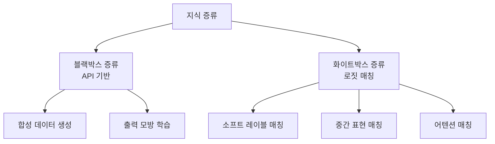

# LLM 지식 증류

## 개요

지식 증류(knowledge distillation)는 크고 강력한 **교사 모델(teacher model)**의 지식을 더 작은 **학생 모델(student model)**로 전달하는 기법이다. Hinton et al.(2015)이 제안한 고전적 개념이지만, LLM 시대에 들어 그 형태와 활용 방식이 크게 변화했다. 특히 GPT-4 같은 클로즈드 API 모델을 교사로 활용해 소형 오픈소스 모델을 강화하는 방식이 2023년 이후 폭발적으로 활용되고 있다.

## 증류 유형



### 블랙박스 증류 (Black-box Distillation)

교사 모델의 내부에 접근하지 않고 **입출력만 활용**하는 방식. API 모델(GPT-4, Claude 등)을 교사로 사용할 때 유일한 방법이다.

- **합성 데이터 생성**: 교사 모델에게 대량의 입력-출력 쌍 생성을 요청하고 학생 모델을 파인튜닝
- **응답 모방**: 교사 모델의 응답을 정답으로 삼아 학생이 지도 학습

### 화이트박스 증류 (White-box Distillation)

교사 모델의 **내부 상태(로짓, 어텐션, 은닉층 표현)**를 활용하는 전통적 방식.

- **소프트 레이블(soft labels)**: 원-핫 정답 대신 교사의 전체 확률 분포로 학습. "고양이"와 "개"의 구분이 "고양이"와 "자동차"보다 어렵다는 정보가 확률 분포에 담김
- **중간 표현 매칭**: 교사와 학생의 특정 레이어 출력을 유사하게 만드는 보조 손실
- **어텐션 매칭**: TinyBERT에서 사용. 교사의 어텐션 패턴을 학생이 모방

## 대표 사례: Alpaca/Vicuna 패턴

2023년 3월 Stanford의 Alpaca가 LLM 증류의 실용 가능성을 보여줬다.

1. **Self-Instruct**: GPT-3.5-turbo에 52,000개의 지시-응답 쌍 생성 요청 (약 500달러 비용)
2. **LLaMA 7B 파인튜닝**: 생성된 데이터로 Meta의 LLaMA 7B를 파인튜닝
3. **결과**: GPT-3.5와 유사한 지시 따르기 능력, 훨씬 작은 모델

이후 Vicuna(2023)는 ShareGPT에서 수집한 실제 ChatGPT 대화 70,000개로 LLaMA 13B를 학습해 GPT-4 대비 90% 이상 품질을 달성했다고 주장했다.

```
교사: GPT-3.5/GPT-4
    ↓ 합성 데이터
학생: LLaMA 7B/13B (Alpaca, Vicuna, WizardLM, ...)
```

## 증류 모델 예시

| 모델 | 교사 | 학생 기반 | 특징 |
|------|------|----------|------|
| Alpaca | GPT-3.5-turbo | LLaMA 7B | 최초 API 증류 시도 |
| Vicuna | ChatGPT (ShareGPT) | LLaMA 13B | 대화 품질 강조 |
| WizardLM | ChatGPT | LLaMA | Evol-Instruct (난이도 점진 증가) |
| distil-whisper | Whisper large-v2 | 자체 소형 | 음성 인식, 6배 속도 |
| TinyLlama | Llama-2 로짓 | 1.1B 구조 | 극소형, 엣지 디바이스 타깃 |
| DistilBERT | BERT | 66M 파라미터 | BERT 크기의 40%, 속도 60% 향상 |

## 온-폴리시 vs 오프-폴리시 증류

**오프-폴리시 (Off-policy)**: 교사가 미리 생성한 데이터로 학생을 학습. Alpaca/Vicuna가 이 방식.
- 장점: 저렴, 간단
- 단점: 학생의 실수에서 교사의 수정을 배울 수 없음. 분포 이동(distribution shift)

**온-폴리시 (On-policy)**: 학생이 생성한 출력에 대해 교사가 피드백. 최신 방식.
- 학생의 실제 실수를 교사가 수정하며 학습
- RLHF-like 루프와 결합 가능
- 더 비쌈. 교사 API 비용이 학생 학습 횟수에 비례

## 법적·윤리적 고려사항

블랙박스 증류는 법적 리스크가 있다. 주요 API 제공사들은 이용 약관에서 **경쟁 모델 학습에 출력을 사용하는 것을 명시적으로 금지**한다.

- OpenAI ToS: "You may not use output from the Services to develop models that compete with OpenAI"
- Meta LLaMA 라이선스: 특정 규모 이상의 서비스에 대한 별도 라이선스 요구
- Vicuna 등의 "GPT-4 수준 달성" 주장은 이러한 약관을 위반한 학습에 기반한 경우가 많아 학술계에서 논란

이 때문에 기업 프로덕션 환경에서는 허용된 데이터로만 증류하거나, 독점 모델 대신 공개 대형 모델(Llama 3, Qwen 등)을 교사로 사용하는 방향으로 전환 중이다.

## 증류 vs 기타 압축 기법

| 기법 | 핵심 아이디어 | 장점 | 단점 |
|------|-------------|------|------|
| 지식 증류 | 교사 지식 전달 | 능력 이전, 작은 모델로 높은 품질 | 교사 필요, 추가 학습 비용 |
| 양자화 | 가중치 정밀도 감소 | 추가 학습 불필요, 간단 | 일부 품질 손실 |
| 프루닝 | 가중치 제거 | 구조적 압축 | 재구성 어려움 |
| 로라(LoRA) | 저랭크 어댑터 | 빠른 파인튜닝 | 전체 모델 압축이 아님 |

## 실무 관점

LLM 증류는 "저비용으로 강력한 소형 모델 확보"라는 매력 때문에 널리 사용되지만, 핵심 함정이 있다. **학생 모델은 교사가 생성한 데이터의 품질 상한을 넘기 어렵다.** 교사가 틀린 정보를 생성하면 학생도 그 오류를 학습한다. 따라서 데이터 품질 검증 파이프라인이 증류 프로세스의 핵심이다.

## 관련 문서

- [[합성 데이터 학습]]
- [[양자화와 모델 압축]]
- [[LoRA/QLoRA]]
- [[PEFT 기법 비교]]
- [[전이 학습]]
- [[환각 완화 (Hallucination Mitigation)]]
