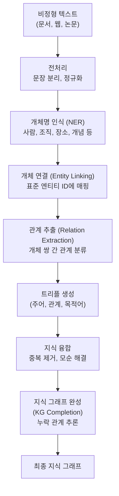
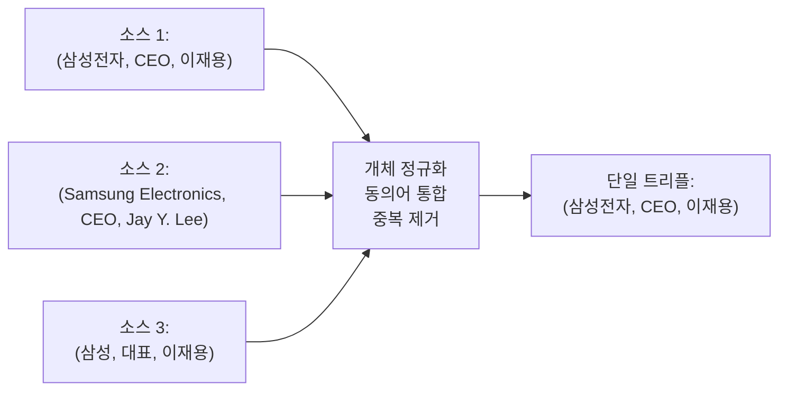
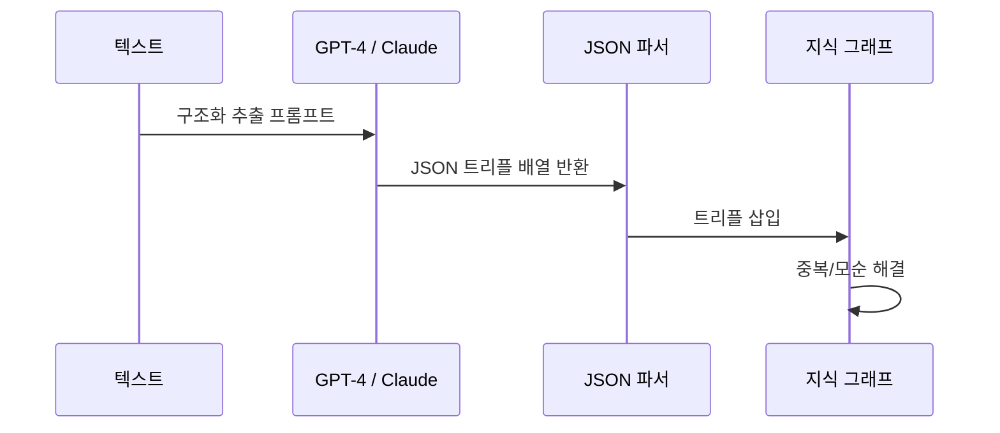

# 지식 그래프 구축 (Knowledge Graph Construction)

## 개요

지식 그래프(Knowledge Graph, KG) 구축은 비정형 텍스트 또는 반정형 데이터에서 개체(Entity)와 관계(Relation)를 추출해 `(주어, 관계, 목적어)` 트리플 형태의 구조화된 그래프 데이터베이스를 만드는 과정이다.

구글의 Knowledge Graph(2012), DBpedia, Freebase, Wikidata 등이 대표적인 대규모 KG다. 검색 엔진, 추천 시스템, 챗봇 지식 베이스, 의료 온톨로지 등 다양한 응용에서 활용된다.

[[knowledge-graph]] 개념의 실제 구현 파이프라인이며, [[relation-extraction]] 기법을 핵심 구성 요소로 사용한다.

## 전체 구축 파이프라인



## 핵심 구성 요소

### 1. 개체명 인식 (Named Entity Recognition, NER)

텍스트에서 개체(Entity)의 위치와 유형을 식별한다.

**입력**: "삼성전자는 2024년 한국 수원에서 신규 반도체 공장을 착공했다."

**출력**:
- `삼성전자` → ORG (조직)
- `2024년` → DATE (날짜)
- `한국` → GPE (지정 정치 실체)
- `수원` → LOC (장소)
- `반도체 공장` → FAC (시설)

현대 NER은 BERT 기반 시퀀스 레이블링(BIO 태깅)이 주류다.

```python
# spaCy를 이용한 NER 예시
import spacy
nlp = spacy.load("ko_core_news_sm")
doc = nlp("삼성전자는 2024년 한국 수원에서 신규 반도체 공장을 착공했다.")
for ent in doc.ents:
    print(f"{ent.text} → {ent.label_}")
```

### 2. 개체 연결 (Entity Linking, EL)

텍스트의 개체 표현(mention)을 표준 KG 엔티티(Wikidata QID 등)에 연결한다.

- "삼성전자" → `wd:Q20716` (Wikidata 삼성전자 엔티티)
- "수원" → `wd:Q25506` (Wikidata 수원 엔티티)

동음이의어 해소(disambiguation)가 핵심 과제다. "애플"이 과일인지 Apple Inc.인지 맥락으로 판단해야 한다.

### 3. 관계 추출 (Relation Extraction)

[[relation-extraction]]은 개체 쌍 간의 의미적 관계를 분류한다.

**입력**: ("삼성전자", "수원"), 문장 전체

**출력**: `headquartered_in` (본사 위치)

최신 접근법은 생성형 LLM을 활용한 통합 추출이다:

```
프롬프트: 다음 문장에서 (주어, 관계, 목적어) 트리플을 모두 추출하라.
문장: "삼성전자는 2024년 수원에 반도체 공장을 착공했다."

LLM 출력:
(삼성전자, 착공하다, 반도체 공장)
(반도체 공장, 위치, 수원)
(착공일, 연도, 2024)
```

### 4. 지식 융합 (Knowledge Fusion)

다양한 소스에서 추출된 트리플을 병합할 때 발생하는 문제를 해결한다.



### 5. 지식 그래프 완성 (Knowledge Graph Completion)

추출된 KG에는 누락된 관계가 많다. TransE, RotatE, ComplEx 같은 KG 임베딩 모델로 누락된 관계를 예측한다.

TransE: 관계를 임베딩 공간의 변환으로 모델링

$$h + r \approx t \quad \text{(head + relation ≈ tail)}$$

예: `(삼성전자, 본사, ?)` → `수원` 추론

## LLM 기반 통합 KG 구축

기존 NER → RE 파이프라인 대신 대형 언어 모델을 사용한 end-to-end 추출이 부상하고 있다.



LLM 기반 방식의 장점: 파이프라인 단계 축소, 낮은 빈도 관계 유형도 추출 가능, 맥락 이해도 높음.

단점: 비용, 환각(hallucination) 위험, 일관성 부족.

## 주요 오픈소스 도구

| 도구 | 주요 기능 | 특징 |
|------|-----------|------|
| spaCy | NER, 의존 구문 분석 | 빠른 속도, 다국어 지원 |
| Stanford CoreNLP | NER, 관계 추출 | 높은 정확도 |
| DeepKE | 중국어 KG 구축 특화 | LLM 통합 지원 |
| REBEL | 관계 추출 end-to-end | seq2seq 생성 방식 |
| Neo4j | 그래프 DB 저장/쿼리 | Cypher 쿼리 언어 |

## 대표 지식 그래프

| 이름 | 규모 | 특징 |
|------|------|------|
| Wikidata | 1억+ 트리플 | 오픈소스, 다국어 |
| DBpedia | 4.6억+ 트리플 | Wikipedia 기반 |
| YAGO | 5억+ 트리플 | Wikipedia + WordNet |
| Freebase | 19억+ 트리플 | Google 구축 (현재 Wikidata로 이전) |
| UMLS | 수백만 개념 | 의료 온톨로지 |

## 실무 적용 관점

**왜 중요한가**: 비정형 텍스트에 묻혀 있는 지식을 구조화해 기계가 추론 가능한 형태로 만드는 것이 KG 구축의 가치다. RAG(Retrieval-Augmented Generation) 시스템에서 KG를 검색 인덱스로 활용하면 단순 벡터 검색보다 관계 기반 다홉(multi-hop) 추론이 가능하다.

**실무에서 어떻게 쓰이나**:
- 기업 지식 관리: 내부 문서에서 제품-부품-공급업체 관계 추출
- 의약품 상호작용: 의학 논문에서 약물-질환-부작용 KG 구축
- 금융 리스크: 기업-인물-사건 관계 네트워크 구축 (탈세, 불법거래 탐지)
- 추천 시스템: 사용자-상품-속성 KG 기반 설명 가능한 추천

## 관련 문서

- [[knowledge-graph]] - 지식 그래프의 일반 개념 및 활용
- [[relation-extraction]] - 관계 추출 기법 상세
- [[scene-graph-generation]] - 이미지에서 시각적 지식 그래프 구축
