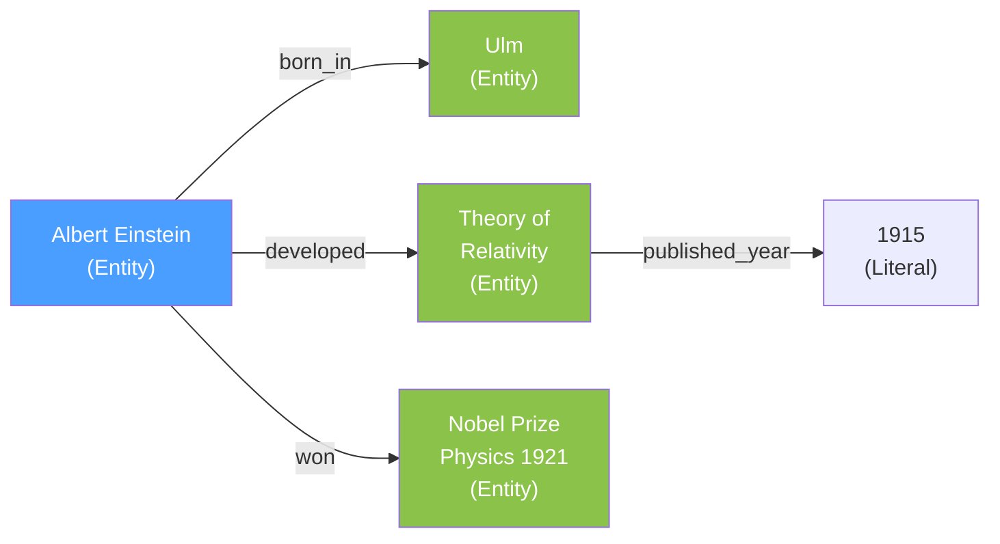
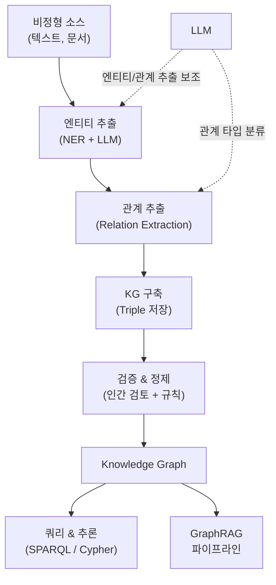

# Knowledge Graph (지식 그래프)

## 정의

**Knowledge Graph(지식 그래프, KG)**는 현실 세계의 엔티티(entity)와 그 사이의 관계(relation)를 그래프 구조로 표현한 지식 저장소다. 노드는 사물/개념을, 간선은 관계를 나타내며, **(주어, 관계, 목적어)** 트리플(triple)이 기본 단위다. 위키 내 **19회 이상 언급**되며, [[graphrag-in-production|GraphRAG]]과 [[rag-architecture-evolution-2026|RAG 아키텍처 진화]]의 핵심 인프라다.

Google이 2012년 "Knowledge Graph"를 공식 발표하며 대중화했고, 2024-2025년 LLM + KG 결합이 프로덕션 수준에 도달하면서 300-320% ROI를 달성하는 사례가 보고되고 있다.

## 핵심 구성 요소

| 구성 요소 | 설명 | 예시 |
|-----------|------|------|
| **Entity (노드)** | 사람, 장소, 개념, 사건 등 고유 식별 가능한 객체 | "Albert Einstein", "Ulm" |
| **Relation (간선)** | 엔티티 간 의미적 연결 | "born_in", "developed" |
| **Triple** | (주어, 관계, 목적어) 형태의 기본 사실 단위 | (Einstein, born_in, Ulm) |
| **Literal** | 속성값 (날짜, 숫자, 문자열) | "1915", "3.0 x 10^8 m/s" |
| **Ontology** | 엔티티 타입과 관계 타입의 스키마 | Person --born_in--> Place |

## 지식 그래프 vs 관계형 DB vs 벡터 DB

| 특성 | Knowledge Graph | RDBMS | Vector DB |
|------|----------------|-------|-----------|
| 데이터 모델 | 그래프 (노드 + 간선) | 테이블 (행 + 열) | 벡터 (임베딩) |
| 쿼리 방식 | 그래프 순회, SPARQL, Cypher | SQL | 유사도 검색 (ANN) |
| 강점 | 관계 추론, multi-hop 탐색 | 정형 CRUD, 트랜잭션 | 의미적 유사도 |
| 약점 | 구축 비용, 스키마 설계 | 유연성 부족, 관계 조인 비용 | 관계 추론 불가 |
| LLM 연동 | GraphRAG | Text-to-SQL | RAG |

## 구축 파이프라인

### LLM 기반 KG 구축 (2024-2026)

2025년 이전에는 NER + 규칙 기반 관계 추출이 주류였으나, LLM이 엔티티-관계 추출을 직접 수행하는 방식이 급부상했다. LLM-empowered KG construction은 프롬프트 기반으로 트리플을 추출하며, 전통 파이프라인 대비 구축 속도가 3-5배 향상되었다.

다만 LLM의 [[hallucination|환각]] 문제로 인해 자동 추출된 트리플의 검증 단계가 필수적이다.

## GraphRAG에서의 역할

Knowledge Graph는 [[graphrag-in-production|GraphRAG]]의 핵심 인프라다. 기존 [[rag-architecture-evolution-2026|벡터 기반 RAG]]가 개별 청크의 유사도만 보는 반면, GraphRAG는 KG의 구조를 활용하여 관계를 추론한다.

| 측면 | 벡터 RAG | GraphRAG (KG 기반) |
|------|---------|-------------------|
| 검색 단위 | 텍스트 청크 | 엔티티 + 관계 경로 |
| 추론 능력 | 청크 내 한정 | 연결된 사실들 간 multi-hop |
| 설명가능성 | 소스 문서 참조 | 노드와 경로 추적 가능 |
| 전역 질문 대응 | 어려움 | 커뮤니티 요약으로 가능 |

### 커뮤니티 감지 (Community Detection)

GraphRAG는 KG 내 밀집 연결 그룹을 커뮤니티로 분할하고, 각 커뮤니티를 LLM으로 요약한다. "이 데이터셋의 주요 주제는 무엇인가?" 같은 전역(global) 질문에 답할 수 있는 것이 이 구조 덕분이다.

## 대표적 지식 그래프 시스템

### 공개 지식 그래프

- **Wikidata**: 위키미디어 재단의 구조화된 지식 베이스. 1억+ 항목
- **DBpedia**: Wikipedia에서 구조화된 정보 추출
- **YAGO**: 시간적/공간적 지식이 풍부한 학술 KG

### 그래프 데이터베이스

- **Neo4j**: Cypher 쿼리 언어, 프로덕션 가장 보편적
- **Amazon Neptune**: AWS 관리형 그래프 DB
- **TigerGraph**: 대규모 분산 그래프 분석

### LLM-KG 통합 프레임워크

- **Microsoft GraphRAG**: KG + 커뮤니티 요약 + LLM 파이프라인
- **LightRAG**: GraphRAG 대비 10x 토큰 절감하는 경량 접근
- **LazyGraphRAG**: 비용-품질 최적화. [[graphrag-in-production|GraphRAG in Production]] 참조

## 한계와 과제

1. **구축 비용**: 고품질 KG 수동 구축은 도메인 전문가가 필요하며 비용이 높다
2. **불완전성(incompleteness)**: 현실 세계 지식을 완전히 포착하는 것은 불가능
3. **스키마 경직성**: 온톨로지 변경 시 기존 데이터 마이그레이션 부담
4. **동적 지식**: 시간에 따라 변하는 사실의 갱신 문제
5. **LLM 환각**: 자동 구축 시 [[hallucination|환각]]으로 인한 잘못된 트리플 삽입

## 관련 페이지

- [[graphrag-in-production|GraphRAG in Production]] -- KG 기반 RAG 파이프라인의 프로덕션 적용
- [[rag-architecture-evolution-2026|RAG Architecture Evolution]] -- 벡터에서 그래프로의 진화 맥락
- [[semantic-search|Semantic Search]] -- 벡터 기반 vs 그래프 기반 검색 비교
- [[hallucination|Hallucination]] -- LLM 기반 KG 구축의 핵심 위험
- [[dense-retrieval|Dense Retrieval]] -- 벡터 검색과 KG 검색의 상호보완 관계

## 참고 자료

- Google, "Introducing the Knowledge Graph" (2012) -- KG 대중화의 시작
- arXiv:2510.20345, "LLM-empowered Knowledge Graph Construction: A Survey" (2025)
- Meilisearch, "What is GraphRAG: Complete guide" (2026) -- 실무 중심 GraphRAG + KG 가이드
