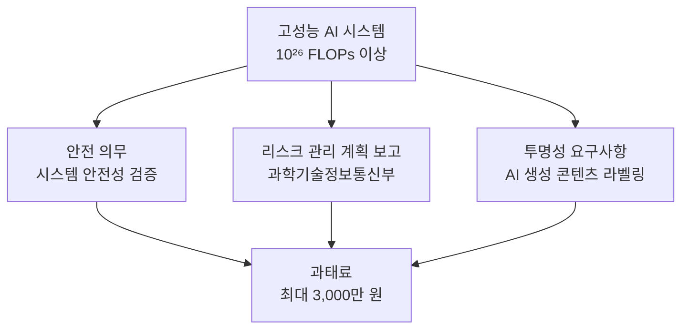
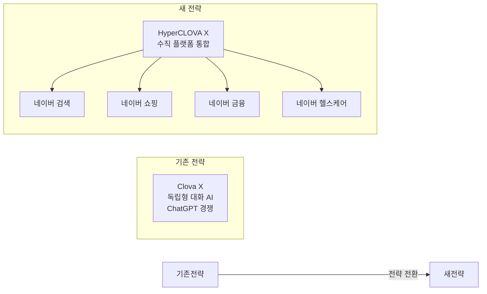
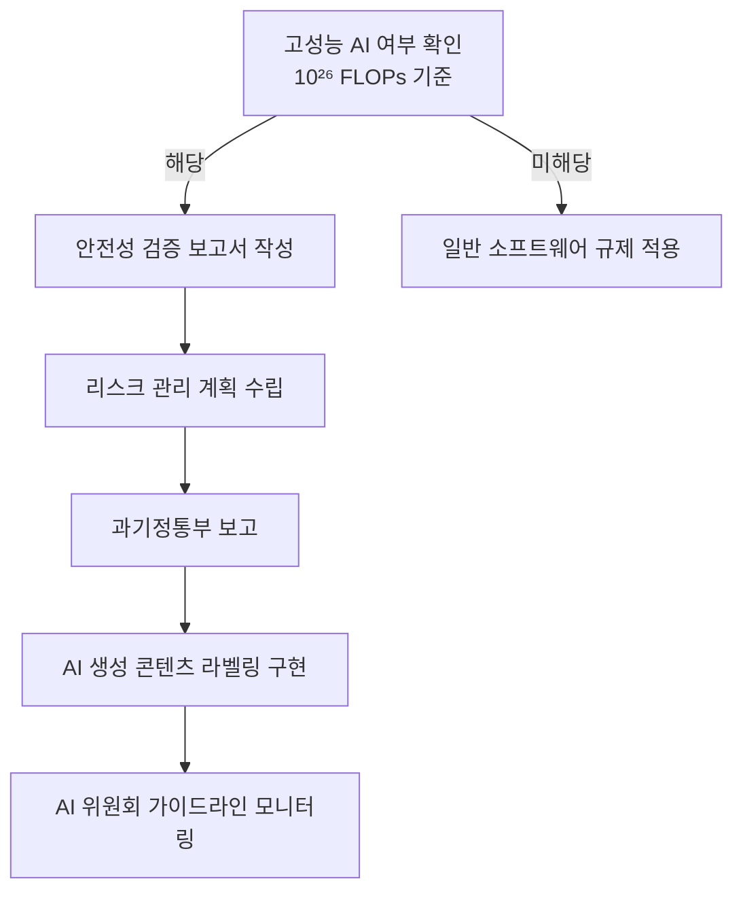

# 한국 AI 기본법 2026 - 시행 내용과 산업 영향

## 개요

**AI 발전 및 신뢰 기반 조성에 관한 법률**(이하 AI 기본법)이 2026년 1월 22일 시행됐다. 한국은 이로써 [[eu-ai-act-enforcement|EU AI Act]]에 이어 포괄적 AI 규제 체계를 도입한 주요국 중 하나가 됐다. 법률 시행과 동시에 네이버가 Clova X 서비스를 종료하고 HyperCLOVA X 중심의 수직 AI 전략으로 전환한 것도 주목할 만한 산업 동향이다.

[[regulatory-ai]] 개념 문서에서 글로벌 AI 규제 프레임워크 비교를 참조하라.

## 법률 주요 내용

### 1. 적용 범위: 고성능 AI 정의

AI 기본법은 모든 AI 시스템을 규율하지 않고, **"고성능 AI"**로 분류된 시스템에 특별 의무를 부과한다.

**고성능 AI 기준 (2026년 1월 시행 기준):**
- 학습 연산량: **$10^{26}$ FLOPs 이상**

이 기준은 [[eu-ai-act-enforcement|EU AI Act]]의 GPAI(General Purpose AI) 기준인 $10^{25}$ FLOPs보다 10배 높다. 즉 현재 GPT-5, Claude Opus 4.x 급 이상의 프론티어 모델에 해당하며, 소형 모델이나 파인튜닝 모델은 대부분 해당하지 않는다.

### 2. 고성능 AI 공급자 의무

- **안전 의무**: 고성능 AI 시스템 출시 전 안전성 검증 수행 및 문서화
- **리스크 관리 계획**: 주기적으로 리스크 평가 결과를 과학기술정보통신부에 보고
- **투명성**: AI가 생성한 콘텐츠(텍스트, 이미지, 영상)에 AI 생성 표시 의무
- **과태료**: 의무 위반 시 최대 3,000만 원 (EU AI Act 대비 상당히 낮은 수준)

### 3. EU AI Act와의 비교

| 항목 | 한국 AI 기본법 | EU AI Act |
|------|---------------|-----------|
| 시행 시기 | 2026-01-22 | 2026-08-02 (전면) |
| 고위험 분류 기준 | 고성능 AI ($10^{26}$ FLOPs) | 분야별 위험도 분류 |
| 최대 과태료 | 3,000만 원 (~22,000 USD) | 3,500만 유로 또는 매출 7% |
| GPAI 규제 | 간접적 | 직접 규율 |
| 집행 기관 | 과학기술정보통신부 | EU AI Office + 각국 기관 |

한국 AI 기본법의 과태료 한도가 EU AI Act 대비 극히 낮다는 점에서, 현재 법률은 **자율 규제(self-regulation) 촉진**과 **규제 프레임워크 확립** 측면에 더 방점이 있는 것으로 해석된다. 실질적 집행력보다 방향성 제시에 가깝다.

### 4. AI 위원회 및 거버넌스 체계

AI 기본법은 대통령 직속 **AI 위원회** 설치를 규정한다. 위원회는 국가 AI 전략 수립, 고성능 AI 리스크 관리 감독, AI 윤리 가이드라인 제정 권한을 가진다.

또한 기업이 AI 안전팀(AI safety team) 구성을 권고(강제 아님)하며, 이는 [[eu-ai-act-enforcement]]에서 다루는 GPAI 공급자 의무보다 느슨한 접근이다.

## 산업 영향: 네이버 Clova X 종료와 HyperCLOVA X 전략

AI 기본법 시행과 같은 맥락에서 네이버는 2026년 4월 9일 **대화형 AI 서비스 Clova X를 종료**했다. 이는 단순한 서비스 중단이 아니라 네이버 AI 전략의 근본적 재편이다.

### Clova X 종료의 배경

Clova X는 ChatGPT·Gemini·Claude와 정면 대결하는 범용 대화 AI로 포지셔닝했지만, 글로벌 모델 대비 경쟁력 확보에 한계가 있었다. 네이버는 대신 HyperCLOVA X를 자사의 핵심 플랫폼 서비스(검색, 쇼핑, 금융, 헬스케어)에 깊이 통합하는 **수직 AI 통합(vertical AI integration)** 전략으로 전환했다.

### 수직 AI 통합 전략의 의미

네이버의 전략 전환은 한국 AI 산업의 더 넓은 패턴을 반영한다:

1. **글로벌 모델 경쟁 포기**: GPT-5, Claude Opus와 범용 성능 경쟁은 사실상 불가능하다는 현실 인정
2. **도메인 특화(domain-specific) 승부**: 한국어 검색, 한국 쇼핑 생태계 등 로컬 강점이 있는 분야에 AI 통합
3. **데이터 해자(data moat)**: 네이버가 보유한 한국어 검색·쇼핑·지도 데이터를 AI와 결합해 글로벌 모델이 복제하기 어려운 경험 구축

## 글로벌 규제 환경과의 연결

### [[eu-ai-act-enforcement]] 시행 D-100

AI 기본법 시행 시점(2026-01-22)은 EU AI Act 전면 시행(2026-08-02)보다 약 6개월 앞선다. 한국이 EU보다 먼저 AI 기본법을 시행한 것은:

- 아시아 AI 규제 선도 위치 확보
- 한국 기업의 EU 수출 시 AI Act 대비 선제적 컴플라이언스 구축

의 전략적 효과가 있다.

### 미국과의 대비

같은 시기 트럼프 행정부는 AI 규제를 완화하고 주(州) AI 법률을 연방 기준으로 선점하는 방향을 추진하고 있다. 한국·EU가 규제를 강화하는 동안 미국이 규제를 완화하는 **규제 차익(regulatory arbitrage)** 구조가 형성되고 있다.

## 실무 컴플라이언스 관점

### 한국에서 고성능 AI를 운영하는 기업의 체크리스트

**실무적 시사점:**
- 현재 $10^{26}$ FLOPs 기준은 GPT-4 수준 이상 모델에만 적용되므로, 대부분의 파인튜닝 모델이나 소형 모델은 해당하지 않음
- 과태료가 낮아 단기적 집행 리스크는 제한적이나, 규제 강화 추세에 대비 필요
- EU AI Act 컴플라이언스와 함께 준비 시 효율적

## 왜 중요한가

한국 AI 기본법은 아시아 최초의 포괄적 AI 규제 입법 사례로서 역사적 의미를 가진다. 법률 자체의 집행력은 아직 제한적이지만, 네이버 Clova X 종료 사례에서 보듯 **AI 규제 프레임워크의 존재 자체가 기업의 전략 전환을 촉발**한다. 향후 과태료 상향, 집행 강화, 고위험 AI 분야 확대 등이 예상되며, 한국 AI 산업의 방향을 결정할 핵심 제도적 변수다.

## 관련 문서

- [[regulatory-ai]] - AI 규제 일반 개념
- [[eu-ai-act-enforcement]] - EU AI Act 2026년 8월 전면 시행
- [[ai-labor-market-impact-2026-04]] - AI 규제와 노동시장 변화
